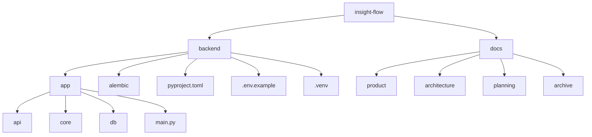
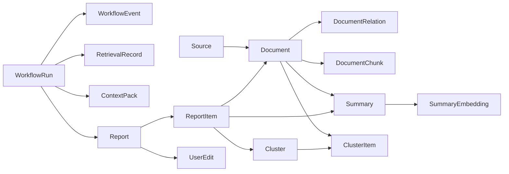

# Insight Flow 当前代码导读

## 1. 目的

这份文档用于解释当前项目里已经落地的代码到底在做什么。

重点不是重复文件名，而是回答三个问题：

1. 每个目录和 package 的职责是什么
2. 每个关键文件负责哪一层逻辑
3. 当前代码为什么要这样组织

当前范围覆盖：

- `backend/`
- `docs/`

当前不覆盖：

- 模块 03 之后还没实现的业务逻辑
- 前端代码

---

## 2. 项目总览

当前项目结构可以概括成两部分：

- `backend/`
  后端代码、数据库模型、迁移与运行环境
- `docs/`
  产品、架构、规划与执行约束文档

从实现阶段看，当前已经完成了两层底座：

1. 应用骨架
   FastAPI + 配置 + 日志 + 数据库连接 + Alembic
2. 数据骨架
   核心领域模型、表结构和初始迁移

也就是说，现在系统还没有真正开始跑“抓取、分析、RAG、周报生成”，但已经把“后续业务长在哪些骨头上”定下来了。

---

## 3. 目录职责



### 3.1 `backend/`

这是运行中的后端系统本体。

它的职责是：

- 提供 API 服务
- 管理数据库连接和 ORM 模型
- 管理数据库迁移
- 为后续 ingest / RAG / workflow 提供宿主

### 3.2 `docs/`

这是项目的设计与执行基线。

它的职责是：

- 明确产品定位
- 明确架构边界
- 明确版本路线图
- 明确执行顺序和日志约束

当前这个项目已经不是“代码先写再补文档”，而是“文档和代码一起推进”。

---

## 4. `backend/` 详细说明

## 4.1 `pyproject.toml`

文件：

- [backend/pyproject.toml](/Users/sz/Code/insight-flow/backend/pyproject.toml)

职责：

- 定义后端项目的 Python 包信息
- 定义运行依赖
- 定义构建方式

当前依赖的底层含义：

| 依赖 | 作用 |
| --- | --- |
| `fastapi` | 提供 API 服务框架 |
| `uvicorn[standard]` | 本地运行 ASGI 服务 |
| `sqlalchemy` | ORM 与数据访问基础 |
| `psycopg[binary]` | PostgreSQL 驱动 |
| `alembic` | 数据库迁移 |
| `pgvector` | PostgreSQL 向量字段支持 |
| `pydantic-settings` | 环境变量与配置管理 |

底层逻辑：

- 这个后端不是脚本集合，而是一个标准 Python 服务
- 数据层已经明确以 PostgreSQL + pgvector 为基础
- 后续所有模块都基于这个运行时环境扩展

## 4.2 `.env.example`

文件：

- [backend/.env.example](/Users/sz/Code/insight-flow/backend/.env.example)

职责：

- 给开发环境提供配置模板
- 告诉项目有哪些运行时变量需要被注入

底层逻辑：

- 配置不硬编码进代码
- 运行环境和应用逻辑解耦

## 4.3 `app/main.py`

文件：

- [backend/app/main.py](/Users/sz/Code/insight-flow/backend/app/main.py)

职责：

- 应用入口
- 初始化日志
- 创建 FastAPI app
- 挂载路由

关键逻辑：

```python
configure_logging(settings.log_level)

app = FastAPI(...)
app.include_router(health_router)
```

底层逻辑：

- 启动服务时先初始化日志系统
- 创建应用对象后再把模块化路由接进来
- 后续所有业务接口都不会直接堆在这里，而是通过 `router` 挂载

## 4.4 `app/core/`

### `config.py`

文件：

- [backend/app/core/config.py](/Users/sz/Code/insight-flow/backend/app/core/config.py)

职责：

- 提供全局配置对象
- 从 `.env` 和环境变量中读取配置

关键对象：

- `Settings`
- `get_settings()`
- `settings`

底层逻辑：

- `Settings(BaseSettings)` 让配置变成强类型对象
- `@lru_cache` 保证配置只初始化一次
- 当前默认数据库地址是：
  `postgresql+psycopg:///insight_flow`

这表示：

- 使用本地 PostgreSQL
- 使用 Unix socket
- 数据库名是 `insight_flow`

### `logging.py`

文件：

- [backend/app/core/logging.py](/Users/sz/Code/insight-flow/backend/app/core/logging.py)

职责：

- 初始化应用级日志

关键函数：

- `configure_logging(level: str = "INFO")`

当前实现还比较轻，只完成了：

- 统一日志级别
- 统一日志输出格式

底层逻辑：

- 先建立统一日志入口
- 后面模块 03 开始，会在这个基础上扩成结构化日志、trace id、workflow run id 和节点级日志

## 4.5 `app/api/`

### `routes/health.py`

文件：

- [backend/app/api/routes/health.py](/Users/sz/Code/insight-flow/backend/app/api/routes/health.py)

职责：

- 提供最小健康检查接口

关键对象和函数：

- `router = APIRouter(tags=["health"])`
- `healthcheck()`

返回内容：

- `status`
- `app_env`

底层逻辑：

- 这不是业务接口
- 它的意义是验证应用能启动、配置能读取、路由能注册
- 这是后续一切业务接口之前的最小活性探针

## 4.6 `app/db/`

这是当前后端最核心的一层。

它的职责不是“存数据”这么简单，而是定义整个 Insight Flow 的领域对象与持久化结构。

### `base.py`

文件：

- [backend/app/db/base.py](/Users/sz/Code/insight-flow/backend/app/db/base.py)

职责：

- 定义所有 ORM 模型的统一基类 `Base`
- 定义约束命名规则

关键对象：

- `naming_convention`
- `class Base(DeclarativeBase)`

底层逻辑：

- 所有模型都继承同一个 `Base`
- 主键、索引、唯一约束、外键命名统一
- 这样 Alembic 自动生成或管理迁移时不会出现约束名混乱

### `session.py`

文件：

- [backend/app/db/session.py](/Users/sz/Code/insight-flow/backend/app/db/session.py)

职责：

- 创建数据库 engine
- 创建 session 工厂
- 提供 FastAPI 可注入的 DB session

关键对象和函数：

- `engine`
- `SessionLocal`
- `get_db()`

底层逻辑：

- `engine` 管理数据库连接和连接池
- `SessionLocal` 创建 ORM 会话
- `get_db()` 通过 `yield` 的方式保证请求结束后 session 关闭

这是后续 repository、service、API handler 的数据库入口。

### `mixins.py`

文件：

- [backend/app/db/mixins.py](/Users/sz/Code/insight-flow/backend/app/db/mixins.py)

职责：

- 提供可复用的主键和时间戳字段

关键 mixin：

- `UUIDPrimaryKeyMixin`
- `TimestampMixin`

底层逻辑：

- 每张表都需要 `id`
- 大多数表都需要 `created_at` / `updated_at`
- 用 mixin 能避免重复定义

### `enums.py`

文件：

- [backend/app/db/enums.py](/Users/sz/Code/insight-flow/backend/app/db/enums.py)

职责：

- 定义领域状态与类型常量

它本质上是在定义系统的“领域语言”。

例如：

- `SourceType`
  表示来源类型
- `DocumentIngestType`
  表示文档是怎么进入系统的
- `DocumentExtractionMethod`
  表示抓取/提取路径
- `DocumentQualityStatus`
  表示内容质量是否通过
- `DocumentDedupStatus`
  表示在去重中的角色
- `WorkflowStatus`
  表示工作流处于什么阶段

底层逻辑：

- 后续状态流转不能到处散写字符串
- 应该围绕这些受控枚举推进

### `types.py`

文件：

- [backend/app/db/types.py](/Users/sz/Code/insight-flow/backend/app/db/types.py)

职责：

- 定义 embedding 的统一数据库类型

关键内容：

- `EMBEDDING_DIM = 1536`
- `EmbeddingVector = Vector(EMBEDDING_DIM)`

底层逻辑：

- 向量字段的维度在系统里必须统一
- 后续 `SummaryEmbedding` 和 `DocumentChunk` 都复用这个定义

## 4.7 `app/db/models/`

这是 Insight Flow 当前最重要的代码区域。

这些文件不是简单的“表定义”，而是在表达系统的核心实体。

### 模型分组图



### `source.py`

文件：

- [backend/app/db/models/source.py](/Users/sz/Code/insight-flow/backend/app/db/models/source.py)

核心实体：

- `Source`

职责：

- 表示一个信息源，比如 RSS feed

关键字段：

- `type`
- `name`
- `config_json`
- `status`
- `last_synced_at`

关系：

- `documents`

底层逻辑：

- `Source` 不是内容本身，而是“内容从哪里来”
- 这为后续来源管理、来源级同步、来源级启停打底

### `document.py`

文件：

- [backend/app/db/models/document.py](/Users/sz/Code/insight-flow/backend/app/db/models/document.py)

核心实体：

- `Document`
- `DocumentRelation`
- `DocumentChunk`

`Document` 的职责：

- 表示一篇被摄入进系统的原始内容资产

关键字段分层理解：

- 输入层：
  `source_id`, `ingest_type`, `url`, `canonical_url`
- 元数据层：
  `title`, `author`, `published_at`, `language`
- 文本层：
  `raw_content`, `cleaned_content`
- 控制层：
  `content_hash`, `extraction_method`, `quality_status`, `dedup_status`, `status`

底层逻辑：

- 所有外部内容一旦进入系统，先变成 `Document`
- 后续摘要、切块、聚类、引用都围绕它展开

`DocumentRelation` 的职责：

- 显式记录文档与文档之间的关系

关键字段：

- `document_id`
- `related_document_id`
- `relation_type`
- `similarity_score`

底层逻辑：

- 系统不仅要知道“这篇文章存在”
- 还要知道“它和另一篇是什么关系”
- 这对去重、支持源归并和事件组织都重要

`DocumentChunk` 的职责：

- 把清洗后的正文切成可检索 chunk

关键字段：

- `chunk_index`
- `chunk_text`
- `token_count`
- `embedding_model`
- `embedding`

底层逻辑：

- RAG 不应该只基于整篇文章粗检索
- 需要细粒度 chunk 级召回

### `summary.py`

文件：

- [backend/app/db/models/summary.py](/Users/sz/Code/insight-flow/backend/app/db/models/summary.py)

核心实体：

- `Summary`
- `SummaryEmbedding`

`Summary` 的职责：

- 表示模型对单篇文档做出的结构化分析结果

关键字段：

- `short_summary`
- `key_points`
- `tags`
- `category`
- `bilingual_terms`
- `quality_score`
- `prompt_version`
- `model_name`
- `status`

底层逻辑：

- 这个项目不是只保留一句摘要
- 而是保留面向检索和报告生成的结构化分析结果

`SummaryEmbedding` 的职责：

- 为摘要级语义检索提供向量索引

底层逻辑：

- Summary 负责高层语义召回
- Chunk 负责原始证据回填
- 这就是双路 RAG 的数据基础

### `cluster.py`

文件：

- [backend/app/db/models/cluster.py](/Users/sz/Code/insight-flow/backend/app/db/models/cluster.py)

核心实体：

- `Cluster`
- `ClusterItem`

职责：

- 把若干相关文档组织成“事件簇”

底层逻辑：

- 周报最终不该按“文章列表”组织
- 而应该按“事件/主题”组织

`Cluster` 保存：

- 事件标题
- 事件摘要
- 时间窗
- 聚类版本

`ClusterItem` 保存：

- cluster 和 document 的对应关系
- 该文档在 cluster 中的位置

### `workflow.py`

文件：

- [backend/app/db/models/workflow.py](/Users/sz/Code/insight-flow/backend/app/db/models/workflow.py)

核心实体：

- `WorkflowRun`
- `WorkflowEvent`
- `RetrievalRecord`
- `ContextPack`

这组表的职责不是“业务内容”，而是“可追溯执行记录”。

`WorkflowRun`

- 表示一次完整 workflow 执行
- 保存整体状态、时间窗、状态快照、重试计数

`WorkflowEvent`

- 表示某个 workflow 节点的一次执行事件
- 保存节点名、状态、错误信息、快照引用、时间

`RetrievalRecord`

- 表示一次 RAG 检索行为
- 记录 query、过滤条件、命中的 summary/chunk 和打分快照

`ContextPack`

- 表示一次最终上下文构建结果
- 保存将要喂给生成模型的上下文内容

底层逻辑：

- Workflow 不能只在内存里跑
- 必须能复盘“这次到底做了什么”

### `report.py`

文件：

- [backend/app/db/models/report.py](/Users/sz/Code/insight-flow/backend/app/db/models/report.py)

核心实体：

- `Report`
- `ReportItem`
- `UserEdit`

`Report`

- 表示一份实际输出，比如周报草稿或最终报告

关键字段：

- `type`
- `title`
- `window_start`, `window_end`
- `content_md`
- `status`
- `version`
- `generated_by_run_id`

底层逻辑：

- 报告是系统中的正式产物，不是临时字符串

`ReportItem`

- 表示报告中的条目和引用链

它显式关联：

- `summary`
- `document`
- `cluster`
- `source_url`

底层逻辑：

- 一份报告必须可追溯到它引用了什么材料

`UserEdit`

- 表示人工编辑痕迹

底层逻辑：

- 人改动了什么，不能被覆盖掉
- 要沉淀成可回溯、可分析的编辑记录

### `models/__init__.py`

文件：

- [backend/app/db/models/__init__.py](/Users/sz/Code/insight-flow/backend/app/db/models/__init__.py)

职责：

- 集中导出所有模型
- 触发所有模型注册到 `Base.metadata`

底层逻辑：

- Alembic 和 ORM 都依赖完整的 metadata
- 如果某些模型没被导入，迁移和建表就会不完整

## 4.8 `alembic/`

### `env.py`

文件：

- [backend/alembic/env.py](/Users/sz/Code/insight-flow/backend/alembic/env.py)

职责：

- 定义 Alembic 迁移环境
- 把项目配置和 ORM metadata 注入 Alembic

关键逻辑：

- 从 `settings` 读取数据库地址
- 导入 `app.db.models`
- 设置 `target_metadata = Base.metadata`

底层逻辑：

- Alembic 并不知道你定义了哪些表
- 它必须通过 `metadata` 拿到完整 schema 描述

### `versions/20260416_0001_initial_schema.py`

文件：

- [backend/alembic/versions/20260416_0001_initial_schema.py](/Users/sz/Code/insight-flow/backend/alembic/versions/20260416_0001_initial_schema.py)

职责：

- 定义初始数据库结构

做了三类事：

1. 创建 `vector` 扩展
2. 创建所有核心表
3. 创建索引、唯一约束、GIN 索引和部分唯一索引

底层逻辑：

- `pgvector` 是 RAG 的基础设施之一
- schema 不是随便建表，而是已经开始考虑：
  - URL 去重
  - 标签检索
  - 向量检索
  - 外键删除策略

---

## 5. `docs/` 详细说明

### `docs/README.md`

文件：

- [docs/README.md](/Users/sz/Code/insight-flow/docs/README.md)

职责：

- 作为文档总入口
- 告诉阅读顺序和文档分类方式

### `docs/product/`

职责：

- 解释为什么做这个项目
- 定义项目价值、场景、PRD 和产品边界

### `docs/architecture/`

职责：

- 解释系统怎么设计
- 定义 workflow、数据库、技术方案与实现方向

### `docs/planning/`

职责：

- 解释怎么推进项目
- 管理任务顺序、版本路线图、学习地图和执行约束

### `docs/archive/`

职责：

- 保留早期讨论和历史版本

---

## 6. 当前代码到底做到了什么

当前代码还没实现：

- RSS 抓取
- URL 导入
- 文本清洗
- LLM 分析
- embedding 写入
- LangGraph workflow
- Report 生成

但它已经把整个系统的“底盘”立起来了：

- 服务可启动
- 配置可加载
- 日志入口已建立
- PostgreSQL 已接通
- `pgvector` 已接通
- Alembic 迁移已跑通
- 15 张核心表已落库
- Insight Flow 的核心领域对象已经定型

换句话说，现在系统已经不是一个空目录，而是一个可继续长出业务链路的后端骨架。

---

## 7. 下一步怎么接

当前最自然的下一步是模块 03：

- 输入来源 API
- URL / RSS / 手动文本导入
- 抓取与标准化
- 质量评分
- 语义去重
- 单篇分析
- chunk 与 embedding

也就是说，接下来系统会第一次开始把这些表真正“跑起来”。
