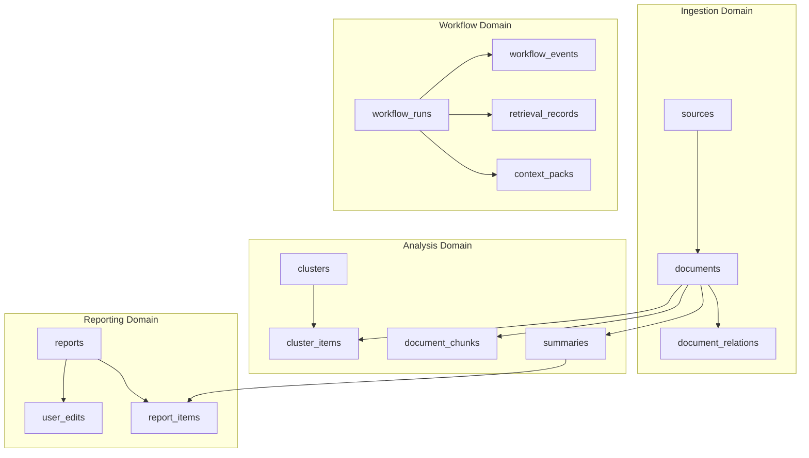
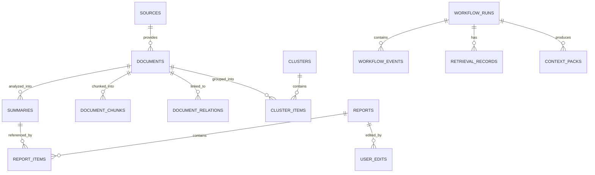

# Insight Flow 数据库 Schema 设计

## 1. 文档目标

本文档定义 Insight Flow MVP 的数据库 Schema 设计，覆盖：

- 数据建模原则
- 表结构设计
- 表间关系
- 索引策略
- 状态字段约定
- 向量与检索存储方式
- workflow / checkpoint / 引用链的落地方式

本文档的目标是作为 MVP 数据库实现的直接依据，为 SQLAlchemy model、Alembic migration 和查询设计提供统一基线。

---

## 2. 设计原则

## 2.1 以关系模型为主，向量能力内嵌

MVP 采用：

- `PostgreSQL` 作为主数据库
- `pgvector` 作为向量存储扩展

原因：

- 业务数据强结构化
- workflow、编辑、引用链天然适合关系模型
- 向量检索规模在 MVP 阶段不需要独立向量数据库

## 2.2 数据库不仅存业务结果，也存过程证据

Insight Flow 的核心价值之一是“可追踪、可复盘”，因此数据库不应只保存最终文档和周报，还必须保存：

- workflow 运行状态
- 节点事件
- 检索记录
- 人工编辑记录
- 报告引用链

## 2.3 尽量用稳定主键，不在 state 中塞大文本

LangGraph state 中只保存：

- ID
- ref
- snapshot key

大文本内容、草稿、context pack 都通过数据库表或持久化引用落地。

## 2.4 MVP 先做“够用而可演进”的 schema

第一版 schema 必须支撑：

- 资产沉淀
- 语义去重
- 事件聚类
- 双路 RAG
- Reviewer 审查
- Human-in-the-loop

但不需要提前为多租户、复杂权限、平台化协作做过度设计。

---

## 3. 总体数据域

## 3.1 数据域划分图

## 3.2 数据域说明

### Ingestion Domain

负责描述“内容从哪里来”和“去重关系是什么”。

### Analysis Domain

负责描述“内容被如何结构化”和“如何支持检索与聚类”。

### Reporting Domain

负责描述“报告如何生成、引用哪些证据、人工怎么修改”。

### Workflow Domain

负责描述“任务怎样执行、如何恢复、做过哪些检索与节点操作”。

---

## 4. 核心关系图

---

## 5. 主键与通用字段约定

## 5.1 主键类型

MVP 建议使用：

- 应用层生成的 `UUID` 或 `ULID` 作为主键

推荐：

- 对业务表使用 `UUID`
- 若希望按时间排序更直观，可对 `workflow_runs`、`reports` 使用 `ULID`

## 5.2 通用时间字段

建议所有核心表包含：

- `created_at timestamptz not null`
- `updated_at timestamptz not null`

事件类表额外包含：

- `started_at`
- `finished_at`

## 5.3 通用状态字段

建议核心状态字段统一使用受限枚举或 text + check constraint。

避免：

- 任意自由字符串

这样后续状态流更容易约束。

---

## 6. 表结构设计

## 6.1 `sources`

用途：

- 记录 RSS 源和手动输入源

建议字段：

| 字段 | 类型 | 说明 |
| --- | --- | --- |
| id | uuid pk | 主键 |
| type | text | `rss` / `manual` |
| name | text | 源名称 |
| config_json | jsonb | RSS url、抓取配置等 |
| status | text | `active` / `disabled` |
| last_synced_at | timestamptz | 最近同步时间 |
| created_at | timestamptz | 创建时间 |
| updated_at | timestamptz | 更新时间 |

索引建议：

- `idx_sources_type`
- `idx_sources_status`

---

## 6.2 `documents`

用途：

- 存储原始文档与清洗后正文

建议字段：

| 字段 | 类型 | 说明 |
| --- | --- | --- |
| id | uuid pk | 主键 |
| source_id | uuid fk nullable | 来源 |
| ingest_type | text | `rss` / `url` / `manual_text` |
| url | text nullable | 原始 URL |
| canonical_url | text nullable | 规范化 URL |
| title | text | 标题 |
| author | text nullable | 作者 |
| published_at | timestamptz nullable | 发布时间 |
| language | text nullable | 语言 |
| raw_content | text nullable | 原始抓取内容 |
| cleaned_content | text nullable | 清洗后正文 |
| content_hash | text | 正文 hash |
| extraction_method | text | `local` / `fallback_jina` / `fallback_firecrawl` |
| quality_status | text | `pending` / `accepted` / `rejected_low_value` |
| dedup_status | text | `pending` / `primary` / `supporting` / `duplicate` |
| status | text | `ingested` / `normalized` / `failed` |
| created_at | timestamptz | 创建时间 |
| updated_at | timestamptz | 更新时间 |

约束建议：

- `content_hash` 非空
- `status` 加 check constraint

索引建议：

- `idx_documents_source_id`
- `idx_documents_published_at`
- `idx_documents_status`
- `idx_documents_content_hash`
- `idx_documents_canonical_url`
- `idx_documents_quality_status`
- `idx_documents_dedup_status`

唯一性建议：

- 对 `canonical_url` 可做部分唯一索引：
  `unique (canonical_url) where canonical_url is not null`

---

## 6.3 `document_relations`

用途：

- 表示文档间的近重复或 supporting-source 关系

建议字段：

| 字段 | 类型 | 说明 |
| --- | --- | --- |
| id | uuid pk | 主键 |
| document_id | uuid fk | 当前文档 |
| related_document_id | uuid fk | 关联主文档 |
| relation_type | text | `supporting_source` / `near_duplicate` |
| similarity_score | double precision | 相似度 |
| created_at | timestamptz | 创建时间 |

索引建议：

- `idx_document_relations_document_id`
- `idx_document_relations_related_document_id`
- `idx_document_relations_relation_type`

唯一性建议：

- `unique(document_id, related_document_id, relation_type)`

---

## 6.4 `summaries`

用途：

- 存储结构化分析结果

建议字段：

| 字段 | 类型 | 说明 |
| --- | --- | --- |
| id | uuid pk | 主键 |
| document_id | uuid fk | 关联文档 |
| short_summary | text | 一句话摘要 |
| key_points | jsonb | 关键观点数组 |
| tags | jsonb | 标签数组 |
| category | text | 分类 |
| bilingual_terms | jsonb | 中英双语术语表 |
| quality_score | smallint | 1-5 分 |
| prompt_version | text | prompt 版本 |
| model_name | text | 模型名 |
| status | text | `completed` / `failed` |
| created_at | timestamptz | 创建时间 |
| updated_at | timestamptz | 更新时间 |

索引建议：

- `idx_summaries_document_id`
- `idx_summaries_category`
- `gin_summaries_tags` on `tags jsonb_path_ops`
- `idx_summaries_quality_score`

唯一性建议：

- `unique(document_id, prompt_version, model_name)`

说明：

- `key_points` 和 `tags` 用 `jsonb` 即可，MVP 不必立即拆成多表

---

## 6.5 `document_chunks`

用途：

- 存储检索用 chunk 与 embedding

建议字段：

| 字段 | 类型 | 说明 |
| --- | --- | --- |
| id | uuid pk | 主键 |
| document_id | uuid fk | 关联文档 |
| chunk_index | integer | chunk 顺序 |
| chunk_text | text | chunk 内容 |
| token_count | integer | token 数 |
| embedding_model | text | embedding 模型 |
| embedding | vector | pgvector 向量 |
| created_at | timestamptz | 创建时间 |

索引建议：

- `idx_document_chunks_document_id`
- `idx_document_chunks_chunk_index`
- 向量索引：
  `ivfflat` 或 `hnsw`，取决于 pgvector 版本和数据规模

建议：

- MVP 初期可以先使用 `ivfflat`
- 数据量增大后评估 `hnsw`

唯一性建议：

- `unique(document_id, chunk_index, embedding_model)`

---

## 6.6 `summary_embeddings`

用途：

- 存储 summary / key_points 级 embedding

说明：

虽然也可以把向量直接放进 `summaries`，但建议单独拆表，理由是：

- 便于支持多 embedding 模型
- 避免 `summaries` 过宽
- 检索对象与业务对象解耦更清晰

建议字段：

| 字段 | 类型 | 说明 |
| --- | --- | --- |
| id | uuid pk | 主键 |
| summary_id | uuid fk | 关联 summary |
| embedding_model | text | embedding 模型 |
| embedding_source | text | `short_summary` / `key_points_merged` |
| embedding | vector | 向量 |
| created_at | timestamptz | 创建时间 |

索引建议：

- `idx_summary_embeddings_summary_id`
- 向量索引：`ivfflat` / `hnsw`

唯一性建议：

- `unique(summary_id, embedding_model, embedding_source)`

---

## 6.7 `clusters`

用途：

- 存储周内事件簇

MVP 定位：

- 轻量事件聚合单元
- 不是复杂主题知识图谱

建议字段：

| 字段 | 类型 | 说明 |
| --- | --- | --- |
| id | uuid pk | 主键 |
| title | text | cluster 标题 |
| summary | text | cluster 摘要 |
| cluster_type | text | `weekly_event` |
| window_start | timestamptz | 聚类窗口开始 |
| window_end | timestamptz | 聚类窗口结束 |
| build_version | text | 聚类算法版本 |
| status | text | `active` / `discarded` |
| created_at | timestamptz | 创建时间 |
| updated_at | timestamptz | 更新时间 |

索引建议：

- `idx_clusters_window_start_end`
- `idx_clusters_cluster_type`
- `idx_clusters_status`

---

## 6.8 `cluster_items`

用途：

- 表示 cluster 包含哪些 document

建议字段：

| 字段 | 类型 | 说明 |
| --- | --- | --- |
| id | uuid pk | 主键 |
| cluster_id | uuid fk | 关联 cluster |
| document_id | uuid fk | 关联 document |
| position | integer nullable | 在 cluster 内顺序 |
| created_at | timestamptz | 创建时间 |

索引建议：

- `idx_cluster_items_cluster_id`
- `idx_cluster_items_document_id`

唯一性建议：

- `unique(cluster_id, document_id)`

---

## 6.9 `reports`

用途：

- 存储周报草稿和最终导出稿

建议字段：

| 字段 | 类型 | 说明 |
| --- | --- | --- |
| id | uuid pk | 主键 |
| type | text | `weekly` |
| title | text | 标题 |
| window_start | timestamptz | 周报开始时间 |
| window_end | timestamptz | 周报结束时间 |
| content_md | text | Markdown 内容 |
| status | text | `draft` / `editing` / `finalized` / `exported` |
| version | integer | 版本号 |
| generated_by_run_id | uuid fk nullable | 来源 workflow |
| created_at | timestamptz | 创建时间 |
| updated_at | timestamptz | 更新时间 |

索引建议：

- `idx_reports_type`
- `idx_reports_window_start_end`
- `idx_reports_status`
- `idx_reports_generated_by_run_id`

---

## 6.10 `report_items`

用途：

- 保存报告条目与引用链

这是 MVP 中非常关键的表，因为它承接：

- `ReportItem -> Summary`
- `Summary -> Document`
- `Document -> Source URL`

建议字段：

| 字段 | 类型 | 说明 |
| --- | --- | --- |
| id | uuid pk | 主键 |
| report_id | uuid fk | 关联报告 |
| summary_id | uuid fk | 关联摘要 |
| document_id | uuid fk | 关联原文 |
| cluster_id | uuid fk nullable | 来源 cluster |
| source_url | text | 引用源 URL |
| item_type | text | `event` / `supporting_evidence` |
| position | integer | 排序 |
| created_at | timestamptz | 创建时间 |

索引建议：

- `idx_report_items_report_id`
- `idx_report_items_summary_id`
- `idx_report_items_document_id`
- `idx_report_items_cluster_id`

唯一性建议：

- `unique(report_id, summary_id, document_id, position)`

---

## 6.11 `user_edits`

用途：

- 记录人工编辑行为

建议字段：

| 字段 | 类型 | 说明 |
| --- | --- | --- |
| id | uuid pk | 主键 |
| report_id | uuid fk | 关联报告 |
| editor_type | text | `human` |
| before_content | text | 编辑前内容 |
| after_content | text | 编辑后内容 |
| edit_summary | text nullable | 编辑摘要 |
| created_at | timestamptz | 创建时间 |

索引建议：

- `idx_user_edits_report_id`

说明：

- MVP 不做复杂 diff 存储，保留前后内容快照即可

---

## 6.12 `workflow_runs`

用途：

- 记录一次 LangGraph workflow 执行

建议字段：

| 字段 | 类型 | 说明 |
| --- | --- | --- |
| id | uuid pk | 主键 |
| workflow_type | text | `weekly_report` |
| status | text | `running` / `waiting_human_edit` / `completed` / `failed` / `needs_manual_intervention` |
| week_start | timestamptz | 周范围开始 |
| week_end | timestamptz | 周范围结束 |
| state_json | jsonb | 最后状态快照 |
| retry_count | integer | reviewer 回路次数 |
| started_at | timestamptz | 开始时间 |
| finished_at | timestamptz nullable | 结束时间 |
| created_at | timestamptz | 创建时间 |
| updated_at | timestamptz | 更新时间 |

索引建议：

- `idx_workflow_runs_type`
- `idx_workflow_runs_status`
- `idx_workflow_runs_week_start_end`

说明：

- 即使 LangGraph 自己有 saver，业务层仍保留 `state_json` 快照，便于 API 展示和诊断

---

## 6.13 `workflow_events`

用途：

- 记录节点级事件日志

建议字段：

| 字段 | 类型 | 说明 |
| --- | --- | --- |
| id | uuid pk | 主键 |
| workflow_run_id | uuid fk | 关联 workflow |
| node_name | text | 节点名 |
| status | text | `started` / `completed` / `failed` / `skipped` |
| idempotency_key | text nullable | 幂等 key |
| input_snapshot_ref | text nullable | 输入引用 |
| output_snapshot_ref | text nullable | 输出引用 |
| error_code | text nullable | 错误码 |
| error_message | text nullable | 错误信息 |
| started_at | timestamptz | 开始时间 |
| finished_at | timestamptz nullable | 结束时间 |
| created_at | timestamptz | 创建时间 |

索引建议：

- `idx_workflow_events_run_id`
- `idx_workflow_events_node_name`
- `idx_workflow_events_status`

---

## 6.14 `retrieval_records`

用途：

- 记录一次检索的 query 和召回结果

建议字段：

| 字段 | 类型 | 说明 |
| --- | --- | --- |
| id | uuid pk | 主键 |
| workflow_run_id | uuid fk | 关联 workflow |
| query_text | text | 检索 query |
| filter_json | jsonb | 时间窗 / 标签过滤条件 |
| retrieved_summary_ids | uuid[] | 召回 summary 列表 |
| retrieved_chunk_ids | uuid[] | 回填 chunk 列表 |
| score_snapshot | jsonb | 相似度分数快照 |
| created_at | timestamptz | 创建时间 |

索引建议：

- `idx_retrieval_records_workflow_run_id`
- `gin_retrieval_records_retrieved_summary_ids`

说明：

- `uuid[]` 对 MVP 足够，后续如果要更细粒度检索分析可拆成 join table

---

## 6.15 `context_packs`

用途：

- 存储生成周报前组装好的上下文包

为什么需要：

- LangGraph state 不适合直接存大文本
- Reviewer 与 Draft 节点都可能复用同一 context pack

建议字段：

| 字段 | 类型 | 说明 |
| --- | --- | --- |
| id | uuid pk | 主键 |
| workflow_run_id | uuid fk | 关联 workflow |
| context_json | jsonb | 组装后的上下文结构 |
| build_version | text | 构建器版本 |
| created_at | timestamptz | 创建时间 |

索引建议：

- `idx_context_packs_workflow_run_id`

---

## 7. 建议的枚举值

## 7.1 `documents.status`

- `ingested`
- `normalized`
- `failed`

## 7.2 `documents.quality_status`

- `pending`
- `accepted`
- `rejected_low_value`

## 7.3 `documents.dedup_status`

- `pending`
- `primary`
- `supporting`
- `duplicate`

## 7.4 `summaries.status`

- `completed`
- `failed`

## 7.5 `reports.status`

- `draft`
- `editing`
- `finalized`
- `exported`

## 7.6 `workflow_runs.status`

- `running`
- `waiting_human_edit`
- `completed`
- `failed`
- `needs_manual_intervention`

---

## 8. 索引策略

## 8.1 索引设计原则

MVP 索引重点服务三类查询：

1. 按时间窗口筛选本周文档
2. 按状态查看 workflow 和报告
3. 做向量相似检索和引用回溯

## 8.2 关键查询路径

### 周报候选文档查询

条件：

- `published_at between week_start and week_end`
- `quality_status = accepted`
- `dedup_status = primary`

需要索引：

- `idx_documents_published_at`
- 组合索引：
  `(quality_status, dedup_status, published_at)`

### workflow 列表页

条件：

- `workflow_type = weekly_report`
- `status in (...)`
- 按 `created_at desc`

需要索引：

- `(workflow_type, status, created_at desc)`

### 报告页查看引用链

条件：

- `report_id = ?`

需要索引：

- `idx_report_items_report_id`

### 向量检索

条件：

- summary embedding 相似度搜索

需要：

- `summary_embeddings.embedding` 向量索引

---

## 9. pgvector 设计建议

## 9.1 检索对象拆分

MVP 推荐保留两类向量：

1. `summary_embeddings`
2. `document_chunks.embedding`

优先级：

- 先用 `summary_embeddings` 做检索
- 再用 `document_chunks` 做证据回填

## 9.2 向量列设计

建议：

- 所有 embedding 保持单模型单维度
- 如果要换模型，新建记录，不覆盖旧记录

原因：

- 避免维度变动导致旧索引失效
- 便于灰度切换 embedding 模型

---

## 10. Schema 与 LangGraph 的映射

## 10.1 State 到表的映射

| State 字段 | 对应表字段 |
| --- | --- |
| run_id | workflow_runs.id |
| report_id | reports.id |
| accepted_document_ids | documents.id |
| summary_ids | summaries.id |
| cluster_ids | clusters.id |
| retrieved_summary_ids | retrieval_records.retrieved_summary_ids |
| retrieved_chunk_ids | retrieval_records.retrieved_chunk_ids |
| context_pack_ref | context_packs.id |
| draft_report_ref | reports.id / version |
| review_checks | workflow_events.output_snapshot_ref 或 state_json |

## 10.2 `human_edit` 落地

当 graph 进入 `human_edit`：

- `workflow_runs.status = waiting_human_edit`
- `reports.status = editing`
- checkpoint 由 LangGraph saver 持久化

当用户确认编辑：

- 新增 `user_edits`
- `reports.content_md` 更新
- `reports.status = finalized`
- graph resume 后进入 `export_markdown`

---

## 11. 迁移与建表顺序

建议 Alembic migration 顺序：

1. `sources`
2. `documents`
3. `document_relations`
4. `summaries`
5. `document_chunks`
6. `summary_embeddings`
7. `clusters`
8. `cluster_items`
9. `reports`
10. `report_items`
11. `user_edits`
12. `workflow_runs`
13. `workflow_events`
14. `retrieval_records`
15. `context_packs`

理由：

- 先建内容主干
- 再建分析与检索
- 最后建 workflow 与周报相关过程表

---

## 12. MVP 明确不做的 Schema

以下数据结构不建议在 MVP 预建：

- 多用户表
- 权限表
- 团队协作表
- 支付订阅表
- 复杂偏好学习表
- 通用知识图谱节点边表

这些结构会显著增加 schema 复杂度，但对 MVP 主闭环没有直接价值。

---

## 13. 后续演进预留

## 13.1 为 V1 预留

- `reports.type` 扩展为 `weekly / topic_observation`
- `clusters.cluster_type` 扩展更多类型

## 13.2 为 V2 预留

- 将 `user_edits` 纳入检索体系
- 增加 `report_embeddings`
- 增加负反馈权重表

## 13.3 为 V3 预留

- Reviewer 细粒度审查结果表
- evidence coverage 统计表

## 13.4 为 V4+ 预留

- 多租户 schema
- 协作评论表
- 自动调度表

---

## 14. 结论

Insight Flow MVP 的数据库设计核心不是“存文章和报告”，而是：

> 用一套关系清晰、可追踪、能承载向量检索与 workflow 过程证据的 schema，把长期研究资产、周报闭环和人工修订链条真正落地。

最关键的 schema 决策包括：

1. 以 `PostgreSQL + pgvector` 统一承载业务数据与向量数据
2. 用 `documents + summaries + chunks + summary_embeddings` 支撑双路 RAG
3. 用 `document_relations` 承载语义去重与 supporting-source 归并
4. 用 `clusters` 将周报输入提升为事件级颗粒度
5. 用 `report_items` 和 `retrieval_records` 保留引用链与检索证据
6. 用 `workflow_runs + workflow_events + context_packs` 支撑 LangGraph 的可追踪与可恢复

这份文档应作为后续 SQLAlchemy model、Alembic migration 和查询设计的直接基础。
