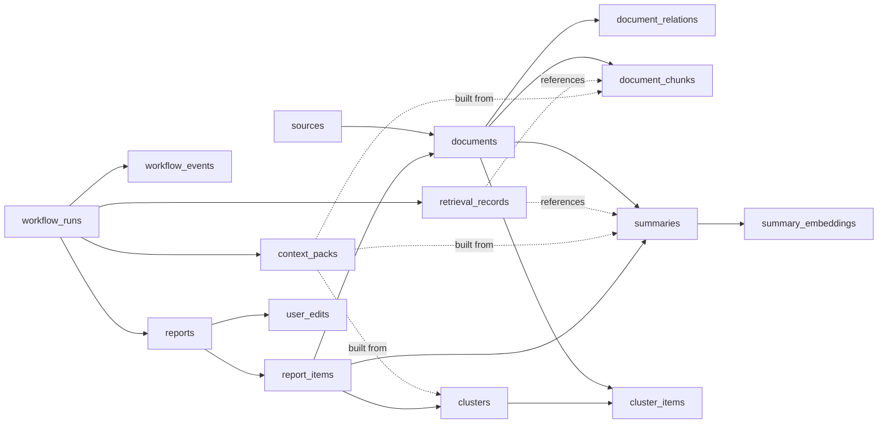
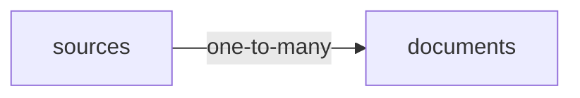
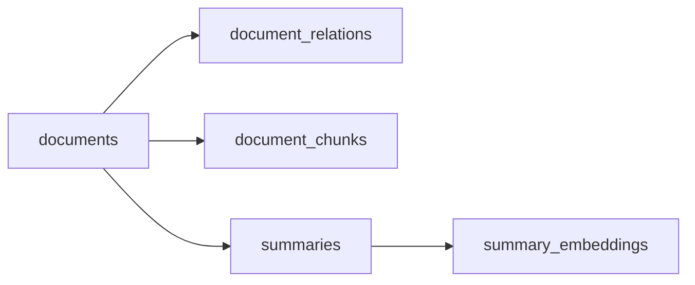
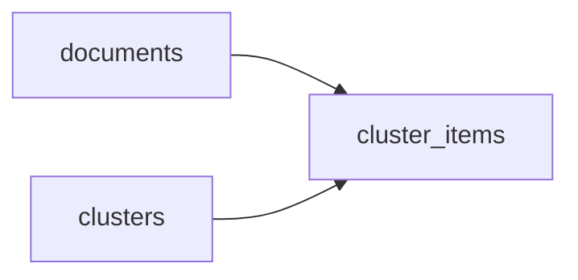
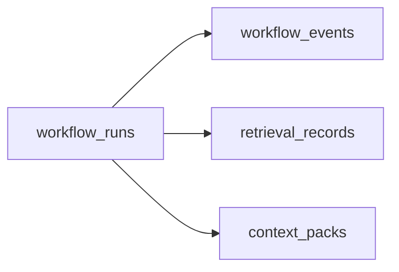
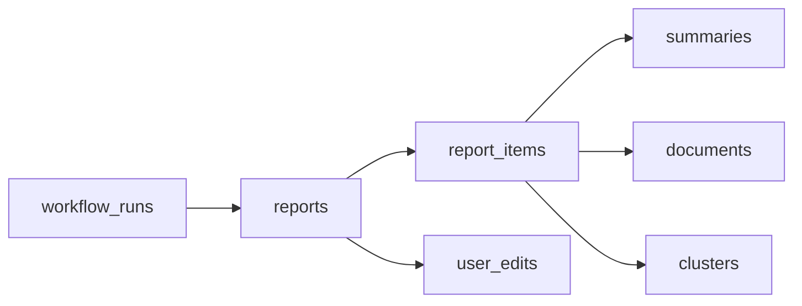
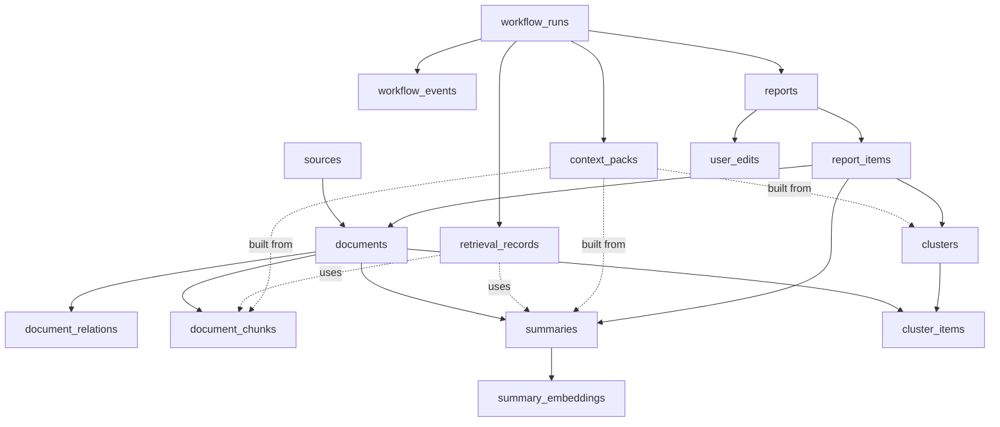

# Insight Flow 数据库表流转关系梳理

## 1. 目的

这份文档专门解释当前数据库 15 张核心表之间的关系和流转。

重点回答：

1. 每张表在系统里扮演什么角色
2. 数据是怎么从一张表流到另一张表的
3. 哪些表是“业务资产”，哪些表是“执行记录”，哪些表是“输出结果”

---

## 2. 表分类

当前数据库里的 15 张核心表可以先分成五组。

| 分组 | 表 |
| --- | --- |
| 来源与原始内容 | `sources`, `documents` |
| 内容结构化与检索 | `document_relations`, `document_chunks`, `summaries`, `summary_embeddings` |
| 事件聚合 | `clusters`, `cluster_items` |
| 工作流与追踪 | `workflow_runs`, `workflow_events`, `retrieval_records`, `context_packs` |
| 输出与人工编辑 | `reports`, `report_items`, `user_edits` |

底层逻辑：

- 先有来源和原始内容
- 再有结构化分析与检索材料
- 再把多篇内容组织成事件
- 再由 workflow 记录执行过程
- 最后落成报告与人工编辑记录

---

## 3. 总体流转图

---

## 4. 第一层：来源与原始内容

## 4.1 `sources`

职责：

- 定义“内容来自哪里”

典型内容：

- RSS source
- 后续也可以扩展为其他来源

关键意义：

- 这是“上游入口配置”
- 它本身不是内容，只是内容入口

## 4.2 `documents`

职责：

- 表示系统摄入后的原始内容资产

它是全系统最核心的中心表之一。

因为：

- 后续摘要来自它
- 去重关系围绕它
- chunk 围绕它
- 报告引用也最终回到它

### 第一层流转图

流转逻辑：

1. 先定义 `source`
2. 从 source 抓到内容
3. 每篇内容落成一条 `document`

如果是直接 URL 导入或手动文本导入：

- `document` 也可以存在
- 只是 `source_id` 可以为空

---

## 5. 第二层：内容结构化与检索材料

这一层的目标是把原始文档变成可分析、可去重、可检索、可引用的结构化资产。

## 5.1 `document_relations`

职责：

- 记录文档和文档之间的关系

主要关系类型：

- `supporting_source`
- `near_duplicate`

底层意义：

- 系统不能只保存孤立文章
- 还要显式表达“这几篇其实在讲同一件事”或“这篇是那篇的补充来源”

## 5.2 `document_chunks`

职责：

- 把 `document.cleaned_content` 切成多个 chunk
- 为 chunk 存 embedding

底层意义：

- 用于更细粒度的原文召回
- 这是证据回填的基础

## 5.3 `summaries`

职责：

- 保存模型对单篇文档的结构化分析结果

保存的不是一段自由文本，而是：

- 摘要
- 关键观点
- 标签
- 分类
- 双语术语
- prompt/version/model 信息

底层意义：

- 这是后续高层检索和报告草稿生成的主输入

## 5.4 `summary_embeddings`

职责：

- 为 `summaries` 保存向量

底层意义：

- Summary 向量适合做粗粒度语义检索
- Chunk 向量适合做细粒度证据回填

### 第二层流转图

核心流转逻辑：

1. `document` 经过清洗和质量判断
2. 进入语义去重
3. 产生 `document_relations`
4. 产生 `summary`
5. 产生 `summary_embedding`
6. 同时把正文切块生成 `document_chunks`

---

## 6. 第三层：事件聚合

## 6.1 `clusters`

职责：

- 表示一组相关内容聚合出的“事件”

它不是单篇文章，而是一个时间窗内的主题或事件单元。

例如：

- 某个模型版本发布
- 某个 AI Coding 产品新能力上线

## 6.2 `cluster_items`

职责：

- 把具体文档挂到事件簇上

底层意义：

- 一份周报不应该以“文章”为最小组织单位
- 更合理的是以“事件”或“主题”为单位

### 第三层流转图

核心流转逻辑：

1. 系统从本周文档中识别相近内容
2. 构建 `cluster`
3. 用 `cluster_items` 把文档和事件关联起来

---

## 7. 第四层：工作流与执行追踪

这一层不是业务内容本身，而是“系统怎么跑出来这些内容”的记录。

## 7.1 `workflow_runs`

职责：

- 表示一次完整 workflow 执行

例如：

- 一次周报生成任务

它保存：

- workflow 类型
- 状态
- 周报时间窗
- graph state 快照
- 重试计数

## 7.2 `workflow_events`

职责：

- 表示工作流每个节点的一次执行事件

例如：

- `retrieve_history`
- `draft_weekly_report`
- `review_evidence`

底层意义：

- 问题排查不能只看最终成败
- 必须能看到每一步怎么跑的

## 7.3 `retrieval_records`

职责：

- 记录一次检索行为

保存：

- query
- 过滤条件
- 命中的 summary ids
- 命中的 chunk ids
- 打分快照

## 7.4 `context_packs`

职责：

- 记录一次上下文构建结果

底层意义：

- 后续如果要解释“这份草稿为什么这么写”，就要能回看当时喂给模型的 context pack

### 第四层流转图

---

## 8. 第五层：输出与人工编辑

## 8.1 `reports`

职责：

- 表示生成出来的正式报告对象

它保存：

- 标题
- 时间窗
- Markdown 正文
- 版本
- 当前状态
- 由哪个 workflow run 生成

## 8.2 `report_items`

职责：

- 表示报告中的具体条目，以及它引用的材料

它会显式连接：

- `report`
- `summary`
- `document`
- `cluster`

底层意义：

- 报告中的每一条内容都应该可回到原始材料

## 8.3 `user_edits`

职责：

- 保存人工编辑行为

底层意义：

- Report 不是一生成就结束
- 人工编辑是系统闭环的一部分
- 编辑记录本身也是研究资产

### 第五层流转图

---

## 9. 完整分层流转

---

## 10. 用一句话理解每组表

可以这样记：

- `sources`
  内容入口定义
- `documents`
  原始内容资产
- `document_relations`
  文档之间的语义关系
- `document_chunks`
  正文证据切片
- `summaries`
  单篇内容结构化分析
- `summary_embeddings`
  摘要级语义检索向量
- `clusters`
  事件/主题聚合结果
- `cluster_items`
  事件与文档的挂接关系
- `workflow_runs`
  一次完整任务执行
- `workflow_events`
  每个节点的执行事件
- `retrieval_records`
  每次 RAG 检索的命中记录
- `context_packs`
  最终上下文包
- `reports`
  产出的正式报告
- `report_items`
  报告中的引用条目
- `user_edits`
  人工修改痕迹

---

## 11. 当前设计的核心特点

这个 schema 最重要的特点不是“表多”，而是职责分层比较清楚：

1. 内容资产和执行记录分开
2. 粗粒度语义检索和细粒度证据回填分开
3. 事件组织和最终报告分开
4. AI 生成结果和人工修改记录分开

这使得后续系统能同时满足：

- 可检索
- 可追溯
- 可复盘
- 可编辑

---

## 12. 下一步会让这些表真正跑起来的模块

当前表已经建好，但还没有全部进入真实业务流转。

接下来模块 03 会首先让下面这些表开始“活起来”：

- `sources`
- `documents`
- `document_relations`
- `document_chunks`
- `summaries`
- `summary_embeddings`

模块 04 则会让下面这些表开始进入闭环：

- `clusters`
- `workflow_runs`
- `workflow_events`
- `retrieval_records`
- `context_packs`
- `reports`
- `report_items`
- `user_edits`
