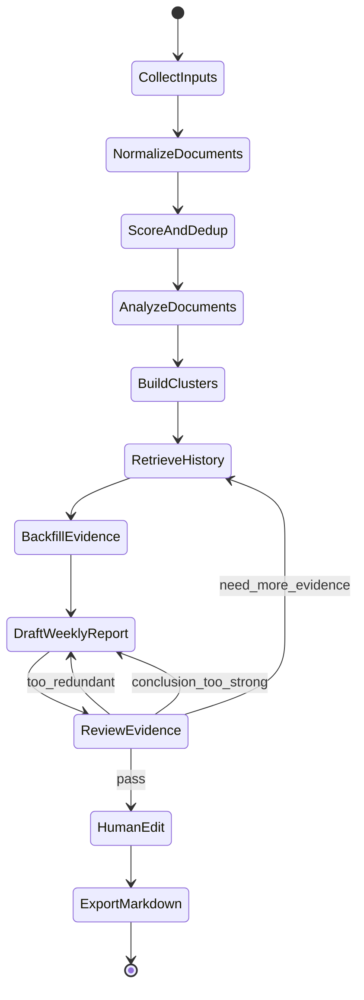
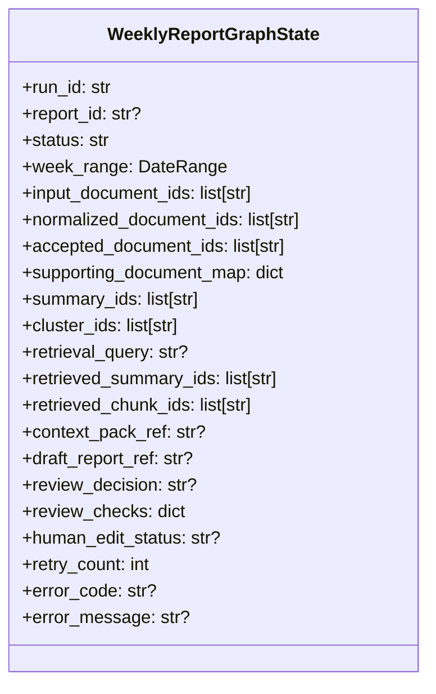
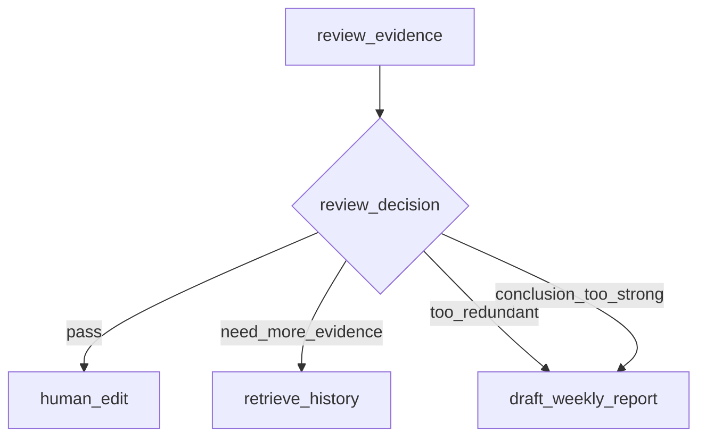
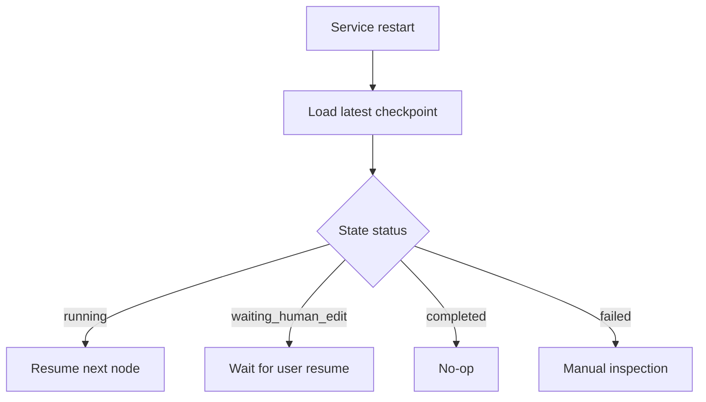
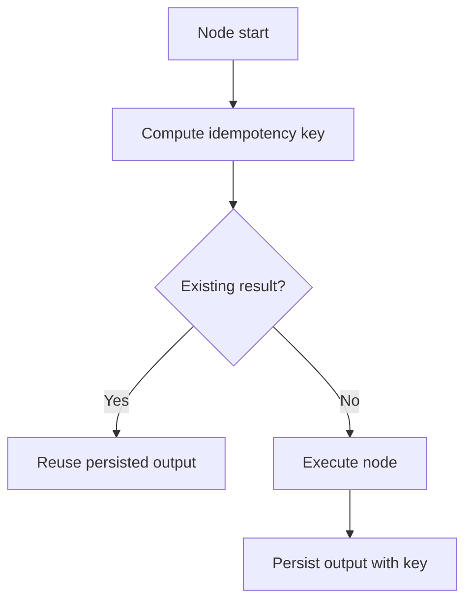
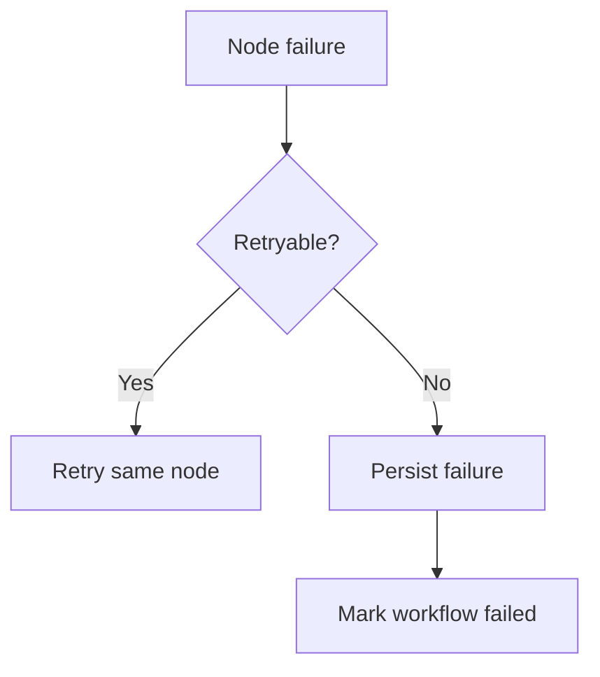
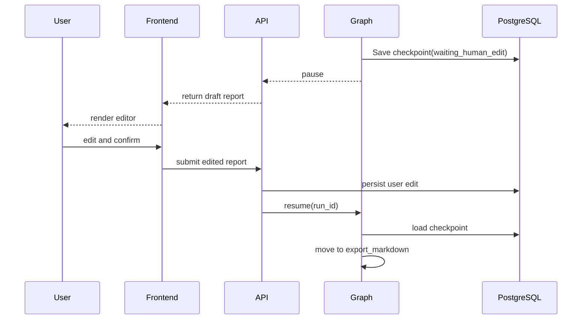

# Insight Flow LangGraph 详细设计

## 1. 文档目标

本文档用于定义 Insight Flow MVP 中 LangGraph workflow 的详细设计，覆盖：

- graph 的职责边界
- state schema
- 节点输入输出协议
- 条件路由规则
- checkpoint 与恢复策略
- 幂等性要求
- 错误处理与人工中断机制

这份文档的目标不是介绍 LangGraph，而是直接作为实现依据。

---

## 2. 设计目标

MVP 中的 LangGraph workflow 需要解决的，不是“让模型自动决定一切”，而是：

1. 将周报生成流程状态化
2. 让历史检索、生成、审查、人工编辑构成可追踪闭环
3. 让 `human_edit` 中断在服务重启后仍可恢复
4. 让高成本节点具备幂等与复用能力

因此，这个 graph 的定位是：

> 一个围绕 Weekly Report 任务构建的、显式状态驱动的研究工作流状态机。

---

## 3. Graph 边界

## 3.1 Graph 负责什么

LangGraph 负责：

- 驱动 Weekly Report 的完整流程
- 管理状态对象
- 编排节点执行顺序
- 记录 checkpoint
- 根据 Reviewer 输出决定是否回退
- 在人工编辑节点中断和恢复

## 3.2 Graph 不负责什么

LangGraph 不负责：

- RSS 周期调度
- URL 抓取本身
- 具体的 LLM provider 实现
- 前端编辑器逻辑
- 数据库底层 CRUD 细节

这些能力由 graph 调用的 domain service 提供。

---

## 4. Graph 总览

## 4.1 主图



## 4.2 节点顺序说明

### 主线

`CollectInputs -> NormalizeDocuments -> ScoreAndDedup -> AnalyzeDocuments -> BuildClusters -> RetrieveHistory -> BackfillEvidence -> DraftWeeklyReport -> ReviewEvidence -> HumanEdit -> ExportMarkdown`

### 回路

- `ReviewEvidence -> RetrieveHistory`
  当证据不足，需要补充历史材料

- `ReviewEvidence -> DraftWeeklyReport`
  当内容过于重复或结论过强，需要基于已有上下文重写草稿

---

## 5. Graph State 设计

## 5.1 设计原则

Graph state 必须满足：

- 可序列化到数据库 checkpoint
- 不直接承载大文本正文，尽量通过 ID / ref 关联
- 区分“任务状态”和“业务对象状态”
- 保证节点之间输入输出边界清晰

## 5.2 State 结构总览



## 5.3 推荐 State Schema

```json
{
  "run_id": "wr_2026_04_15_001",
  "report_id": null,
  "status": "running",
  "week_range": {
    "start": "2026-04-08",
    "end": "2026-04-14"
  },
  "input_document_ids": [],
  "normalized_document_ids": [],
  "accepted_document_ids": [],
  "supporting_document_map": {},
  "summary_ids": [],
  "cluster_ids": [],
  "retrieval_query": null,
  "retrieved_summary_ids": [],
  "retrieved_chunk_ids": [],
  "context_pack_ref": null,
  "draft_report_ref": null,
  "review_decision": null,
  "review_checks": {},
  "human_edit_status": null,
  "retry_count": 0,
  "error_code": null,
  "error_message": null
}
```

## 5.4 字段说明

### `run_id`

- workflow 唯一 ID
- 与 `workflow_runs.id` 一致

### `report_id`

- 草稿 report 的业务 ID
- 在 `draft_weekly_report` 后生成

### `input_document_ids`

- 本次周报任务的候选文档 ID

### `normalized_document_ids`

- 经过标准化并可用的文档 ID

### `accepted_document_ids`

- 通过质量评分和语义去重后，保留为主内容的文档 ID

### `supporting_document_map`

- 记录 supporting source 与主文档的归并关系
- 结构示例：
  `{primary_doc_id: [supporting_doc_id_1, supporting_doc_id_2]}`

### `summary_ids`

- 与 `accepted_document_ids` 对应的结构化分析结果 ID

### `cluster_ids`

- 本次周报输入使用的事件簇 ID

### `retrieval_query`

- 本轮检索使用的 query 文本或 query snapshot

### `retrieved_summary_ids`

- 召回的历史 summary ID

### `retrieved_chunk_ids`

- 回填的原文 chunk ID

### `context_pack_ref`

- 指向 context pack 的持久化对象
- 不直接把大文本塞进 state

### `draft_report_ref`

- 指向周报草稿内容的 ref

### `review_decision`

- `pass | need_more_evidence | too_redundant | conclusion_too_strong`

### `review_checks`

- Reviewer 的结构化判据输出

### `human_edit_status`

- `waiting | resumed | approved`

### `retry_count`

- 当前 run 的审查回路次数

---

## 6. 节点协议设计

## 6.1 节点设计原则

每个节点都必须满足：

- 输入只依赖 state 和 domain service
- 输出通过 state patch 回写
- 失败时返回统一错误结构
- 尽量不在节点内写复杂业务逻辑，调用 service 完成

## 6.2 节点清单


## 6.3 节点详细定义

### `collect_inputs`

目标：

- 读取本周候选文档集合

输入：

- `week_range`

输出 patch：

```json
{
  "input_document_ids": ["doc_1", "doc_2", "doc_3"]
}
```

失败条件：

- 周期范围无效
- 文档查询失败

幂等规则：

- 相同 `week_range + run_type` 下重复执行可重复返回同一集合

---

### `normalize_documents`

目标：

- 确保候选文档具有可用的标准化内容

输入：

- `input_document_ids`

输出 patch：

```json
{
  "normalized_document_ids": ["doc_1", "doc_2"]
}
```

失败条件：

- 文档不存在
- 正文抽取失败且 fallback 也失败

幂等规则：

- 已存在 `cleaned_content` 且版本未变化时直接复用

---

### `score_and_dedup`

目标：

- 筛掉低质量内容
- 识别近重复内容并归并 supporting sources

输入：

- `normalized_document_ids`

输出 patch：

```json
{
  "accepted_document_ids": ["doc_1", "doc_5"],
  "supporting_document_map": {
    "doc_1": ["doc_2", "doc_3"]
  }
}
```

路由风险：

- 如果 `accepted_document_ids` 为空，应直接标记 workflow failed

幂等规则：

- 基于 `document.hash + quality_score + similarity_result` 复用结果

---

### `analyze_documents`

目标：

- 为保留文档生成结构化摘要、标签、分类、观点、双语术语

输入：

- `accepted_document_ids`

输出 patch：

```json
{
  "summary_ids": ["sum_1", "sum_5"]
}
```

失败条件：

- 结构化输出不符合 schema
- 文档分析模型调用失败

幂等规则：

- 若对应 `document_id + prompt_version + model_version` 的 summary 已存在，则复用

---

### `build_clusters`

目标：

- 将本周文档聚合为事件簇，作为周报输入

输入：

- `summary_ids`

输出 patch：

```json
{
  "cluster_ids": ["cluster_a", "cluster_b"]
}
```

说明：

- 这里的 cluster 是 MVP 轻量事件簇，不是复杂主题知识图谱

幂等规则：

- 基于 `summary_ids` 的稳定快照复用 cluster 结果

---

### `retrieve_history`

目标：

- 基于 cluster 构建 query，召回历史 summary

输入：

- `cluster_ids`
- `retry_count`

输出 patch：

```json
{
  "retrieval_query": "AI coding agent tooling trend in past 4 weeks",
  "retrieved_summary_ids": ["sum_hist_1", "sum_hist_2"]
}
```

幂等规则：

- 对同一 `cluster snapshot + retrieval config` 可复用 retrieval result

---

### `backfill_evidence`

目标：

- 依据召回 summary 反查原始 chunk 和 source

输入：

- `retrieved_summary_ids`

输出 patch：

```json
{
  "retrieved_chunk_ids": ["chunk_1", "chunk_9"],
  "context_pack_ref": "ctxpack_20260415_01"
}
```

幂等规则：

- 对相同 `retrieved_summary_ids` 可复用 context pack

---

### `draft_weekly_report`

目标：

- 生成周报草稿并写入 `reports`

输入：

- `cluster_ids`
- `context_pack_ref`

输出 patch：

```json
{
  "report_id": "report_001",
  "draft_report_ref": "report_draft_001"
}
```

幂等规则：

- 相同 `cluster snapshot + context pack + prompt_version` 不重复生成新草稿，可复用已有 draft version

---

### `review_evidence`

目标：

- 对草稿进行结构化审查并给出路由决策

输入：

- `draft_report_ref`
- `context_pack_ref`

输出 patch：

```json
{
  "review_decision": "need_more_evidence",
  "review_checks": {
    "numeric_support_present": false,
    "source_diversity_sufficient": false,
    "language_overclaim": true,
    "evidence_traceable": true
  },
  "retry_count": 1
}
```

幂等规则：

- 对同一草稿版本与同一 reviewer config，结果可复用

---

### `human_edit`

目标：

- 中断 graph，等待用户修订

输入：

- `report_id`

输出 patch：

```json
{
  "human_edit_status": "waiting"
}
```

恢复后输出 patch：

```json
{
  "human_edit_status": "approved"
}
```

说明：

- 该节点不是自动执行结束，而是需要人工 resume

---

### `export_markdown`

目标：

- 导出 Markdown 并完成 workflow

输入：

- `report_id`
- `human_edit_status = approved`

输出 patch：

```json
{
  "status": "completed"
}
```

---

## 7. 条件路由设计

## 7.1 路由图



## 7.2 路由规则

### `pass`

- 草稿质量满足要求
- 进入人工编辑

### `need_more_evidence`

- 当前上下文不足
- 返回 `retrieve_history`
- `retry_count + 1`

### `too_redundant`

- 证据够，但结构重复或来源过度集中
- 不补检索，直接基于现有上下文重写

### `conclusion_too_strong`

- 证据可追溯，但草稿措辞过强
- 不补检索，直接重写草稿

## 7.3 最大回路限制

MVP 必须限制 reviewer 回路次数，防止 workflow 死循环。

建议：

- `max_retry_count = 2`

超过阈值后：

- 将 workflow 状态标记为 `needs_manual_intervention`
- 直接交给人工编辑处理

---

## 8. Checkpoint 与恢复策略

## 8.1 Checkpoint 存储

MVP 正式环境统一采用：

- `LangGraph PostgresSaver`

开发环境可采用：

- `SqliteSaver`

## 8.2 Checkpoint 时机

必须在以下时机落 checkpoint：

1. graph 启动后
2. 每个成功节点后
3. 进入 `human_edit` 前
4. 人工恢复后
5. graph 完成后

## 8.3 恢复图



## 8.4 `human_edit` 恢复机制

建议实现方式：

1. graph 进入 `human_edit`
2. 保存 checkpoint，并将 `workflow_runs.status = waiting_human_edit`
3. 前端展示草稿
4. 用户编辑并点击确认
5. API 调用 graph resume
6. state 更新为 `human_edit_status = approved`
7. graph 进入 `export_markdown`

---

## 9. 幂等设计

## 9.1 幂等目标

MVP 中高成本节点必须支持“重复执行不重复生成脏数据”。

## 9.2 幂等节点

- `normalize_documents`
- `score_and_dedup`
- `analyze_documents`
- `build_clusters`
- `retrieve_history`
- `backfill_evidence`
- `draft_weekly_report`

## 9.3 幂等策略表

| 节点 | 幂等 key |
| --- | --- |
| normalize_documents | `document_id + raw_hash + parser_version` |
| score_and_dedup | `document_id + cleaned_hash + dedup_config_version` |
| analyze_documents | `document_id + cleaned_hash + analysis_prompt_version + model_version` |
| build_clusters | `sorted(summary_ids) + clustering_version` |
| retrieve_history | `cluster_snapshot + retrieval_config_version` |
| backfill_evidence | `sorted(retrieved_summary_ids) + evidence_config_version` |
| draft_weekly_report | `cluster_snapshot + context_pack_ref + report_prompt_version + model_version` |

## 9.4 幂等图



---

## 10. Checkpoint 状态与数据库映射

## 10.1 映射关系

| Graph State 字段 | DB 对象 |
| --- | --- |
| run_id | workflow_runs.id |
| report_id | reports.id |
| accepted_document_ids | documents.id[] |
| summary_ids | summaries.id[] |
| cluster_ids | clusters.id[] |
| retrieved_summary_ids | retrieval_records.retrieved_summary_ids |
| retrieved_chunk_ids | retrieval_records.retrieved_chunk_ids |
| draft_report_ref | reports.version / storage ref |
| review_checks | workflow_events.output_ref |

## 10.2 事件日志建议

每个节点至少记录：

- `workflow_run_id`
- `node_name`
- `status`
- `started_at`
- `finished_at`
- `idempotency_key`
- `input_snapshot_ref`
- `output_snapshot_ref`

---

## 11. 错误处理设计

## 11.1 节点错误返回结构

建议统一错误结构：

```json
{
  "error_code": "RETRIEVAL_TIMEOUT",
  "error_message": "history retrieval timed out",
  "retryable": true,
  "node_name": "retrieve_history"
}
```

## 11.2 节点失败路由



## 11.3 节点级 retry 建议

- 抓取失败：最多 2 次
- LLM 调用失败：最多 2 次
- 检索失败：最多 2 次
- 结构化解析失败：最多 1 次重试后失败

---

## 12. Human-in-the-loop 设计

## 12.1 人工编辑不是 UI 细节，而是 graph 节点

MVP 中 `human_edit` 是 graph 的正式节点，不是“前端单独处理”。

这意味着：

- graph 必须知道自己停在哪
- graph 必须知道何时 resume
- 编辑结果必须回写到业务对象

## 12.2 人工编辑交互图



---

## 13. 实现建议

## 13.1 Graph Builder

建议将 graph 组装逻辑集中在：

- `workflow/weekly_report_graph.py`

职责：

- 定义 state schema
- 注册节点
- 定义 edge 和 conditional edge
- 配置 saver

## 13.2 Node Service 分层

建议结构：

- `workflow/nodes/*.py`
- `services/ingestion_service.py`
- `services/analysis_service.py`
- `services/retrieval_service.py`
- `services/report_service.py`
- `services/review_service.py`

原则：

- node 负责 graph 协调
- service 负责业务逻辑

## 13.3 Resume API

建议至少提供：

- `POST /workflow-runs/{id}/resume`

该接口负责：

- 校验当前 run 是否处于 `waiting_human_edit`
- 加载 checkpoint
- 恢复执行 graph

---

## 14. MVP 约束与后续演进

## 14.1 MVP 明确不做的 graph 能力

- Planner 节点
- 多 Agent 子图
- 并行 retriever 分支
- 复杂 rerank 子图
- 多轮人机审查循环

## 14.2 为 V1 预留

- 可在 `BuildClusters` 前插入 `Planner`
- `WeeklyReportGraphState` 可扩展为 `TopicObservationGraphState`

## 14.3 为 V2 预留

- `retrieve_history` 可扩展到 report / edit retrieval
- `review_checks` 可接入历史反馈信号

## 14.4 为 V3 预留

- `review_evidence` 可拆为更细的 evidence audit nodes

---

## 15. 结论

Insight Flow MVP 的 LangGraph 不是一个“为了展示 Agent 框架而存在”的 graph，而是一个：

> 以 Weekly Report 任务为中心、显式状态驱动、支持历史召回、结构化审查、人工中断和持久化恢复的 workflow 状态机。

它的关键设计点包括：

1. state 只保存可序列化的业务引用和控制字段
2. 节点通过 state patch 协作，而不是共享隐式上下文
3. Reviewer 决策直接驱动条件路由
4. `human_edit` 是正式节点，不是 UI 旁路
5. checkpoint 与幂等是 MVP 的必须项，不是优化项

这份设计文档应作为后续 Weekly Report graph 实现的直接依据。
