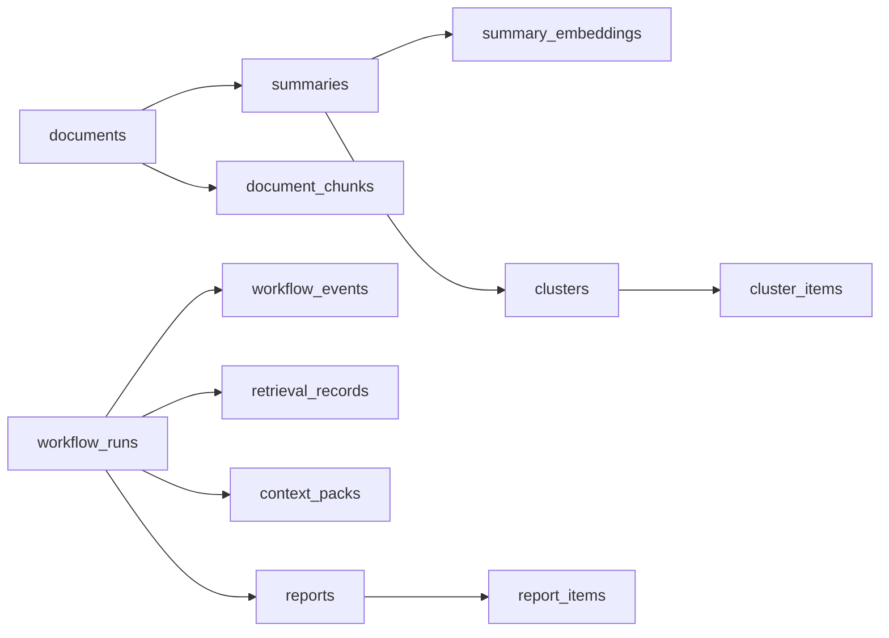
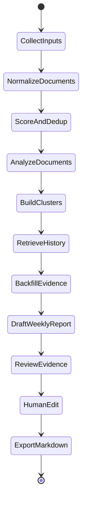
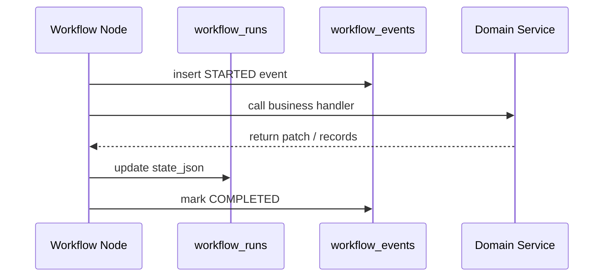
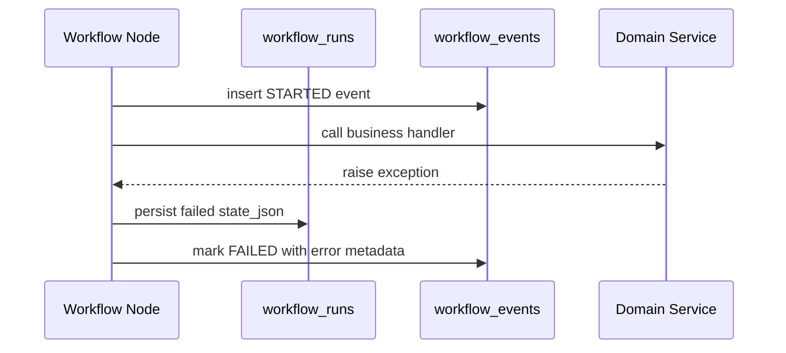

# Insight Flow M04 技术设计细节

## 1. 文档目标

本文档说明模块 04 当前阶段的完整技术设计，覆盖：

- `M04-01 ~ M04-23`
- RAG 服务层
- Weekly Report workflow state
- 核心 workflow 节点
- 执行事件记录与状态持久化
- 幂等性、失败处理与已知边界

本文档聚焦“当前代码已经如何设计和为什么这么设计”，不是泛泛介绍 LangGraph。

---

## 2. 当前范围

模块 04 当前已经落地两层能力：

1. `Service Layer`
   - cluster build
   - retrieval
   - context pack
   - report draft
   - reviewer
   - workflow run / event persistence helpers

2. `Workflow Node Layer`
   - `collect_inputs`
   - `normalize_documents`
   - `score_and_dedup`
   - `analyze_documents`
   - `build_clusters`
   - `retrieve_history`
   - `backfill_evidence`
   - `draft_weekly_report`
   - `review_evidence`
   - `human_edit`
   - `export_markdown`

当前已经补齐 graph 与接口层，剩余未做的是前端对接和模块 06 的更大范围联调。

---

## 3. 模块定位

M04 的目标不是单纯把已有 service 串起来，而是把周报生成变成一条可恢复、可审计、可回放的状态化工作流。

因此它解决的核心问题是：

1. 如何把“文档处理”升级为“周报工作流”
2. 如何把 RAG 的上下文选择过程留下证据
3. 如何把节点执行留痕到数据库
4. 如何让后续 LangGraph 集成不需要推翻现有实现

---

## 4. 分层架构

```mermaid
flowchart TD
    A[Document / Summary / Chunk Tables] --> B[Service Layer]
    B --> C[Workflow Node Layer]
    C --> D[WorkflowRun.state_json]
    C --> E[WorkflowEvent Records]
    C --> I[LangGraph Compiled Graph]
    B --> F[RetrievalRecord]
    B --> G[ContextPack]
    B --> H[Report / ReportItem]

    subgraph Service Layer
        B1[cluster_service]
        B2[retrieval_service]
        B3[context_pack_service]
        B4[report_draft_service]
        B5[reviewer_service]
        B6[workflow_service]
    end

    subgraph Workflow Node Layer
        C1[collect_inputs]
        C2[normalize_documents]
        C3[score_and_dedup]
        C4[analyze_documents]
        C5[build_clusters]
        C6[retrieve_history]
        C7[backfill_evidence]
        C8[draft_weekly_report]
        C9[review_evidence]
        C10[human_edit]
        C11[export_markdown]
    end

    subgraph API Layer
        I1[POST /workflows/weekly-report/run]
        I2[POST /workflows/{run_id}/resume]
    end
```

### 4.1 分层原则

- `Service Layer` 负责具体业务动作和数据库写入
- `Workflow Node Layer` 负责状态迁移、节点边界、事件记录和失败处理
- `WorkflowRun.state_json` 负责保存当前 workflow 的紧凑状态
- `WorkflowEvent` 负责记录每个节点的执行轨迹

这样做的好处是：

- 业务逻辑和 orchestration 逻辑分离
- 以后接入 LangGraph 时，只需要把节点函数注册进 graph
- 现阶段就已经有接近生产可追溯性的执行记录

---

## 5. 核心数据对象



### 5.1 `workflow_runs`

作用：

- 持久化一轮 weekly report workflow 的全局状态

关键字段：

- `workflow_type`
- `status`
- `week_start / week_end`
- `state_json`
- `retry_count`
- `started_at / finished_at`

### 5.2 `workflow_events`

作用：

- 记录每个节点何时开始、是否成功、是否失败

关键字段：

- `node_name`
- `status`
- `idempotency_key`
- `input_snapshot_ref`
- `output_snapshot_ref`
- `error_code / error_message`

### 5.3 `retrieval_records`

作用：

- 保留一次历史检索的 query、过滤条件、命中结果与分数快照

### 5.4 `context_packs`

作用：

- 固化一次 draft step 实际拿到的上下文包

---

## 6. 服务层设计

## 6.1 `cluster_service`

职责：

- 从当前周的 `accepted + primary` 文档构建事件簇

实现要点：

- 使用 `category + first_tag` 做 MVP 聚类键
- 重建同一时间窗时先删旧 cluster，再建新 cluster
- 输出 `clusters / cluster_items`

## 6.2 `retrieval_service`

职责：

- 先召回历史 summary，再回填原始 evidence chunk

实现策略：

1. 将 cluster summary 拼成 query text
2. 对历史 `summary_embeddings` 做相似度排序
3. 取 top summaries
4. 读取对应 document 的 `document_chunks`
5. 再做 chunk 级排序
6. 输出 `RetrievalRecord`

设计重点：

- summary 负责 recall
- chunk 负责 evidence fidelity

## 6.3 `context_pack_service`

职责：

- 把本轮 draft 真正要用的上下文组装成一份持久化 payload

上下文组成：

- current clusters
- retrieved historical summaries
- evidence chunks

## 6.4 `report_draft_service`

职责：

- 将 cluster 和历史上下文渲染成周报 Markdown
- 同时建立 `report_items`

设计重点：

- `Report` 是产物实体
- `ReportItem` 是引用链实体
- 每条 item 都能回溯到 `summary / document / cluster`

## 6.5 `reviewer_service`

职责：

- 用结构化判据审查草稿是否有证据支撑

当前判据：

- `numeric_support_present`
- `source_diversity_sufficient`
- `evidence_traceable`
- `language_overclaim`

---

## 7. Workflow State 设计

当前代码位于：

- [backend/app/workflows/weekly_report/state.py](/Users/sz/Code/insight-flow/backend/app/workflows/weekly_report/state.py)

### 7.1 状态字段

| 字段 | 含义 |
| --- | --- |
| `run_id` | 对应 `workflow_runs.id` |
| `status` | 当前节点或 workflow 状态 |
| `week_range` | 本轮周报的时间窗 |
| `input_document_ids` | 候选文档 |
| `normalized_document_ids` | 标准化成功的文档 |
| `accepted_document_ids` | 通过质量评分并保留为 primary 的文档 |
| `supporting_document_map` | supporting source 归并结果 |
| `summary_ids` | 分析产出的 summary |
| `cluster_ids` | 本轮生成的 cluster |
| `retrieved_summary_ids` | 历史 summary 命中结果 |
| `retrieved_chunk_ids` | evidence chunk 命中结果 |
| `context_pack_ref` | context pack 持久化引用 |
| `report_id` | 草稿 report 标识 |
| `review_decision` | reviewer 决策 |
| `review_checks` | reviewer 结构化判据 |
| `retry_count` | 审查回路重试次数 |
| `error_code / error_message` | 最近一次失败信息 |

### 7.2 设计原则

- JSON-friendly
- 不直接保存大文本
- 节点之间只通过紧凑状态通信
- 复杂对象统一走数据库引用

---

## 8. Workflow 节点设计

当前代码位于：

- [backend/app/workflows/weekly_report/nodes.py](/Users/sz/Code/insight-flow/backend/app/workflows/weekly_report/nodes.py)

## 8.1 节点执行包装器

核心入口：

- `_execute_node(...)`

职责：

1. 读取 `workflow_run`
2. 创建 `workflow_event(started)`
3. 调用具体 handler
4. 合并 state patch
5. 持久化 `workflow_runs.state_json`
6. 完成 `workflow_event(completed)`
7. 如果异常则写 `workflow_event(failed)` 和 workflow error state

## 8.2 `collect_inputs`

职责：

- 根据 `week_range` 收集当前周候选文档

当前实现：

- 如果 state 已显式给了 `input_document_ids`，直接沿用
- 否则按时间窗查询 `documents`

## 8.3 `normalize_documents`

职责：

- 对候选文档执行标准化

当前实现：

- 已标准化且存在 `cleaned_content` 的文档直接跳过重算
- 否则调用 `fetch_and_normalize_document`
- 单条文档失败不会让整条 workflow 失败
- 失败文档会被标记为 `DocumentStatus.FAILED`

## 8.4 `score_and_dedup`

职责：

- 质量评分
- 语义去重
- supporting source 归并

当前输出：

- `accepted_document_ids`
- `supporting_document_map`

## 8.5 `analyze_documents`

职责：

- 产出 `Summary`
- 重建 `DocumentChunk`
- 写入 `SummaryEmbedding`

设计重点：

- 节点没有复用 `process_document_pipeline`
- 而是显式逐步执行

## 8.6 `build_clusters`

职责：

- 按当前周窗口构建事件簇

当前实现：

- 直接调用 `build_weekly_clusters`
- 产出 `cluster_ids`

## 8.7 `retrieve_history`

职责：

- 基于当前 cluster 集合召回历史 summary 和 evidence chunk

当前实现：

- 直接调用 `retrieve_history_for_clusters`
- 回写：
  - `retrieval_query`
  - `retrieved_summary_ids`
  - `retrieved_chunk_ids`

## 8.8 `backfill_evidence`

职责：

- 将最近一次 retrieval 结果组装成持久化 context pack

当前实现：

- 从数据库读取最新 `RetrievalRecord`
- 调用 `build_context_pack`
- 回写 `context_pack_ref`

## 8.9 `draft_weekly_report`

职责：

- 基于 cluster + context pack 生成草稿 report

当前实现：

- 读取 `context_pack_ref`
- 调用 `draft_weekly_report`
- 回写：
  - `report_id`
  - `draft_report_ref`

## 8.10 `review_evidence`

职责：

- 审查草稿的证据支撑是否充分

当前实现：

- 读取 `report_id` 和 `context_pack_ref`
- 调用 `review_report_evidence`
- 回写：
  - `review_decision`
  - `review_checks`
  - `retry_count`

## 8.11 `human_edit`

职责：

- 在自动 draft/review 完成后，为人工修订保留一个显式停靠点

当前实现：

- 读取 `report_id`
- 调用 `mark_report_editing`
- 将 workflow 状态设置为 `waiting_human_edit`
- 回写 `human_edit_status = waiting`

## 8.12 `export_markdown`

职责：

- 将最终报告 Markdown 导出到本地文件系统

当前实现：

- 读取 `report_id`
- 调用 `export_report_markdown`
- 回写：
  - `exported_markdown_path`
  - `human_edit_status = approved`
- 将 workflow 状态切到 `completed`

## 8.13 Graph Assembly

当前代码位于：

- [backend/app/workflows/weekly_report/graph.py](/Users/sz/Code/insight-flow/backend/app/workflows/weekly_report/graph.py)

实现内容：

- 使用 `StateGraph(WeeklyReportGraphState)` 组装完整图
- 配置 review 条件路由：
  - `need_more_evidence -> retrieve_history`
  - `too_redundant / conclusion_too_strong -> draft_weekly_report`
  - 默认 `-> human_edit`
- 配置 `interrupt_after=["human_edit"]`
- 提供：
  - memory checkpointer 版本
  - PostgresSaver 版本

## 8.14 Workflow APIs

当前代码位于：

- [backend/app/api/routes/workflow.py](/Users/sz/Code/insight-flow/backend/app/api/routes/workflow.py)

实现内容：

- `POST /workflows/weekly-report/run`
  - 创建 workflow run
  - 构造 initial state
  - 调用 graph 到 `human_edit`
- `POST /workflows/{workflow_run_id}/resume`
  - 基于 `thread_id` 从 checkpoint 恢复
  - 继续执行到 `export_markdown`

---

## 9. 当前节点序列



---

## 10. 节点执行留痕



失败时：



---

## 11. 幂等性策略

### 11.1 `normalize_documents`

- 已有 `cleaned_content` 且状态为 `normalized` 时直接复用

### 11.2 `analyze_documents`

- `Summary` 使用 upsert
- `DocumentChunk` 使用 rebuild
- `SummaryEmbedding` 使用 upsert

### 11.3 `build_clusters`

- 同一时间窗会先删旧 cluster，再重建

### 11.4 `workflow_events`

- 已写 `idempotency_key = {workflow_run_id}:{node_name}`
- 当前主要用于追踪

---

## 12. 失败处理策略

### 12.1 节点级失败

- `_execute_node` 统一捕获异常
- 回写：
  - `workflow_runs.status = failed`
  - `state.error_code`
  - `state.error_message`
  - `workflow_events.status = failed`

### 12.2 文档级失败

当前只在 `normalize_documents` 中做了更细粒度处理：

- 单条文档失败 => 标记文档 `failed`
- workflow 继续执行

---

## 13. 已验证的真实问题

当前 M04 已经通过真实联调暴露并修复了 3 个问题：

1. `pgvector` 数组不能直接做真值判断
2. `numpy.float32` 不能直接写入 JSONB
3. 单条 URL 抓取失败会让 `normalize_documents` 整体失败

---

## 14. 当前边界与后续工作

当前模块 04 本身已完成，后续工作转移到：

下一步直接承接的任务是：

- `M04-19 ~ M04-23`
其实这些现在也已经完成，后续应转入模块 05 与模块 06。

---

## 15. 结论

M04 当前已经形成了一个清晰的演进路径：

- 先把周报核心服务独立成立
- 再把核心 workflow 节点状态化
- 同时把执行留痕、失败留痕、状态持久化做进去

这样后续做前端和更大范围联调时，不需要再重写业务层或 workflow 主干。
