# Insight Flow MVP 技术方案

## 1. 文档目标

本文档定义 Insight Flow MVP 的技术实现方案，覆盖以下内容：

- MVP 的技术目标
- 整体架构与模块边界
- 技术选型与取舍理由
- 核心数据流与 workflow 设计
- 数据存储与索引方案
- 非功能要求与演进方向

本文档服务于 MVP 落地，不讨论 V1 之后的完整平台化设计，但会明确保留必要的演进空间。

---

## 2. 方案目标

MVP 的技术方案需要同时满足四个目标：

1. 支撑固定垂直场景：AI / AI Coding / 科技动态跟踪
2. 跑通资产沉淀 + 周报生成的完整闭环
3. 让 `RAG`、`LangGraph`、`Reviewer` 在 MVP 中各有明确职责
4. 保持系统足够简单，避免在第一版引入过多基础设施复杂度

同时必须正面处理三类真实问题：

5. AI 领域高噪音输入下的语义重复与低质量内容
6. 长周期 RAG 中“摘要的摘要”造成的信息衰减
7. `human_edit` 中断场景下的 workflow 持久化恢复

因此，这份方案的核心原则是：

> 以单体系统 + 明确模块边界为主，以 workflow 和数据资产为核心，而不是以分布式拆分为目标。

---

## 3. 总体架构

## 3.1 系统上下文图

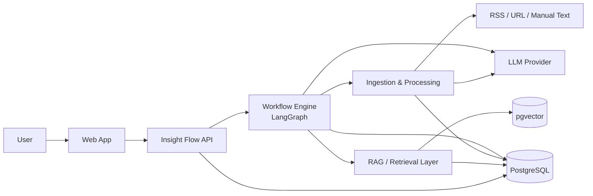

## 3.2 MVP 架构结论

MVP 建议采用：

- `单仓`
- `前后端分离但同一项目管理`
- `单体后端`
- `PostgreSQL + pgvector`
- `LangGraph 作为 workflow 内核`
- `异步任务采用应用内 job runner，不引入复杂消息系统`

这是因为 MVP 的重点是：

- 数据资产
- workflow 可追踪
- 生成与检索闭环

而不是高并发或复杂微服务治理。

---

## 4. 技术选型

## 4.1 选型总览

| 层 | 选型 | 理由 |
| --- | --- | --- |
| 前端 | Next.js + React + TypeScript | 适合快速做工作台式 UI，后续扩展空间好 |
| 后端 API | FastAPI | Python 生态成熟，适合 AI 工作流和结构化 API |
| Workflow | LangGraph | MVP 需要显式状态、条件分支、人工介入 |
| LLM 接入 | Provider abstraction | 便于切换 OpenAI / Anthropic |
| 内容抓取 | httpx + feedparser + trafilatura | RSS、网页正文抽取都是成熟组合 |
| 抓取回退 | Jina Reader 或 Firecrawl | 作为复杂网页和动态页面的 fallback |
| 数据库 | PostgreSQL | 结构化资产、任务状态、编辑记录都适合关系型存储 |
| 向量检索 | pgvector | MVP 阶段直接与 PostgreSQL 集成，减少基础设施复杂度 |
| ORM / DB Layer | SQLAlchemy + Alembic | 数据模型清晰，迁移可控 |
| 后台任务 | 应用内异步 job runner + DB task table | MVP 不急着引入 Celery / Redis |
| 对象存储 | 本地文件或后续 S3 兼容 | MVP 先不引入复杂对象存储依赖 |
| 认证 | 单用户或极简 auth | MVP 不做多用户权限系统 |
| 可观测性 | Structured logging + task trace + DB records | 先满足可追踪和可复盘 |

## 4.2 为什么后端选 Python

MVP 后端建议使用 Python，原因是：

- LangGraph / LLM / RAG 生态最成熟
- 内容抓取、清洗、结构化输出工具链完整
- 对 AI workflow 的表达最直接
- 后续做检索、审查、节点编排成本更低

## 4.2.1 为什么抓取层需要 fallback

仅靠 `httpx + trafilatura` 对 AI 领域内容抓取并不稳妥。很多高价值内容来自：

- Substack
- 动态加载页面
- 富文本发布页
- 对 crawler 不友好的站点

因此抓取层建议采用两级策略：

1. 默认路径：`httpx + trafilatura`
2. 回退路径：`Jina Reader` 或 `Firecrawl`

触发回退的条件包括：

- 本地抽取失败
- 正文长度低于阈值
- 正文疑似仅包含导航、广告或壳内容

## 4.3 为什么数据库选 PostgreSQL + pgvector

MVP 不建议从一开始拆成：

- PostgreSQL 存业务数据
- 外部向量库存 embedding

原因是这会过早引入双存储复杂度。

MVP 更合适的方案是：

- PostgreSQL 存结构化业务对象
- pgvector 存 embedding

这样做的好处：

- 数据一致性更容易维护
- 检索结果和业务对象天然可 join
- 迁移和部署成本更低
- 后续如果检索规模增大，再迁移到专门向量库也更容易

## 4.4 为什么任务系统先不用 Redis / Celery

MVP 需要异步处理，但不需要复杂分布式队列。

建议第一版使用：

- 数据库中的 `workflow_runs` / `jobs` 表
- 应用内后台 worker

优点：

- 部署简单
- 状态天然可追踪
- 和 workflow 记录更一致

缺点：

- 吞吐有限
- 不适合大量并发

但这些缺点在 MVP 阶段不是核心问题。

## 4.5 为什么 LangGraph 必须启用持久化 checkpoint

MVP 的 `human_edit` 节点可能跨小时甚至跨天。

因此 workflow 不能只依赖内存执行状态，必须启用持久化 checkpoint。

建议：

- 本地开发：`SqliteSaver`
- MVP 正式环境：`PostgresSaver`

这样可以确保：

- 服务重启后可恢复
- 中断节点状态不会丢失
- workflow 可回放、可审计、可调试

---

## 5. 逻辑架构

## 5.1 模块划分图

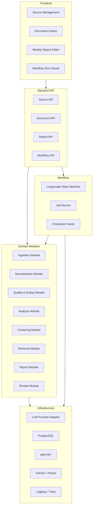

## 5.2 模块职责

### Ingestion Module

负责：

- RSS 拉取
- URL 抓取
- 手动文本接收
- 原始内容入库

### Normalization Module

负责：

- 正文提取
- 元数据清洗
- 语言识别
- hash 计算
- 基础去重

### Quality & Dedup Module

负责：

- 规则噪音过滤
- 轻量质量评分
- 语义近重复检测
- duplicate / supporting-source 关系归并

### Analysis Module

负责：

- 摘要
- 标签
- 分类
- 关键观点提取
- 中英双语关键术语提取
- 结构化结果持久化

### Clustering Module

负责：

- 将本周相似内容聚合为事件簇
- 为 cluster 生成标题和摘要
- 将周报输入颗粒度从“单篇文档”提升为“事件单元”

### Retrieval Module

负责：

- 文档 / 摘要 chunking
- embedding 写入
- 相似内容召回
- 时间窗过滤
- 命中 summary 后回溯原文 chunk
- 为周报生成拼接双路上下文

### Report Module

负责：

- 周报草稿生成
- 草稿版本保存
- Markdown 导出

### Review Module

负责：

- Reviewer 检查
- 证据不足判断
- 重复来源过多判断
- 是否需要补检索的信号输出
- 结论强度检查
- 引用链完整性检查

---

## 6. 部署架构

## 6.1 MVP 部署图

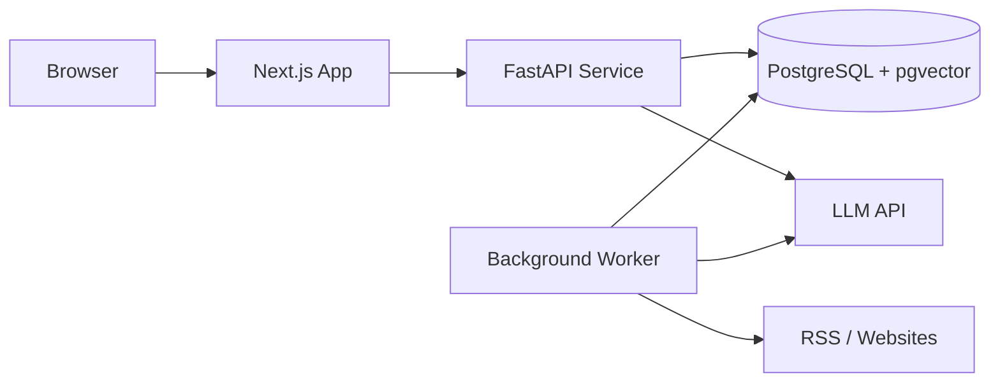

## 6.2 部署建议

MVP 建议最低部署单元：

- 1 个前端服务
- 1 个后端 API 服务
- 1 个后台 worker 进程
- 1 个 PostgreSQL 实例

在本地开发时，也可以进一步收缩为：

- 前端 dev server
- 后端 dev server
- PostgreSQL 本地实例
- 同进程 worker

---

## 7. 核心数据流设计

## 7.1 日常沉淀数据流

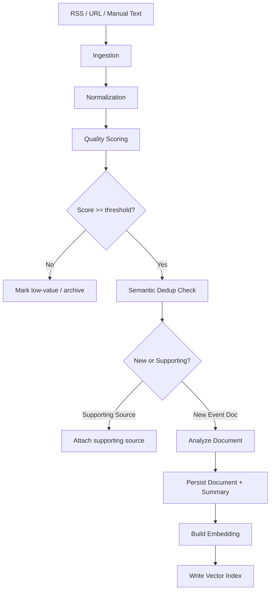

## 7.2 周报生成数据流

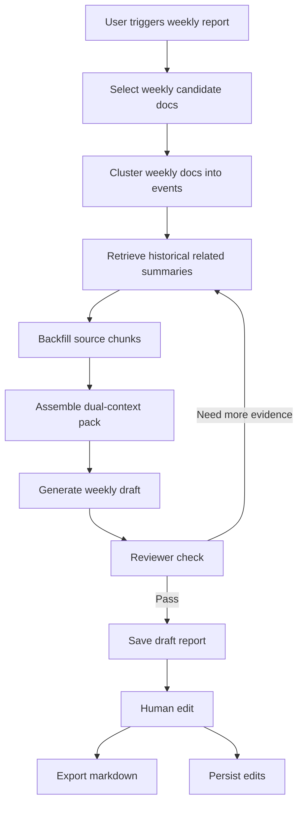

---

## 8. Workflow 设计

## 8.1 为什么 MVP 用 LangGraph

MVP 不是简单的 pipeline，至少包含以下特征：

- 状态对象需要显式保存
- 存在条件分支
- 存在检索 -> 生成 -> 审查 -> 回退的回路
- 存在人工编辑中断点
- 存在跨重启恢复需求

因此，LangGraph 在 MVP 中是合理的，它解决的是 workflow 表达问题，而不是“为了用 AI 框架”。

## 8.2 MVP workflow 状态机图

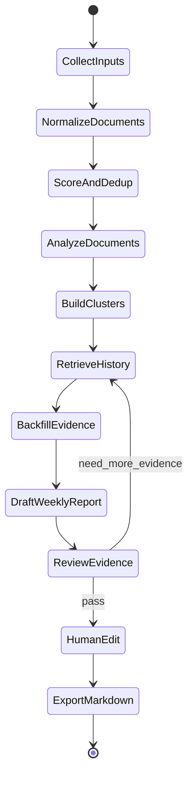

## 8.3 LangGraph 节点定义

### `collect_inputs`

- 接收本周候选文档范围
- 读取待处理文档或新输入

### `normalize_documents`

- 确保进入 workflow 的文档具有干净、可用的结构化内容

### `score_and_dedup`

- 做质量评分
- 做语义近重复检测
- 将近重复内容归并为 supporting source

### `analyze_documents`

- 生成或读取已有摘要、标签、分类、关键观点、双语术语表

### `build_clusters`

- 将本周文档聚合为事件簇
- 为后续周报提供更稳的结构输入单元

### `retrieve_history`

- 根据 cluster 主题、标签、时间窗召回历史 summary

### `backfill_evidence`

- 根据召回 summary 反查原始 document chunk
- 组装“摘要 + 原文证据片段”的双路上下文

### `draft_weekly_report`

- 拼接候选材料 + 历史上下文
- 生成周报草稿

### `review_evidence`

- 输出审查结果：
  - `pass`
  - `need_more_evidence`
  - `too_redundant`
  - `conclusion_too_strong`

### `human_edit`

- 中断 workflow，等待用户编辑确认

### `export_markdown`

- 导出最终报告
- 更新 workflow 状态

## 8.4 Workflow 时序图

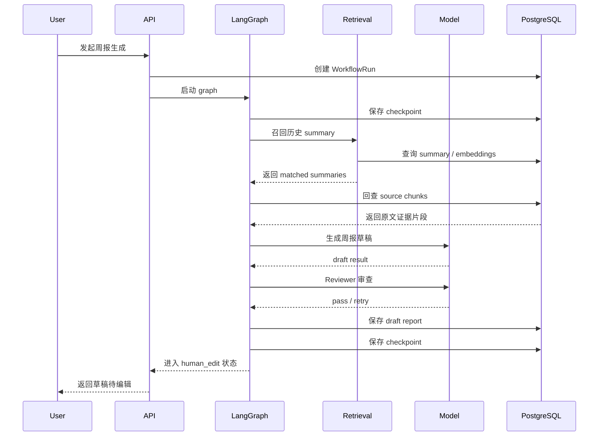

---

## 9. RAG 设计

## 9.1 MVP 中 RAG 的定位

MVP 中的 RAG 不是为了聊天问答，而是为了：

- 在周报生成时召回历史相关材料
- 让输出不只依赖当前周的新内容
- 为后续“研究资产复利”打基础

## 9.2 检索对象

MVP 建议采用双路上下文策略：

1. `检索层`：优先检索摘要级对象
2. `填充层`：命中后反查原始 document chunk

### 检索层对象

- `Summary.short_summary`
- `Summary.key_points`

### 填充层对象

- `Document.cleaned_content` 的原始 chunk
- `Document.source_url`
- supporting sources 列表

这样做的理由是：

- 摘要和观点文本更短，适合做语义检索
- 原文 chunk 能避免“摘要的摘要”带来的信息衰减
- 技术细节和事实核查可以回溯到原始证据

## 9.3 检索策略

MVP 推荐混合检索思路：

1. 时间窗过滤
2. 标签 / 分类过滤
3. 向量相似度召回

也就是说，先缩小候选范围，再做 embedding 相似度召回。

## 9.4 RAG 流程图

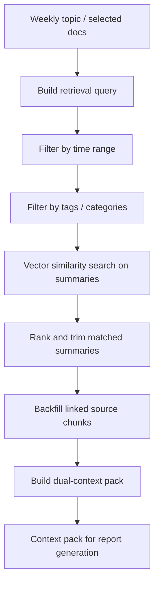

## 9.5 引用回溯要求

MVP 中报告生成不能只保存最终 Markdown，还必须保存引用链。

最低要求：

- `ReportItem -> Summary`
- `Summary -> Document`
- `Document -> Source URL`

这样做的原因是：

- Reviewer 能核查原始事实来源
- 人工编辑时可以回看原文
- 后续支持引用展示与事实追踪

## 9.6 为什么 MVP 不上复杂检索架构

MVP 不建议一开始就做：

- 多路 retriever
- reranker 服务
- 独立向量数据库
- 知识图谱

原因是 MVP 需要先验证：

- 历史材料参与周报是否真的提升体验
- 资产沉淀是否真的被复用

这两个问题先成立，再考虑更复杂的检索优化。

---

## 10. LLM 设计

## 10.1 Provider 抽象

建议定义统一接口：

- `generate_structured_output`
- `generate_text`
- `embed_texts`

通过 provider adapter 层屏蔽底层模型差异。

## 10.2 模型职责拆分

MVP 可按职责拆分模型调用：

- 文档分析模型：摘要、标签、分类、观点
- 周报生成模型：生成草稿
- Reviewer 模型：做审查判断，建议与生成模型异构
- Embedding 模型：向量化

## 10.3 LLM 调用图

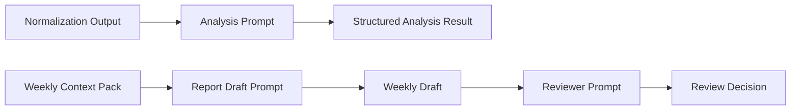

## 10.4 Prompt 设计原则

- 摘要 / 标签 / 分类使用结构化输出
- 周报草稿使用模板化输入
- Reviewer 使用枚举型输出，避免自由文本过多
- 质量评分优先采用轻量 prompt 或规则 + 小模型
- 中英术语表采用结构化输出，避免专业名词翻译漂移

Reviewer 建议输出：

- `pass`
- `need_more_evidence`
- `too_redundant`
- `conclusion_too_strong`

## 10.5 Reviewer 设计约束

Reviewer 不应只输出自由评语，而应输出结构化判据。

建议输出结构：

- `decision`
- `checks.numeric_support_present`
- `checks.source_diversity_sufficient`
- `checks.language_overclaim`
- `checks.evidence_traceable`
- `reasoning_summary`

建议判据包括：

- 结论中的技术特性是否有具体事实支撑
- 是否存在足够独立来源，而不是大量转述同一信号
- 是否出现过强措辞
- 是否能回溯到原文证据

## 10.6 模型异构策略

如果生成模型和 Reviewer 模型完全相同，容易出现“生成者与审查者共鸣”的问题。

因此 MVP 建议：

- 周报生成模型与 Reviewer 模型可配置为不同 provider / 不同模型
- 至少在接口层支持异构模型审查

这不要求 MVP 一开始必须绑定两个厂商，但架构必须支持。

## 10.7 成本控制策略

MVP 建议采用分层成本控制：

- 文档分析与质量评分优先使用较低成本模型
- 周报草稿生成使用较强生成模型
- Reviewer 使用独立但不一定最贵的审查模型

Embedding 建议采用分级策略：

- `document_chunks` 使用低成本 embedding 模型
- `summaries / key_points` 允许使用更高质量 embedding 配置

这样做的原因是：

- 大体量原文 chunk 成本可控
- 核心摘要向量质量更高，有利于召回精度

---

## 11. 数据模型

## 11.1 核心实体图

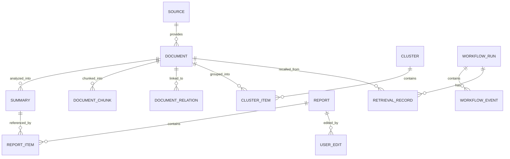

## 11.2 MVP 建议实体

### `sources`

- 记录 RSS 源、手动源
- 字段：`id`, `type`, `name`, `config`, `status`

### `documents`

- 原始和清洗后的内容
- 字段：`id`, `source_id`, `url`, `title`, `author`, `published_at`, `raw_content`, `cleaned_content`, `language`, `hash`, `status`

### `summaries`

- 结构化分析结果
- 字段：`id`, `document_id`, `short_summary`, `key_points`, `tags`, `category`, `bilingual_terms`, `quality_score`, `model_name`, `status`

### `document_chunks`

- 用于检索的 chunk 或 summary projection
- 字段：`id`, `document_id`, `chunk_text`, `embedding`, `chunk_index`, `token_count`

### `document_relations`

- 记录近重复 / supporting source 关系
- 字段：`id`, `document_id`, `related_document_id`, `relation_type`, `similarity_score`

### `clusters`

- 记录周内事件簇
- 字段：`id`, `title`, `summary`, `cluster_type`, `time_range`, `status`

### `cluster_items`

- 记录 cluster 与 document 的关联
- 字段：`id`, `cluster_id`, `document_id`, `position`

### `reports`

- 周报草稿和最终稿
- 字段：`id`, `type`, `title`, `date_range`, `content_md`, `status`, `version`

### `report_items`

- 记录某份报告引用了哪些 summary / document
- 字段：`id`, `report_id`, `summary_id`, `document_id`, `source_url`, `position`

### `user_edits`

- 记录人工修订
- 字段：`id`, `report_id`, `before_content`, `after_content`, `edited_at`

### `workflow_runs`

- 记录一次 workflow 执行
- 字段：`id`, `type`, `status`, `started_at`, `finished_at`, `state_json`

### `workflow_events`

- 节点级事件日志
- 字段：`id`, `workflow_run_id`, `node_name`, `status`, `input_ref`, `output_ref`

### `retrieval_records`

- 记录一次召回结果
- 字段：`id`, `workflow_run_id`, `query_text`, `retrieved_summary_ids`, `retrieved_chunk_ids`, `score_snapshot`

---

## 12. API 边界

## 12.1 MVP API 分组

### Source API

- `POST /sources/rss`
- `GET /sources`
- `DELETE /sources/{id}`

### Ingestion API

- `POST /documents/url`
- `POST /documents/text`
- `GET /documents`
- `GET /documents/{id}`

### Report API

- `POST /reports/weekly/generate`
- `GET /reports`
- `GET /reports/{id}`
- `PATCH /reports/{id}`
- `POST /reports/{id}/export`

### Workflow API

- `GET /workflow-runs`
- `GET /workflow-runs/{id}`

## 12.2 API 边界图

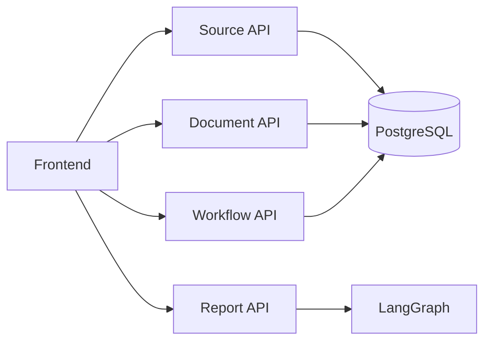

---

## 13. 前端工作台设计

## 13.1 MVP 页面结构

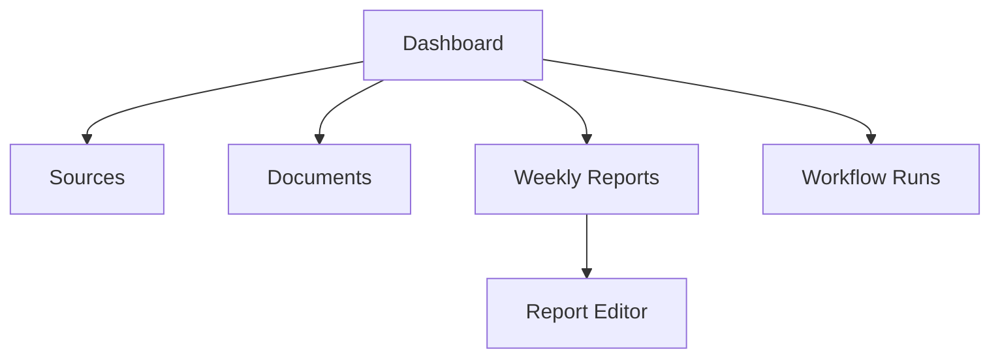

## 13.2 MVP 页面职责

### Dashboard

- 本周新增文档数
- 最近 workflow 状态
- 最近生成的周报

### Sources

- 管理 RSS 源
- 手动触发同步

### Documents

- 查看文档及摘要
- 过滤标签和分类
- 删除无效内容
- 查看 supporting sources / duplicate 归并

### Weekly Reports

- 发起周报生成
- 查看草稿和历史版本

### Report Editor

- 编辑周报草稿
- 查看引用来源
- 导出 Markdown

### Workflow Runs

- 查看任务状态
- 查看失败节点

---

## 14. 可观测性与错误处理

## 14.1 可追踪要求

MVP 至少需要做到：

- 每个 workflow run 有唯一 ID
- 每个节点执行有事件记录
- 每次检索有 retrieval record
- 每次导出有报告版本记录
- 每次 workflow 状态切换有 checkpoint

## 14.2 错误分类

建议将错误分为：

- 抓取错误
- 清洗错误
- 模型调用错误
- 检索错误
- workflow 编排错误
- 导出错误

## 14.2.1 幂等与恢复要求

MVP 中以下高成本节点必须设计为幂等：

- `analyze_documents`
- `build_embeddings`
- `build_clusters`
- `draft_weekly_report`

最低要求：

- 基于 `document.hash` 或稳定输入快照判断是否已处理
- 若 workflow 从 checkpoint 恢复，已完成节点应可跳过或复用已有结果
- 重复执行不应产生重复 summary、重复 chunk、重复 report item

## 14.3 错误处理图

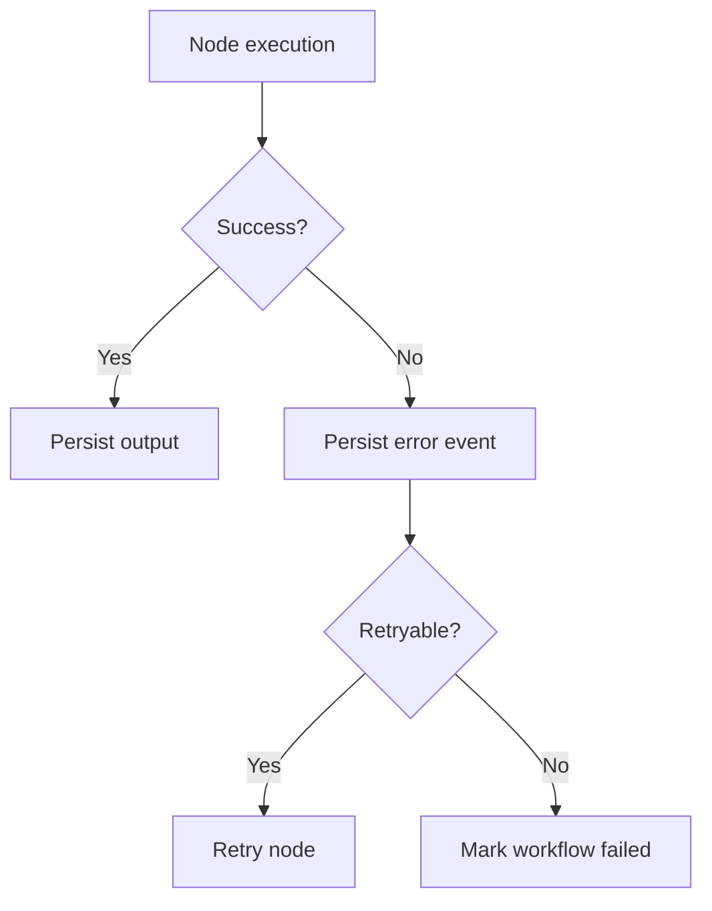

---

## 15. 安全与边界

## 15.1 MVP 安全边界

由于 MVP 不是多租户系统，第一版只需关注：

- API 基础鉴权
- 外部 URL 抓取安全限制
- Prompt 注入的基础防御
- Markdown 导出内容的基本清洗
- 第三方抓取 fallback 的域名白名单与配额控制

## 15.2 不在 MVP 解决的问题

- 企业级权限隔离
- 多租户数据隔离
- 高级审计权限系统
- 复杂 secrets 管理平台

---

## 16. 演进预留

MVP 的设计必须允许后续扩展到 roadmap 的后续阶段。

## 16.1 为 V1 预留

- `Planner` 节点可插入 LangGraph
- `reports.type` 支持 `weekly` / `topic_observation`
- `clusters.cluster_type` 支持更细粒度主题聚类

## 16.2 为 V2 预留

- 检索对象从 summary 扩展到 report / edits
- chunking 策略可替换
- retrieval ranking 可增强
- user feedback 可作为 negative filtering signal
- bilingual term memory 可参与后续生成

## 16.3 为 V3 预留

- Reviewer 输出协议可增加证据维度
- workflow 可插入 evidence audit node

## 16.4 为 V4+ 预留

- 后端模块职责清晰后，可拆出独立 worker 或 retriever service
- provider abstraction 保留多模型支持

---

## 17. 方案结论

Insight Flow MVP 的技术方案，核心不是做一个复杂的 AI 平台，而是做一个：

> 以结构化研究资产、显式 workflow 和最小 RAG 闭环为中心的单体 AI 工作系统。

最关键的技术决策包括：

1. 后端采用 `Python + FastAPI`
2. workflow 采用 `LangGraph`
3. 数据存储采用 `PostgreSQL + pgvector`
4. LangGraph 必须启用 `Postgres checkpoint persistence`
5. 摄入层加入 `质量评分 + 语义近重复检测`
6. RAG 采用 `summary retrieval + source chunk backfill` 的双路上下文
7. 后台任务采用 `DB task table + worker`
8. MVP 只做 `Weekly Report` 主闭环，不提前平台化

只要这套技术方案实现得足够扎实，Insight Flow 就能在 MVP 阶段支撑起它真正的产品价值：

- 长期资产沉淀
- 历史材料复用
- 可追踪工作流
- AI 与人工协作输出
