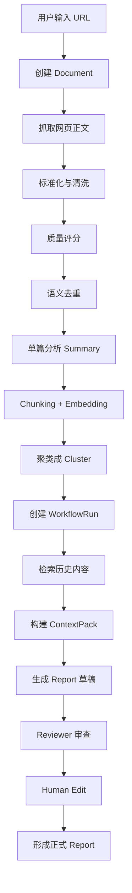
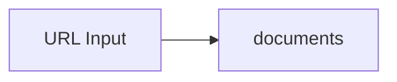
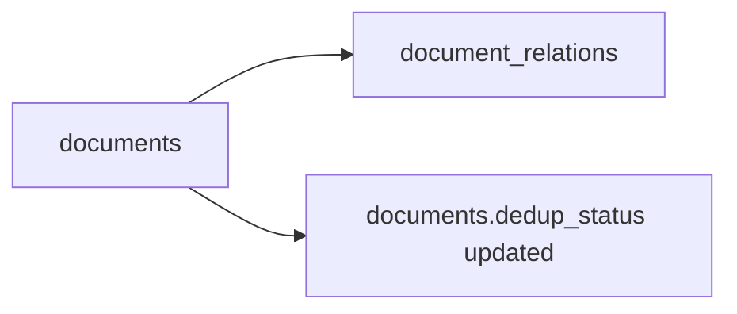
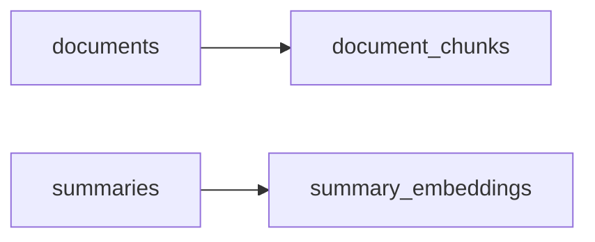
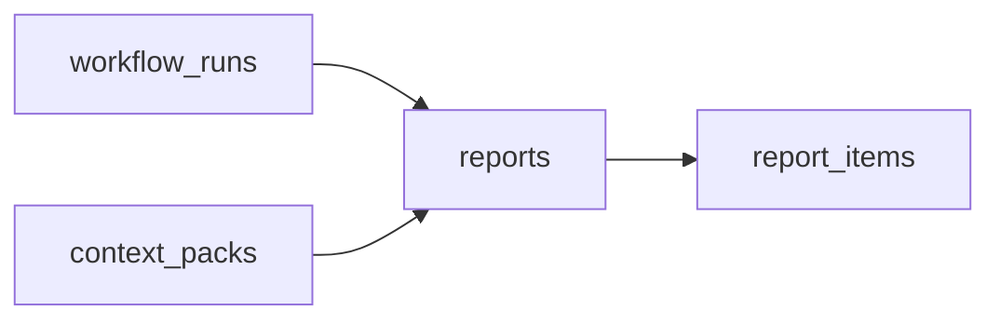
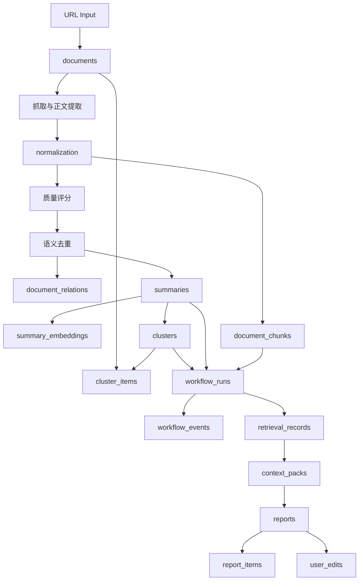

# 从输入一篇 URL 到形成 Report 的完整数据生命周期

## 1. 目的

这份文档描述 Insight Flow 里一条内容从“输入一篇 URL”到“形成 Report”的完整生命周期。

重点回答：

1. 这条内容在系统里会经历哪些阶段
2. 每个阶段会落哪些数据
3. 哪些阶段属于内容资产沉淀，哪些属于 workflow 执行，哪些属于最终输出

注意：

- 当前很多阶段的代码还没实现
- 但数据路径和设计意图已经通过 schema 和技术方案确定了

---

## 2. 生命周期总览

---

## 3. 阶段 1：输入 URL

起点：

- 用户在系统中输入一篇 URL

这个动作的业务含义不是“立刻生成报告”，而是：

- 往系统里注入一条新的内容资产

此时系统最先关心的是三件事：

1. 这是不是一个合法的输入
2. 它将以什么 ingest 类型进入系统
3. 它是否对应某个已有 source

在 MVP 中：

- URL 导入更偏单次输入
- 通常会直接生成一条 `Document`
- `source_id` 可以为空
- `ingest_type = url`

---

## 4. 阶段 2：创建 `Document`

第一落点是：

- `documents`

初始时通常会先写入这些字段：

- `ingest_type = url`
- `url`
- `canonical_url` 先为空或暂时等于 `url`
- `title` 先占位或后补
- `content_hash` 先为空或后补
- `status = ingested`
- `quality_status = pending`
- `dedup_status = pending`

### 初始落库图

底层逻辑：

- 在真正抓取和分析前，先把输入变成数据库中的正式对象
- 这样后续失败、重试、补抓取、补分析都有对象可挂

---

## 5. 阶段 3：抓取正文

接下来系统会尝试从 URL 中提取正文。

典型路径：

1. `httpx + trafilatura`
2. 如果失败，再走 fallback
   - `Jina Reader`
   - `Firecrawl`

这一阶段主要更新 `documents`：

- `raw_content`
- `title`
- `author`
- `published_at`
- `language`
- `extraction_method`

如果抓取失败：

- `status = failed`
- 后续可以通过日志和错误记录排查

如果抓取成功：

- 进入标准化阶段

---

## 6. 阶段 4：标准化与清洗

抓到网页原文后，系统会做 normalization。

这一阶段主要处理：

- 去掉无关噪音
- 统一空白和段落结构
- 提取真正正文
- 计算 `content_hash`
- 尝试归一 `canonical_url`

这一阶段主要更新 `documents`：

- `cleaned_content`
- `content_hash`
- `canonical_url`
- `status = normalized`

底层逻辑：

- 后续质量评分、去重、分析都依赖 `cleaned_content`
- 所以 `raw_content` 是保底原始值，`cleaned_content` 才是业务处理主文本

---

## 7. 阶段 5：质量评分

不是所有抓到的内容都值得进入后续资产链路。

因此在标准化之后，会有一个质量评分阶段。

典型判断：

- 是否只是广告或导航页
- 是否正文太短
- 是否几乎没有有效信息
- 是否只是低价值转述

结果主要写回 `documents`：

- `quality_status = accepted`
  或
- `quality_status = rejected_low_value`

底层逻辑：

- 这个系统的价值不在“什么都存”
- 而在“持续沉淀高价值研究材料”

---

## 8. 阶段 6：语义去重与关系归并

如果内容通过质量判断，就会进入语义去重。

这里不是只做 hash 去重，而是要判断：

- 这是不是一篇近重复内容
- 它是不是已有事件的补充来源

这一阶段会涉及两类写入：

1. 更新 `documents.dedup_status`
2. 写入 `document_relations`

可能结果：

- `PRIMARY`
  这是本次保留的主文档
- `SUPPORTING`
  这是补充来源
- `DUPLICATE`
  这是重复项

`document_relations` 则记录：

- 和哪篇文档相关
- 关系类型
- 相似度多少

### 去重阶段图

底层逻辑：

- Insight Flow 不是简单内容池
- 它需要把“同一事件的多篇材料”组织成有主次的资产结构

---

## 9. 阶段 7：单篇分析，生成 `Summary`

接下来对文档做单篇分析。

模型会产出结构化结果：

- `short_summary`
- `key_points`
- `tags`
- `category`
- `bilingual_terms`

写入：

- `summaries`

同时还要记录：

- `prompt_version`
- `model_name`
- `status`

底层逻辑：

- 系统未来生成周报时，主输入通常不会直接是整篇文档
- 而是先使用结构化摘要层

---

## 10. 阶段 8：Chunking 与 Embedding

这一步会产生两类向量资产。

## 10.1 Document chunk

把 `document.cleaned_content` 切成多个 chunk，写入：

- `document_chunks`

每个 chunk 保存：

- 文本
- 索引位置
- token 数
- embedding 向量

## 10.2 Summary embedding

为 `summary` 生成向量，写入：

- `summary_embeddings`

### 双层检索图

底层逻辑：

- `summary_embeddings`
  用于高层语义召回
- `document_chunks`
  用于原始证据回填

这就是当前设计里“双路上下文”的基础。

---

## 11. 阶段 9：聚类成事件 `Cluster`

当系统开始准备周报时，不会直接把若干 `summary` 平铺出来。

它会先尝试把相关文档组织成事件簇。

写入：

- `clusters`
- `cluster_items`

例如：

- 某一周里多篇文章都在讨论同一个模型发布
- 它们会被聚到一个 `cluster`

底层逻辑：

- 最终周报的自然组织方式是“事件”
- 不是“文章列表”

---

## 12. 阶段 10：创建 `WorkflowRun`

真正生成周报时，系统会创建一次 workflow 运行记录：

- `workflow_runs`

这个对象代表：

- 一次周报生成任务

它保存：

- 周报时间窗
- 当前状态
- graph state
- 重试计数

同时 workflow 中的每个节点执行都写入：

- `workflow_events`

底层逻辑：

- 周报生成不能只是一段临时脚本
- 必须能复盘每个节点做了什么

---

## 13. 阶段 11：检索历史材料

为了形成真正“有持续性”的报告，系统会做历史检索。

这一阶段会：

1. 基于当前事件或主题检索相关 `summary`
2. 再回填相关 `document_chunk`

检索记录写入：

- `retrieval_records`

它会保存：

- query
- filter
- 命中的 summary ids
- 命中的 chunk ids
- 打分快照

底层逻辑：

- 系统不是只看本周输入
- 而是要把历史沉淀重新拉回上下文

---

## 14. 阶段 12：构建 `ContextPack`

在检索完成后，系统会把用于生成周报的材料打包成上下文。

写入：

- `context_packs`

通常包含：

- 当前时间窗内的事件簇
- 相关 summary
- 回填的 chunk 证据
- 可能的主题脉络

底层逻辑：

- 这样以后排查时，可以回答：
  “这份草稿到底基于哪些上下文生成的？”

---

## 15. 阶段 13：生成 `Report` 草稿

当上下文准备好后，系统会生成一份周报草稿。

写入：

- `reports`

此时通常：

- `status = draft`
- `content_md` 保存草稿正文
- `generated_by_run_id` 指向这次 workflow

同时还会生成：

- `report_items`

`report_items` 负责把报告中的条目和引用链挂起来：

- 这条报告项来自哪个 `summary`
- 对应哪个 `document`
- 属于哪个 `cluster`
- 原始来源 URL 是什么

### 草稿生成图

底层逻辑：

- 报告正文和引用条目必须同时存在
- 否则“可追溯”只停留在口头上

---

## 16. 阶段 14：Reviewer 审查

生成草稿后，系统还会进入审查阶段。

这一阶段主要不是创建新业务表，而是：

- 更新 `workflow_events`
- 必要时更新 `workflow_runs.status`

Reviewer 会检查：

- 证据是否充分
- 是否存在重复信息
- 结论是否过强

底层逻辑：

- 系统要避免“生成得很像，但证据链不扎实”

---

## 17. 阶段 15：人工编辑

如果 workflow 进入人工编辑阶段：

- `workflow_runs.status = waiting_human_edit`

用户编辑 report 后，会写入：

- `user_edits`

并且可能更新：

- `reports.content_md`
- `reports.status`
- `reports.version`

底层逻辑：

- Insight Flow 不是全自动写作机
- 人工编辑是正式闭环的一部分

---

## 18. 阶段 16：形成正式 `Report`

当编辑或确认完成后，系统里的报告进入更稳定状态：

- `status = finalized`
  或
- `status = exported`

此时一条 URL 触发的数据链路，最终沉淀成了几类资产：

1. 原始内容资产
   - `documents`
2. 分析资产
   - `summaries`
   - `summary_embeddings`
   - `document_chunks`
3. 组织资产
   - `clusters`
   - `cluster_items`
4. 执行追踪资产
   - `workflow_runs`
   - `workflow_events`
   - `retrieval_records`
   - `context_packs`
5. 输出资产
   - `reports`
   - `report_items`
   - `user_edits`

---

## 19. 完整生命周期图

---

## 20. 为什么这个生命周期比“直接问 GPT”更有系统性

如果只是直接问 GPT：

- 输入是临时的
- 中间过程不可追溯
- 历史资产不稳定
- 报告和引用链不会自然沉淀

而在这个生命周期里：

- URL 先变成正式 `document`
- 分析结果单独沉淀成 `summary`
- 向量检索材料独立沉淀
- workflow 有运行记录
- report 有引用链
- human edit 也保留下来

这正是 Insight Flow 的系统价值来源。

---

## 21. 当前实现状态

当前已经真正完成并落库的是：

- `documents` 相关 schema
- `summaries` 相关 schema
- `document_chunks` / `summary_embeddings` 相关 schema
- `clusters` 相关 schema
- `workflow_*` 相关 schema
- `reports` 相关 schema

当前还没有真正写完代码的阶段是：

- URL 输入 API
- 抓取链路
- 质量评分
- 去重逻辑
- 单篇分析
- embedding 写入
- cluster 构建
- workflow 运行
- report 生成

也就是说，生命周期设计已经定型，但业务链路还将在模块 03 和模块 04 里逐步兑现。
