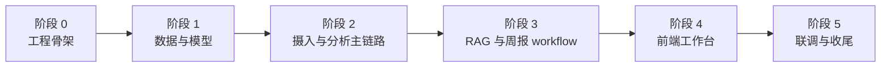
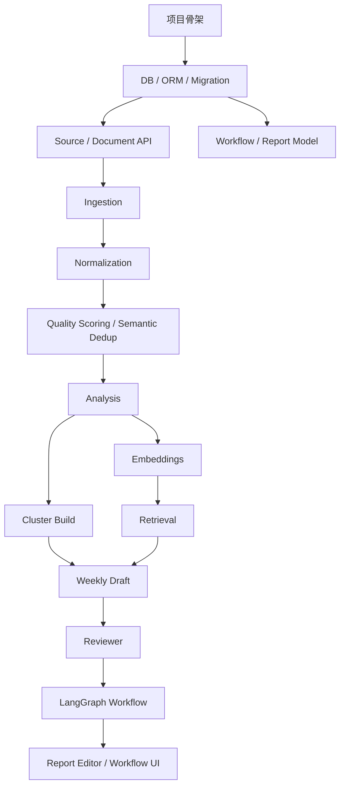

# Insight Flow 实现顺序规划

## 1. 文档目的

本文档用于明确 Insight Flow MVP 的推荐实现顺序，回答三个问题：

1. 哪些模块要先写
2. 哪些模块依赖前置模块
3. 哪些模块可以并行实现，后续可以拆给多个 agent

本文档默认目标是：

> 优先尽快跑通 MVP 主闭环，而不是先把所有模块都铺开。

---

## 2. 总体原则

实现顺序遵循四个原则：

1. 先打基础设施和数据主干，再写业务闭环
2. 先做“可存、可查、可跑”的最小主链路，再补高级能力
3. 先做后端闭环，再补前端体验
4. 能并行的模块尽量并行，但必须保证依赖边界清晰

---

## 3. 总体阶段图

---

## 4. 推荐实现顺序

## 4.1 阶段 0：工程骨架

目标：

- 把项目跑起来
- 建立后续开发的统一约束

先做内容：

- 后端项目骨架
- 前端项目骨架
- 数据库连接与配置管理
- 基础日志与环境变量体系
- SQLAlchemy Base / Mixins / Enums / Types
- Alembic 初始化

依赖：

- 无前置依赖

产出：

- 可启动的 API 服务
- 可连接的 PostgreSQL
- 可执行的 migration 基础设施

并行建议：

- `Agent A`：后端项目骨架、配置、日志、DB session
- `Agent B`：前端项目骨架、基础布局、路由壳子

注意：

- 前端壳子可以并行，但不应先写复杂页面逻辑

---

## 4.2 阶段 1：数据与模型

目标：

- 先把长期资产沉淀的主干定下来

先做内容：

- Source / Document / Summary model
- DocumentChunk / SummaryEmbedding model
- Cluster / ClusterItem model
- Report / ReportItem / UserEdit model
- WorkflowRun / WorkflowEvent / RetrievalRecord / ContextPack model
- 对应 Alembic migration

依赖：

- 阶段 0 完成

产出：

- 数据主干可落库
- ORM 模型可用
- migration 可反复执行

并行建议：

- `Agent A`：内容资产模型
  `Source / Document / Summary / Chunk / SummaryEmbedding`
- `Agent B`：workflow 与报告模型
  `WorkflowRun / WorkflowEvent / RetrievalRecord / ContextPack / Report / UserEdit`

注意：

- `Cluster` 虽然是分析层对象，但建议也在这阶段建好，避免后面回改 schema

---

## 4.3 阶段 2：摄入与分析主链路

目标：

- 跑通“输入 -> 清洗 -> 去重 -> 摘要 -> 入库”

先做内容：

- RSS 源管理 API
- URL / 手动文本导入 API
- `httpx + trafilatura` 抓取链路
- fallback 抓取链路
- normalization service
- 质量评分
- 语义去重
- 文档分析 service
  `摘要 / 标签 / 分类 / 关键观点 / 双语术语表`
- embedding 构建

依赖：

- 阶段 1 完成

产出：

- 文档可以被真正摄入和分析
- 文档库与摘要库开始积累真实数据

并行建议：

- `Agent A`：抓取与标准化模块
- `Agent B`：质量评分、语义去重、分析模块
- `Agent C`：Source / Document 相关 API

注意：

- 这一阶段结束后，项目应已具备最小“研究资产沉淀”能力

---

## 4.4 阶段 3：RAG 与周报 workflow

目标：

- 跑通 MVP 的核心价值闭环

先做内容：

- summary embedding 检索
- source chunk backfill
- context pack 组装
- cluster build service
- weekly report draft service
- reviewer service
- LangGraph weekly report graph
- checkpoint persistence
- workflow run / resume API

依赖：

- 阶段 2 完成

产出：

- 可以生成周报草稿
- 有 reviewer 回路
- 有 human_edit 中断与恢复

并行建议：

- `Agent A`：Retrieval / RAG 模块
- `Agent B`：Report draft / Reviewer 模块
- `Agent C`：LangGraph 节点与 workflow API

注意：

- 这是 MVP 的关键阶段
- 在这之前不要分心做复杂前端细节

---

## 4.5 阶段 4：前端工作台

目标：

- 把主闭环变成可实际操作的产品

先做内容：

- Sources 页面
- Documents 页面
- Weekly Reports 页面
- Report Editor 页面
- Workflow Runs 页面

依赖：

- 阶段 2 完成后可先做文档页
- 阶段 3 完成后才能完整做周报与 workflow 页

产出：

- 可操作的最小工作台

并行建议：

- `Agent A`：Sources / Documents 页面
- `Agent B`：Weekly Reports / Report Editor
- `Agent C`：Workflow Runs 可观测页面

注意：

- 前端可以阶段性并行，但必须依赖已存在的 API 边界

---

## 4.6 阶段 5：联调与收尾

目标：

- 把零散模块变成真正稳定的 MVP

先做内容：

- 端到端联调
- workflow 恢复测试
- 引用链检查
- 数据一致性检查
- 基础异常处理补齐
- README / 环境说明

依赖：

- 阶段 4 完成

产出：

- 可演示、可复跑、可继续迭代的 MVP

并行建议：

- `Agent A`：联调与 bugfix
- `Agent B`：测试与恢复场景验证
- `Agent C`：文档整理

---

## 5. 模块级依赖图

---

## 6. 第一优先级主链路

如果只能先做最关键的实现，应按这个顺序：

1. 项目骨架
2. 数据库 / ORM / Migration
3. Document 摄入与标准化
4. 文档分析与摘要入库
5. embedding 与最小检索
6. weekly draft 生成
7. reviewer
8. LangGraph workflow + checkpoint
9. human_edit + export

这是 MVP 的最小价值链。

---

## 7. 可并行拆分建议

## 7.1 第一轮可并行

- 后端工程骨架
- 前端工程骨架

## 7.2 第二轮可并行

- 内容资产 ORM / migration
- workflow / reporting ORM / migration

## 7.3 第三轮可并行

- 抓取与标准化
- 分析与 embedding
- Source / Document API

## 7.4 第四轮可并行

- Retrieval / RAG
- Weekly Draft / Reviewer
- LangGraph orchestration

## 7.5 第五轮可并行

- Sources / Documents 前端
- Reports / Editor 前端
- Workflow 可观测前端

---

## 8. 不建议过早实现的模块

以下内容不应混入 MVP 前半段：

- Planner
- 泛化观察稿系统
- 多 Agent
- 自动调度平台
- 复杂负反馈学习
- 高级证据评分体系

这些都应该在主闭环稳定后再进入。

---

## 9. 推荐的 Agent 拆分方式

后续如果要交给多个 agent 实现，建议按“写入边界”拆分，而不是按概念拆分。

### Agent 1：后端基础设施

负责：

- DB
- SQLAlchemy
- Alembic
- 基础配置

### Agent 2：内容摄入与分析

负责：

- Ingestion
- Normalization
- Quality Scoring
- Semantic Dedup
- Summary Analysis

### Agent 3：RAG 与 Workflow

负责：

- Embedding
- Retrieval
- Context Pack
- Reviewer
- LangGraph

### Agent 4：报告与前端

负责：

- Report API
- Report Editor
- Sources / Documents / Workflow 页面

---

## 10. 最终建议

最稳的推进方式不是平均铺开所有模块，而是：

> 先把“内容资产沉淀”做通，再把“周报 workflow”做通，最后再补“前端工作台体验”。

如果按这个顺序推进，哪怕中途暂停，项目也始终是逐步可运行、逐步可验证的，而不是最后才看到整体效果。
