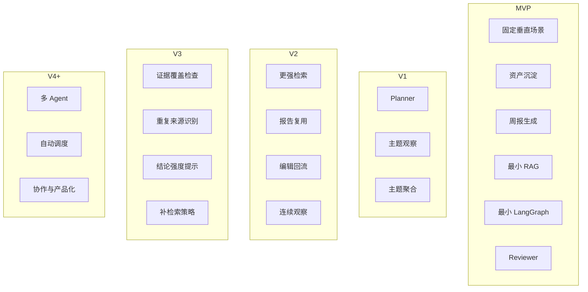

# Insight Flow 版本路线图

## 1. 文档目的

本文档用于明确 Insight Flow 的版本分层，回答两个关键问题：

1. MVP 到底要做什么
2. MVP 之后各阶段继续增强什么

这样做的目的，是避免后续 PRD 和系统设计继续混淆“第一版必须验证的价值”和“后续版本逐步增强的能力”。

Insight Flow 的版本规划应遵循一个核心原则：

> MVP 先证明系统是否成立，后续版本再证明系统能否变得更强。

换句话说，第一版不负责把所有技术概念都做满，而是要验证：

- 垂直场景是否成立
- 长期资产沉淀是否成立
- 相比每次临时问 GPT，系统是否更值得持续使用

---

## 2. 版本规划总原则

### 2.1 先证明“存在价值”，再证明“智能增强”

Insight Flow 不是一个为了展示技术名词而设计的项目。

因此版本规划不应按“先上哪些概念”来排，而应按“先验证哪些价值”来排。

顺序应当是：

1. 先证明固定场景下的研究闭环成立
2. 再证明系统能处理更复杂的研究任务
3. 再证明研究资产会随着使用持续增值
4. 最后再证明系统能进行更强的审查、判断支持与复杂协作

### 2.2 第一版聚焦固定垂直场景

第一版只聚焦于一个场景：

> 持续跟踪 AI / AI Coding / 科技动态，并输出中文周报与基础观察稿。

所有版本规划都应围绕这个场景逐步增强，而不是重新回到“通用研究平台”的宽泛设定。

### 2.3 技术引入必须服务阶段目标

`RAG`、`LangGraph`、`Agent`、`Human-in-the-loop` 并不是越早越多越好。

每个版本都只引入当前阶段真正需要的技术能力：

- MVP：最小 RAG、最小 LangGraph、最小 Reviewer
- 后续版本：Planner、更强 RAG、证据审查、复杂协作

---

## 3. 路线图总览

---

## 4. MVP：验证系统是否成立

### 4.1 阶段目标

MVP 的目标不是证明 Insight Flow 很聪明，而是证明：

> 在 AI / AI Coding 动态跟踪这个固定场景下，Insight Flow 作为一个长期研究系统是成立的。

也就是说，MVP 重点验证以下四件事：

1. 用户能否持续输入领域相关材料
2. 系统能否将这些材料沉淀为结构化研究资产
3. 系统能否基于这些资产生成一份可编辑的周报草稿
4. 这套流程是否比每次临时问 GPT 更省心、更可复用

### 4.2 MVP 核心能力

MVP 必须包含：

- 固定垂直场景：AI / AI Coding / 科技动态跟踪
- 输入：RSS、URL、手动文本
- 内容处理：抓取、清洗、基础去重、入库
- 单篇分析：摘要、标签、分类、关键观点
- 资产沉淀：材料、摘要、标签、周报持久化
- 最小 RAG：周报生成时召回历史相关材料
- 最小 LangGraph：跑通周报生成 workflow
- Reviewer 节点：检查证据不足或重复信息过多
- 人工编辑和 Markdown 导出

### 4.3 MVP 不做什么

MVP 不应承担以下目标：

- 通用专题研究平台
- 多 Agent 协作
- 自动调度平台
- 个性化风格学习
- 创作者完整工作台
- 多用户协作
- 商业化能力
- 复杂证据评分系统

### 4.4 MVP 成功标志

当以下情况成立时，可以认为 MVP 完成了它的使命：

- 用户可以持续积累 AI / AI Coding 动态材料
- 材料能稳定沉淀为结构化资产
- 历史材料能实际参与周报生成
- 周报草稿可编辑、可导出、可复用
- 这套流程明显优于“每周重新喂材料给 GPT”

### 4.5 MVP 的本质

MVP 本质上是：

> 一个面向 AI / AI Coding 动态跟踪的研究资产沉淀 + 周报生成系统。

---

## 5. V1：从周报系统升级为主题观察系统

### 5.1 阶段目标

V1 的目标是让系统不只会做固定周报，而是开始支持更明确的主题观察任务。

也就是说，系统从：

- “整理本周发生了什么”

升级为：

- “围绕某个主题，生成阶段性观察结果”

### 5.2 V1 新增重点

- 引入 `Planner` 节点
- 支持用户输入主题，生成基础观察稿
- 检索从简单时间窗召回升级到主题召回 + 时间窗召回
- 增强主题聚合和结构组织能力
- 优化 AI / AI Coding 领域的标签与分类体系

### 5.3 V1 的意义

这一步完成后，Insight Flow 会从：

- 周报工具

升级为：

- AI 动态研究观察系统

这会明显增强项目的研究属性和简历亮点。

### 5.4 V1 的边界

即使进入 V1，也仍然不需要：

- 泛化到所有行业
- 支持过多输出类型
- 上复杂多 Agent
- 做高度自由的 agent 自主规划

---

## 6. V2：把研究资产复利做强

### 6.1 阶段目标

V2 的重点不是增加更多输出形式，而是让“历史资产真的越来越有用”。

这一阶段的关键问题是：

> 为什么用户长期使用后，Insight Flow 会越来越比 GPT 临时使用方式更有优势？

答案应该体现在资产复利上。

### 6.2 V2 新增重点

- 更稳的 chunking / embedding / retrieval 策略
- 历史报告进入检索体系
- 人工修改结果进入检索或偏好上下文
- 同一主题的跨周连续观察
- 检索质量调试能力增强
- 更完整的任务和结果版本化

### 6.3 V2 的意义

这一阶段是项目真正形成长期差异化的关键阶段。

如果做得好，项目的亮点会从：

- “能做研究 workflow”

升级为：

- “会随着使用而积累并增强”

### 6.4 V2 的核心价值

V2 真正要做实的一点是：

> 过去处理过的信息，不只是被存起来，而是会持续反哺未来任务。

---

## 7. V3：把证据审查和判断支持做深

### 7.1 阶段目标

V3 才适合强化项目的高阶亮点：

> 帮助用户更可靠地组织证据，并支持阶段性判断形成。

这不是让系统“替用户下结论”，而是让系统在判断之前的证据组织与审查环节更扎实。

### 7.2 V3 新增重点

- Reviewer 更细粒度审查
- 重复来源识别
- 证据覆盖检查
- 结论强度提示
- 补充检索策略
- 输出中的“证据不足提醒”

### 7.3 V3 的意义

如果这一阶段做实，Insight Flow 的定位就会进一步升级：

- 从“研究工作流系统”

升级为：

- “研究判断支持系统”

### 7.4 V3 的风险提醒

这一阶段的价值很高，但也最容易吹过头。

因此必须建立在前两阶段已经稳定的基础上，否则“判断支持”只会停留在概念层。

---

## 8. V4+：多 Agent 与产品化探索

### 8.1 阶段目标

当前面几层已经做扎实之后，才适合探索：

- 更复杂的角色拆分
- 更自动化的任务系统
- 更完整的产品形态

### 8.2 可探索方向

- 拆分 `Retriever / Analyst / Editor / Reviewer`
- 定时采集与自动任务触发
- 更成熟的前端工作台
- 面向内容创作者的研究底稿模式
- 多用户或轻协作
- 轻量商业化形态

### 8.3 为什么不应提前做

这些方向虽然听起来很吸引人，但如果前面的价值闭环没有成立，过早加入只会让项目：

- 更复杂
- 更难收敛
- 更像概念堆叠

所以多 Agent 和产品化应视为结果，而不是起点。

---

## 9. 版本能力分层图

---

## 10. 路线图对 PRD 的约束

这份路线图会直接约束后续 PRD 的写法。

具体来说：

### 10.1 PRD 中属于 MVP 的内容

应只保留：

- 固定垂直场景
- 周报闭环
- 最小 RAG
- 最小 LangGraph
- Reviewer
- 人工编辑导出

### 10.2 PRD 中应移出 MVP 的内容

应明确标记为后续版本：

- 泛化专题分析平台
- Planner 的复杂能力
- 复杂多 Agent
- 高级判断支持
- 大量自动化调度和商业化能力

### 10.3 PRD 中的表达方式

PRD 应把“未来会做什么”单列成 roadmap，而不是混在 MVP 成功标准里。

---

## 11. 最终结论

Insight Flow 的正确演进顺序应当是：

1. 先做一个在固定垂直场景中成立的研究资产沉淀 + 周报生成系统
2. 再扩展到主题观察任务
3. 再做强长期资产复利
4. 再做深证据审查和判断支持
5. 最后再考虑多 Agent 和产品化

这一路径的核心逻辑是：

> 先证明系统有存在价值，再证明系统有智能价值，最后再证明系统有平台价值。

只有按这个顺序推进，Insight Flow 才不会沦为“技术概念很多但产品边界模糊”的项目，而会逐步成长为一个真正成立的 AI 研究工作系统。
