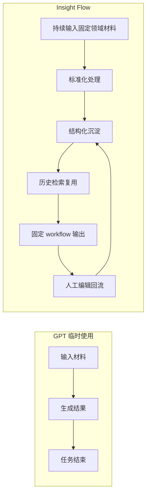
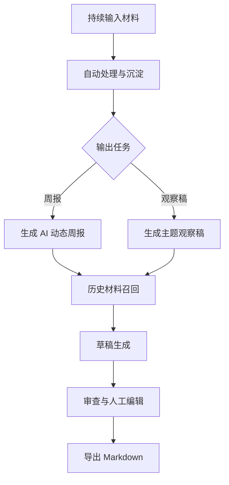
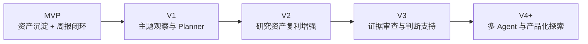
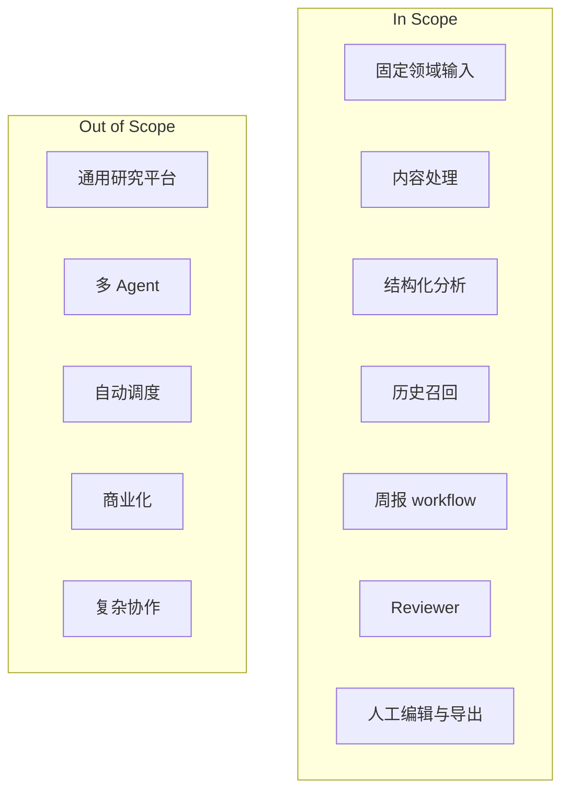
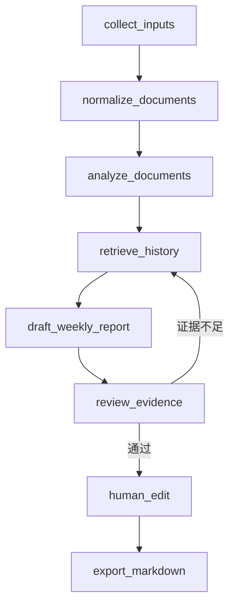
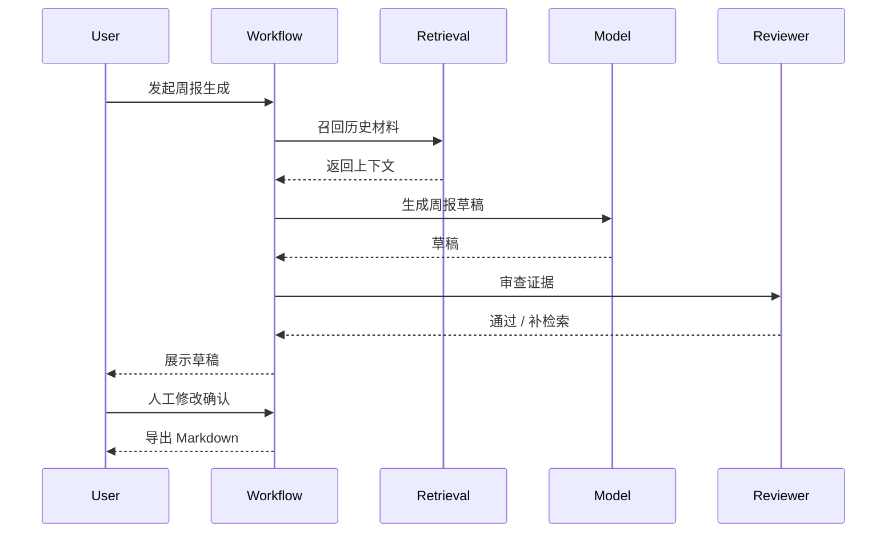
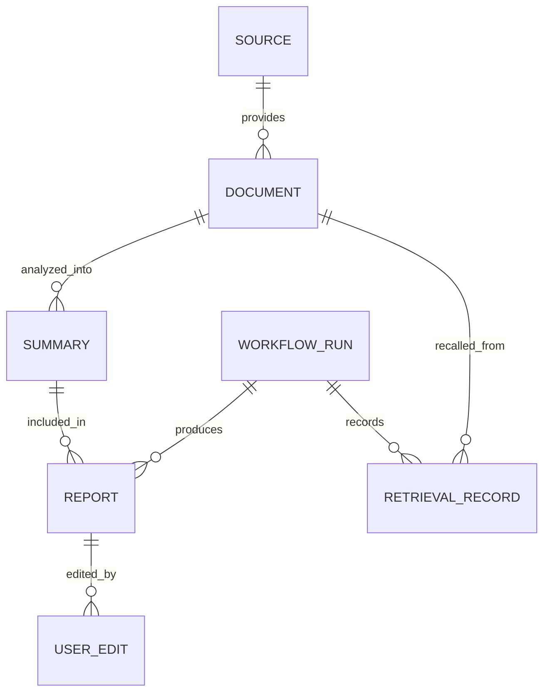

# Insight Flow 基础 PRD

## 1. 文档定位

本文档作为 Insight Flow 的基础产品文档，定义项目的核心价值、目标场景、MVP 边界、版本演进方向和第一版产品要求。

这份文档不讨论个人学习目标，也不把技术名词本身当作价值。  
它关注的是两个更根本的问题：

1. Insight Flow 为什么值得存在
2. 第一版到底应该做什么，后续版本再做什么

---

## 2. 产品定义

Insight Flow 是一个面向固定垂直研究任务的 AI 工作系统。

第一版聚焦于：

> 持续跟踪 AI / AI Coding / 科技动态，并输出中文周报与基础观察稿。

它不是一个通用聊天机器人，也不是一个“把文章喂给模型然后生成摘要”的轻包装工具。  
它试图解决的是长期研究任务中的系统性问题：

- 多源信息如何稳定收集
- 零散材料如何沉淀为长期可复用资产
- 历史材料如何参与后续输出
- 研究流程如何可追踪、可复盘、可调优
- AI 如何与人工编辑形成稳定协作

---

## 3. 项目价值

## 3.1 价值主张

Insight Flow 的价值不在于“更会生成摘要”或“更会写周报”，而在于：

> 比临时调用 GPT 更适合承载长期、可复用、可追踪的研究工作。

这意味着项目的核心竞争点不是单次生成，而是系统能力。

## 3.2 核心价值层

### 第一层：长期研究资产沉淀

系统将原始材料、清洗内容、摘要、标签、报告和人工修改记录持续保存，使其不再是一次性结果，而成为未来任务的基础设施。

### 第二层：流程可追踪、可复盘

系统把研究任务拆成显式 workflow，记录输入、处理、检索、生成、审查和编辑过程，使结果不仅可生成，也可解释。

### 第三层：固定场景深度适配

系统不试图服务所有研究任务，而是聚焦 AI / AI Coding 动态跟踪场景，在输入源、标签体系、输出模板和审查逻辑上做垂直适配。

### 第四层：证据组织与审查支持

系统不替用户做判断，但帮助用户在形成判断前，更扎实地组织证据、补充背景和审查结论强度。

---

## 4. 为什么不是“直接用 GPT 就够了”

如果用户每次只是做一次性任务，GPT 已经足够强。

GPT 已经可以做：

- 单篇摘要
- 多文档归纳
- 周报草稿生成
- 专题草稿生成
- Markdown 输出

因此，以下能力不构成 Insight Flow 的核心卖点：

- 自动摘要
- 自动标签
- 自动分类
- 自动周报
- 自动专题草稿

Insight Flow 必须比 GPT 多解决的是：

- 长周期历史沉淀
- 历史材料复用
- 结构化资产库
- 流程可追踪
- 结果可复盘
- 人工修改回流
- 固定垂直场景适配

### 对比图：GPT 临时使用 vs Insight Flow

### 对比表

| 维度 | GPT / Claude 临时使用 | Insight Flow |
| --- | --- | --- |
| 单篇摘要 | 很强 | 基础能力，不是卖点 |
| 周报草稿生成 | 可完成 | 基础能力，不是卖点 |
| 长周期资产沉淀 | 弱 | 核心能力 |
| 历史材料复用 | 弱 | 核心能力 |
| 流程可追踪 | 弱 | 核心能力 |
| 人工修改回流 | 弱 | 核心能力 |
| 场景深度适配 | 通用但不深 | 核心能力 |
| 证据组织支持 | 不稳定 | 高阶能力 |

---

## 5. 目标用户与核心场景

## 5.1 核心用户

> 持续关注 AI、AI Coding 和科技产品动态的技术从业者、研究型产品人员或内容创作者，需要每周形成中文结构化观察，并希望把平时读到的材料沉淀成长期可复用的研究资产。

## 5.2 核心使用场景

### 场景一：日常沉淀

用户持续输入 RSS、URL 或手动文本，系统自动处理并沉淀为结构化研究材料。

### 场景二：周报生成

用户基于一周内积累的材料生成 AI / AI Coding 动态周报，系统自动召回历史相关内容并输出草稿，用户再进行人工修订。

### 场景三：基础观察稿

用户围绕一个明确主题，例如“过去两周 AI Coding 工具的重要变化”，生成一份基础观察稿。

### 场景图

---

## 6. 产品原则

### 6.1 先做固定场景，不做通用平台

第一版只服务 AI / AI Coding 动态跟踪，不做“面向所有研究任务”的泛化平台。

### 6.2 先做系统能力，不做模型炫技

第一版优先验证资产沉淀、历史复用、流程追踪和人工协作，而不是复杂智能自治。

### 6.3 AI 起草，人类确认

第一版默认采用 AI 起草 + 人工修订的协作方式，不以全自动替代研究为目标。

### 6.4 MVP 先证明存在价值

MVP 先证明系统值得持续使用；更强的主题规划、证据审查和复杂协作放到后续版本。

---

## 7. 版本路线图

Insight Flow 的版本推进顺序如下：

## 7.1 MVP

目标：

> 证明在 AI / AI Coding 动态跟踪场景下，Insight Flow 作为长期研究系统是成立的。

验证重点：

1. 材料能否持续输入
2. 资产能否稳定沉淀
3. 历史材料能否参与周报输出
4. 整体流程是否比每次临时问 GPT 更省心

## 7.2 V1

目标：

> 从周报系统升级为主题观察系统。

新增重点：

- Planner
- 主题观察稿
- 主题聚合
- 主题检索 + 时间窗检索

## 7.3 V2

目标：

> 把研究资产复利做强。

新增重点：

- 更强检索
- 报告复用
- 编辑回流
- 跨周连续观察
- 更强版本化与调优能力

## 7.4 V3

目标：

> 把证据审查和判断支持做深。

新增重点：

- 证据覆盖检查
- 重复来源识别
- 结论强度提示
- 补检索策略

## 7.5 V4+

目标：

> 再考虑多 Agent、自动调度和产品化探索。

---

## 8. MVP 定义

## 8.1 MVP 一句话定义

> 一个面向 AI / AI Coding 动态跟踪的研究资产沉淀 + 周报生成系统。

## 8.2 MVP 要解决的问题

- 平时收集的材料分散，难以复用
- 做周报时需要重新翻找资料
- GPT 能给一次性草稿，但不能自然积累历史资产
- 输出过程缺少可追踪、可调整、可回写的系统结构

## 8.3 MVP 成功标准

满足以下条件即可判定 MVP 成立：

1. 用户可以通过 `RSS / URL / 手动文本` 持续输入 AI / AI Coding 领域材料
2. 系统可以完成清洗、基础去重、摘要、标签、分类、关键观点提取
3. 系统可以沉淀 `Document / Summary / Report / UserEdit / WorkflowRun` 等资产
4. 系统可以在周报生成时召回历史相关材料
5. 系统可以跑通一条带审查和人工编辑的周报 workflow
6. 输出结果可编辑、可导出、可直接复用

---

## 9. MVP 范围

## 9.1 In Scope

### A. 固定输入源

- RSS 源
- 官方博客 / 发布页 URL
- 技术媒体 URL
- 手动粘贴的关键文本片段

### B. 内容标准化处理

- 正文提取
- 文本清洗
- 元数据抽取
- 基础去重
- 文档入库

### C. 单篇结构化分析

- 一句话摘要
- 关键观点
- 标签
- 分类

### D. 历史材料召回

- 基于主题或时间窗检索历史内容
- 为周报生成提供最小可用 RAG

### E. 周报工作流

- 用 LangGraph 跑通周报生成流程
- 包含历史召回、草稿生成、审查、人工编辑、导出

### F. Reviewer 审查节点

- 检查是否证据不足
- 检查是否重复来源过多
- 检查结论是否表达过强

### G. 编辑与导出

- 编辑摘要
- 删除条目
- 调整顺序
- 编辑周报草稿
- 导出 Markdown

## 9.2 Out of Scope

- 通用研究平台
- 复杂专题研究平台
- 多 Agent 协作
- 自动调度平台
- 多用户协作
- 支付与商业化能力
- 高级偏好学习
- 图谱可视化
- 多模态处理

### 范围图

---

## 10. MVP 核心流程

## 10.1 日常沉淀流程

1. 用户输入 RSS、URL 或文本
2. 系统抓取、清洗、去重并入库
3. 系统生成摘要、标签、分类和关键观点
4. 结果进入研究资产库

## 10.2 周报生成流程

1. 用户发起周报生成
2. 系统筛选本周候选材料
3. 系统召回历史相关材料
4. 系统生成周报草稿
5. Reviewer 审查证据与结论强度
6. 用户人工修订
7. 导出 Markdown

### Workflow 图

### 时序图

---

## 11. 数据沉淀要求

MVP 至少沉淀以下对象：

- `Source`
- `Document`
- `Summary`
- `Report`
- `UserEdit`
- `WorkflowRun`
- `RetrievalRecord`

### 数据关系图

这些对象的意义不是单纯存档，而是支撑：

- 历史复用
- 流程复盘
- 结果调优
- 人工修改回流

---

## 12. 非功能要求

### 12.1 可追踪

- 每次任务有状态
- 关键节点有记录
- 检索和编辑行为可回溯

### 12.2 可编辑

- AI 输出默认是草稿，不是最终结果
- 用户必须能对摘要和周报做修改

### 12.3 可扩展

- 后续可扩展到主题观察
- 后续可升级检索与审查逻辑
- 后续可扩展为多 Agent 或自动调度

### 12.4 成本可控

- 第一版避免过多无效模型调用
- Agent 只出现在高价值节点

---

## 13. 版本边界说明

为了让基础 PRD 稳定，以下能力明确不属于 MVP，而属于后续版本：

### 属于 V1

- Planner
- 主题观察稿
- 主题聚合

### 属于 V2

- 更强 RAG
- 报告复用
- 编辑回流增强
- 连续主题观察

### 属于 V3

- 证据覆盖检查深化
- 重复来源识别深化
- 结论强度控制深化

### 属于 V4+

- 多 Agent
- 自动调度
- 产品化与协作能力

---

## 14. 项目基础结论

Insight Flow 第一版不应被定义为“AI 摘要工具”或“AI 周报生成器”。

更准确的定义是：

> 一个面向 AI / AI Coding 动态跟踪场景的研究资产沉淀与周报生成系统。

它的成立基础不在于比 GPT 更会生成，而在于：

1. 它能持续沉淀长期研究资产
2. 它能把一次性任务变成可复用 workflow
3. 它能在固定垂直场景中比临时问 GPT 更顺手
4. 它能通过审查和人工编辑形成更稳的输出闭环

这份基础 PRD 的作用，就是将以上价值和边界固定下来，作为后续系统设计、功能拆分和实现顺序的共同依据。
