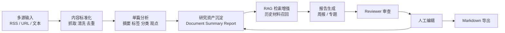
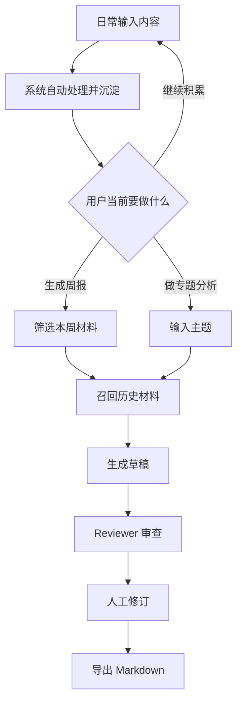
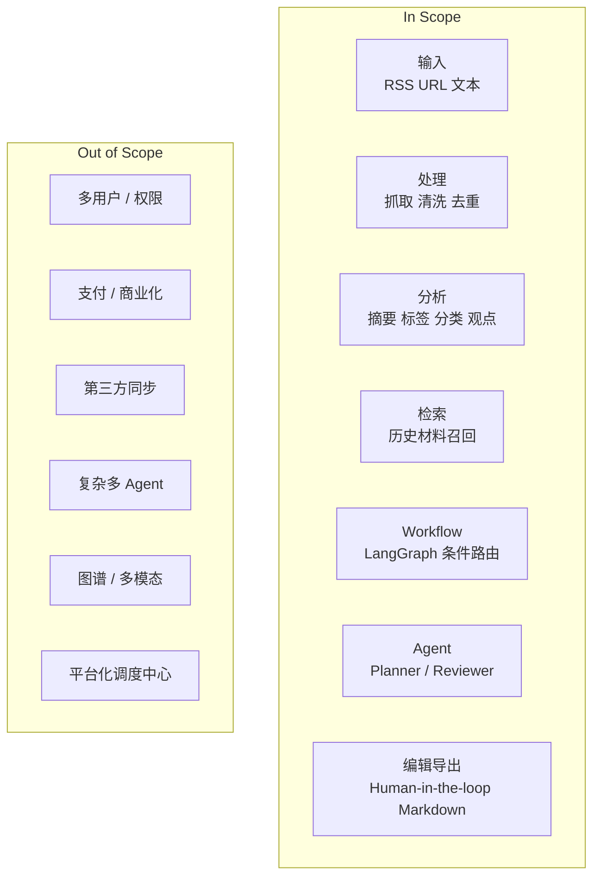
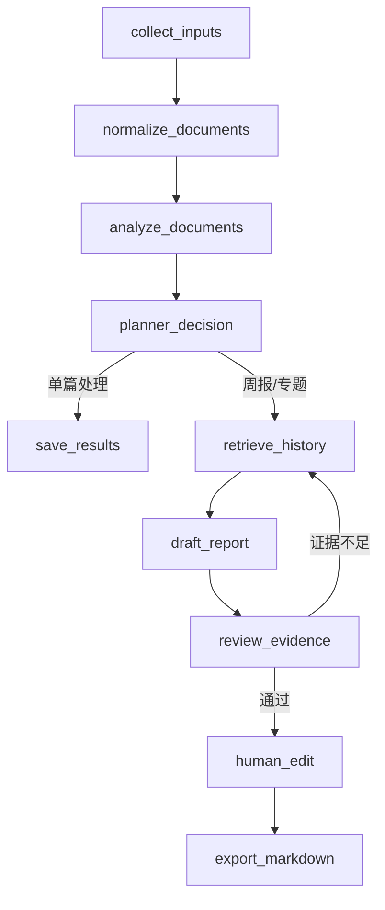
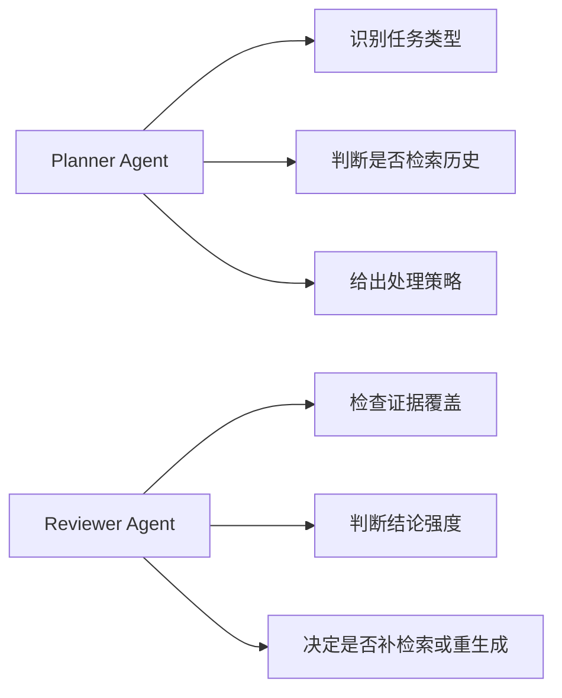
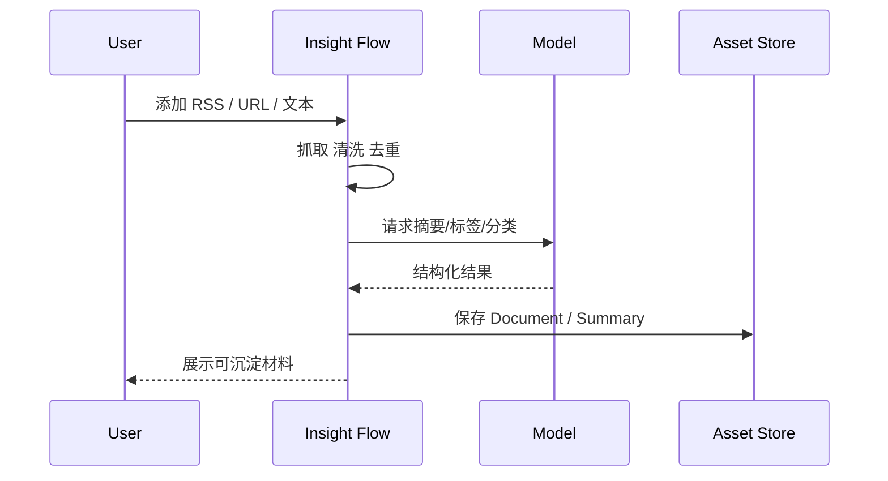
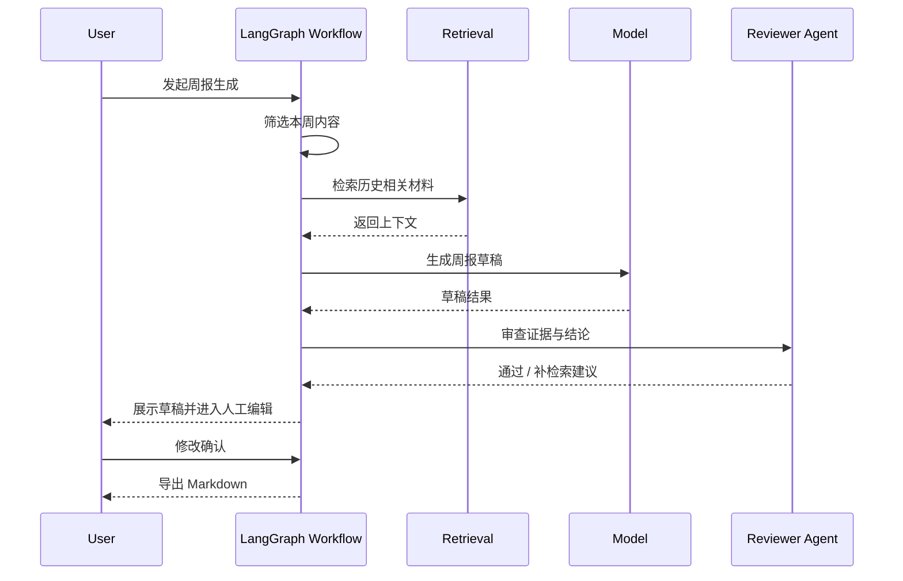
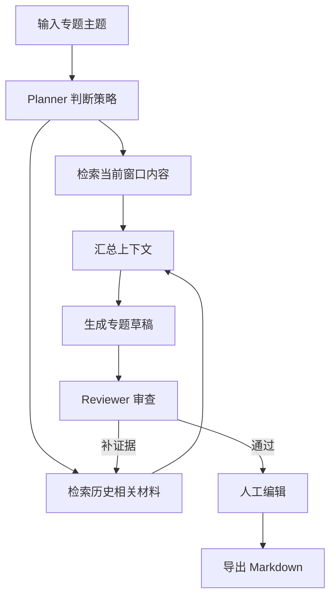
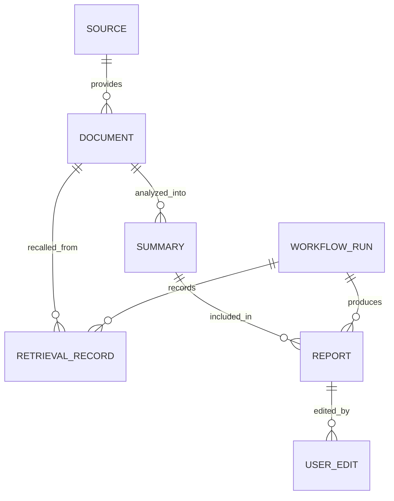
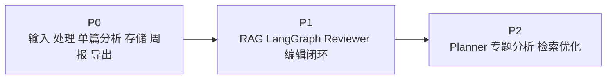

# Insight Flow MVP PRD

## 1. 文档目的

本文档用于定义 Insight Flow 第一版 MVP 的产品目标、用户场景、范围边界、核心功能、关键流程和验收标准。

这版 MVP 的目标不是做一个“大而全”的信息平台，而是：

> 用尽可能收敛的产品面，跑通一条完整的 AI research workflow。

它既要体现学习价值和工程价值，也要具备真实可用性，并为后续迭代预留演进空间。

---

## 2. 产品背景

Insight Flow 被定义为：

> 一个面向持续研究任务的 AI 研究工作流系统，用于把分散信息转化为结构化、可复用的研究输出。

项目的核心价值不在于“帮助用户更快读完更多文章”，而在于：

- 把持续研究任务系统化
- 把信息处理结果资产化
- 把 AI 能力嵌入真实可控的人机协作流程
- 在此基础上探索更高质量的研究判断支持

第一版 MVP 需要验证的不是商业化，而是以下问题：

1. 是否能稳定跑通“信息输入 -> 内容处理 -> 历史召回 -> 报告草稿 -> 人工修订 -> 导出”闭环
2. 是否能让 `RAG`、`LangGraph`、`Agent`、`Human-in-the-loop` 在一个真实场景中各司其职
3. 是否能沉淀出真正可复用的个人研究资产

---

## 3. MVP 目标

### 3.1 产品目标

面向持续跟踪 AI / AI Coding / 科技动态，并需要定期形成结构化中文输出的用户，提供一套可用的研究工作流系统，使其能够：

- 统一收集多源信息
- 自动完成基础处理和结构化分析
- 在生成周报或专题稿时调用历史材料
- 获得 AI 起草结果并进行人工修订
- 导出可直接使用的 Markdown 结果

### 3.2 学习目标

通过第一版 MVP，系统性实践以下能力：

- LLM 结构化输出
- Prompt 设计与拆分
- RAG 设计与最小落地
- LangGraph 状态化编排
- Planner / Reviewer 式 agent 节点
- Human-in-the-loop 工作流
- AI 工程化的日志、状态、错误处理与可追踪性

### 3.3 MVP 成功标准

如果满足以下条件，可以认为 MVP 达标：

1. 用户可以通过 `RSS / URL / 手动文本` 输入内容
2. 系统可以完成标准化处理、摘要、标签、分类和关键观点提取
3. 系统可以基于历史材料进行最小可用的主题检索增强
4. 系统可以通过 LangGraph 跑通一条完整周报或专题分析 workflow
5. 系统至少包含一个人工介入点和一个 Reviewer 式决策点
6. 用户可以修改结果并导出 Markdown
7. 同一用户连续使用数周后，历史材料能够参与新任务

### 3.4 MVP 总览图

---

## 4. 目标用户

### 4.1 核心用户

第一版只服务于一类明确用户：

> 持续跟踪 AI / AI Coding / 科技行业动态，并需要定期输出结构化观察的人。

### 4.2 用户特征

- 日常会阅读 RSS、网页文章、社媒转发内容或手动复制材料
- 需要把零散内容整理成周报、研究笔记或专题观察
- 对信息处理效率敏感，但不希望完全放弃人工判断
- 接受 AI 辅助，但希望输出可控、可编辑、可追溯

### 4.3 第一版不服务的用户

- 泛内容消费用户
- 需要团队协作的多人组织
- 需要正式权限体系和企业交付的用户
- 只想要“快速看摘要”、不关心研究资产沉淀的用户

---

## 5. 核心使用场景

### 场景一：日常收集与沉淀

用户将感兴趣的 RSS 源、网页链接或手动文本输入系统，系统自动完成：

- 内容抓取
- 清洗
- 去重
- 摘要
- 标签与分类

最终把结果沉淀为可检索的研究材料。

### 场景二：生成周报

用户在一周内持续积累内容，到周末发起周报生成任务，系统：

- 汇总候选内容
- 检索历史相关材料
- 生成主题化周报草稿
- 进行 Reviewer 审查
- 提供人工编辑界面
- 导出 Markdown

### 场景三：生成基础专题分析

用户输入一个主题，例如“过去两周 AI Coding 的重要变化”，系统：

- 由 Planner 判断任务类型
- 检索当前时间窗和历史相关内容
- 生成专题观察草稿
- 进行 Reviewer 审查
- 用户修改并导出

## 5.1 用户场景总流程图

---

## 6. MVP 设计原则

### 6.1 功能面收缩，流程完整

第一版不追求平台能力，而追求完整闭环。

### 6.2 技术引入必须有真实职责

`RAG`、`LangGraph`、`Agent` 必须分别解决明确问题，而不是只出现在技术说明里。

### 6.3 AI 先起草，人再确认

第一版默认采用 AI 起草 + 人工修订模式，不追求全自动完成最终研究输出。

### 6.4 为长期资产沉淀而设计

第一版的数据结构和工作流必须考虑未来复用，而不是只服务一次性任务。

---

## 7. MVP 范围

## 7.1 In Scope

### A. 内容输入

- 支持添加 RSS 源
- 支持手动输入网页 URL
- 支持粘贴纯文本内容

### B. 内容处理

- 网页正文提取
- 基础文本清洗
- 标准元数据抽取
- 基础去重
- 文档入库

### C. 单篇 AI 分析

- 一句话摘要
- 关键观点提取
- 标签生成
- 分类结果输出

### D. 历史材料检索

- 基于主题或时间窗检索历史内容
- 为周报或专题分析提供补充上下文
- 最小可用 RAG 流程

### E. Workflow 编排

- 使用 LangGraph 串起处理流程
- 至少包含一个条件分支
- 至少包含一个 Reviewer 决策节点
- 至少包含一个人工介入节点

### F. 报告输出

- 周报生成
- 基础专题分析生成
- Markdown 导出

### G. 人工编辑

- 编辑摘要
- 调整条目顺序
- 删除条目
- 编辑最终报告草稿

## 7.2 Out of Scope

- 多用户系统
- 权限管理
- 支付
- 协作编辑
- 浏览器插件
- 飞书 / Notion / 邮件自动同步
- 平台化调度中心
- 复杂多 Agent 编排
- 图谱可视化
- 多模态处理
- 精细化偏好学习
- 成熟商业化功能

## 7.3 MVP 范围图

---

## 8. MVP 核心功能拆解

## 8.1 功能一：信息输入与采集

### 目标

让用户可以持续向系统输入研究材料。

### 子能力

- RSS 订阅管理
- 单 URL 导入
- 手动文本导入
- 触发采集任务

### MVP 要求

- 用户可以添加至少一个 RSS 源
- 用户可以手动提交 URL 并触发处理
- 用户可以直接粘贴文本并走后续分析流程

## 8.2 功能二：内容标准化处理

### 目标

把不同来源的内容统一为标准文档结构。

### 子能力

- 正文抽取
- 清洗噪音内容
- 语言识别
- 元数据抽取
- hash/URL 层面的基础去重

### MVP 要求

至少统一存储以下字段：

- title
- source
- url
- author
- published_at
- raw_content
- cleaned_content
- language
- hash
- status

## 8.3 功能三：单篇 AI 分析

### 目标

将标准文档转换为结构化研究材料。

### 子能力

- 结构化摘要
- 标签生成
- 分类输出
- 关键观点提取

### MVP 要求

- 输出必须结构化
- 结果需可持久化
- 失败任务应可追踪

## 8.4 功能四：历史材料检索增强

### 目标

让系统在生成周报或专题分析时，不只依赖当前输入，而是能利用历史资产。

### 子能力

- 历史内容 chunking 或摘要级检索
- 基于主题检索相关内容
- 基于时间窗筛选上下文
- 将召回结果注入生成上下文

### MVP 要求

- 至少实现一条最小可用 RAG 路径
- 历史材料必须能在周报或专题生成中实际参与

## 8.5 功能五：研究 workflow 编排

### 目标

用状态化方式管理完整任务，而不是用零散脚本拼接。

### 建议节点

- `collect_inputs`
- `normalize_documents`
- `analyze_documents`
- `planner_decision`
- `retrieve_history`
- `draft_report`
- `review_evidence`
- `human_edit`
- `export_markdown`

### MVP 要求

- 明确状态对象
- 节点执行结果可追踪
- 至少有一次条件路由
- 至少有一次中断等待人工再继续

### Workflow 图

## 8.6 功能六：Planner / Reviewer 节点

### Planner Agent

负责：

- 判断当前任务属于单篇分析、周报还是专题分析
- 判断是否需要检索历史材料
- 输出处理策略

### Reviewer Agent

负责：

- 判断当前草稿是否证据不足
- 判断结论是否表述过强
- 判断是否需要补充召回或重新生成

### MVP 要求

- 不追求复杂自治
- 只在明确高不确定节点承担局部决策

### Agent 职责图

## 8.7 功能七：报告编辑与导出

### 目标

让最终结果能被真实使用，而不是停留在系统内部。

### 子能力

- 编辑摘要内容
- 删除不需要的内容项
- 调整报告结构与顺序
- 导出 Markdown

### MVP 要求

- 周报和专题稿都必须可编辑
- 导出内容必须可直接复用

---

## 9. 核心流程

## 9.1 日常内容沉淀流程

1. 用户添加 RSS / URL / 文本
2. 系统采集并标准化内容
3. 系统执行单篇 AI 分析
4. 结果入库并形成可检索材料

## 9.2 周报生成流程

1. 用户发起周报生成任务
2. Planner 判断处理策略
3. 系统筛选本周候选内容
4. 系统检索历史相关材料
5. 系统生成周报草稿
6. Reviewer 审查证据与结论强度
7. 如有必要，回到检索或重新生成
8. 人工编辑确认
9. 导出 Markdown

## 9.3 专题分析流程

1. 用户输入专题主题
2. Planner 判断是否需要扩大时间范围和历史召回
3. 系统检索相关材料
4. 系统生成专题草稿
5. Reviewer 进行质量审查
6. 用户修改并导出

---

## 10. 数据沉淀要求

为了支撑长期复用，第一版至少需要沉淀以下对象：

- Source
- Document
- Summary
- Digest / Report
- UserEdit
- WorkflowRun
- RetrievalRecord

其中：

`WorkflowRun` 用于记录一次任务执行的状态和节点结果。  
`RetrievalRecord` 用于记录一次检索召回了哪些历史材料。

这样做的原因是，第一版就要为以下能力留出基础：

- 问题定位
- 结果复现
- 检索质量调试
- Prompt 与 workflow 调优

## 10.1 数据沉淀关系图

---

## 11. 非功能要求

### 11.1 可追踪性

- 每个任务要有状态
- 每个关键节点要有输入输出记录
- 失败任务要可定位

### 11.2 可编辑性

- AI 输出不能直接视为最终结果
- 用户必须能修改摘要和报告草稿

### 11.3 可扩展性

- Provider abstraction 需要预留
- 后续支持更多模型或更复杂检索时不应推翻整体结构

### 11.4 成本可控

- 避免在第一版引入过多无效模型调用
- Agent 节点只放在高价值位置

---

## 12. 验收标准

MVP 验收时，至少满足以下标准：

### 功能验收

- 可以成功接收 RSS / URL / 文本三种输入
- 可以完成内容抓取、清洗、入库和基础去重
- 可以为单篇内容生成结构化分析结果
- 可以基于历史材料完成一次实际可用的检索增强
- 可以生成周报草稿
- 可以生成基础专题分析草稿
- 可以触发人工编辑并导出 Markdown

### 工作流验收

- LangGraph workflow 可运行
- 至少存在一个条件分支
- 至少存在一个 Reviewer 节点
- 至少存在一个人工介入节点

### 价值验收

- 历史材料确实参与后续任务，而不是只做静态存储
- 输出结果可被人工快速修改并直接复用
- 用户连续使用时，能够感受到研究资产在累积

---

## 13. 版本不追求的内容

为避免第一版失控，以下目标即便看起来有吸引力，也不作为 MVP 成功标准：

- 全自动无人值守研究
- 复杂多 Agent 自主协作
- 完整商业化能力
- 团队协作产品化
- 高度精细化个性推荐
- 企业级可用性
- 图形化平台能力

第一版最重要的不是“做得多”，而是：

> 把一条真实可用、技术职责清晰、价值闭环成立的 AI research workflow 做扎实。

---

## 14. 建议的开发优先级

### P0

- 输入与采集
- 内容标准化
- 单篇 AI 分析
- 基础存储
- 周报生成
- Markdown 导出

### P1

- 历史检索增强
- LangGraph workflow 编排
- Reviewer 节点
- 人工编辑闭环

### P2

- Planner 节点
- 基础专题分析
- 更细的检索与审查优化

这样的优先级安排是为了确保：

- 第一时间先跑通基础价值闭环
- 再补齐最能体现 AI 工程能力的技术亮点
- 最后再增加更高阶的研究能力

## 14.1 开发优先级路线图

---

## 15. PRD 结论

Insight Flow 第一版 MVP 的正确打开方式，不是做一个大而全的信息平台，也不是做一个简单摘要工具，而是：

> 聚焦一个真实、高频、长期存在的研究场景，用最小但完整的产品功能，承载一条包含内容处理、历史检索、状态化 workflow、局部 agent 决策和人工修订闭环的 AI research workflow。

只要第一版把这条链路做扎实，它就已经同时具备：

- 学习项目价值
- 简历项目价值
- 自用工具价值
- 后续持续演进价值
