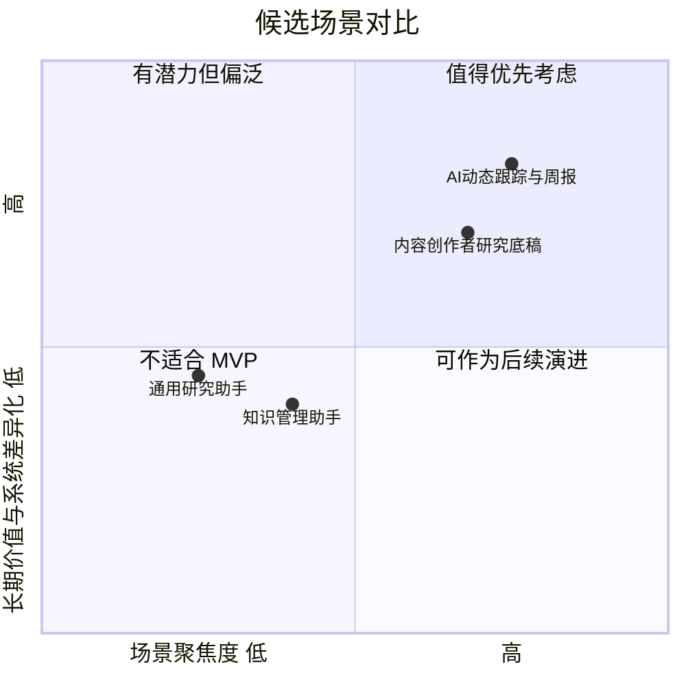
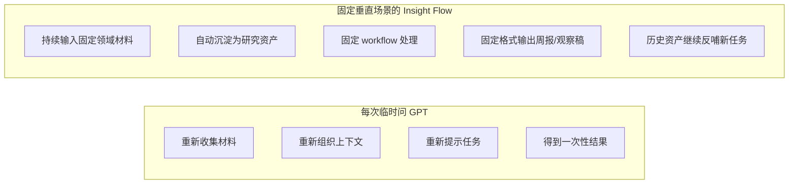

# Insight Flow 垂直场景收敛分析

## 1. 文档目的

在前面的讨论里，Insight Flow 已经明确了一点：

> 它不能继续停留在“通用研究工作流系统”这种宽泛表述上。

如果场景过宽，项目会出现三个问题：

- 产品价值不够锋利
- PRD 会不断膨胀
- 和 GPT 的差异仍然不够明显

因此，本文档的目的不是继续扩展可能性，而是收敛到一个更具体的第一版垂直场景，并回答：

1. 第一版到底服务什么任务
2. 为什么选这个场景
3. 为什么不选其他看起来也合理的方向
4. 这个场景会如何反向约束 MVP 和 PRD

---

## 2. 场景收敛原则

第一版垂直场景必须同时满足以下条件：

### 2.1 高频

任务不是偶尔发生，而是每周甚至每天都会发生。  
只有高频场景，历史资产沉淀和流程优化才有实际意义。

### 2.2 长周期

同一主题需要持续跟踪数周甚至数月。  
只有长周期场景，RAG、资产沉淀、历史复用的价值才成立。

### 2.3 信息来源分散

场景必须天然依赖多个来源，否则系统化整合的价值会太弱。

### 2.4 输出任务明确

系统不只是帮用户“看内容”，而是帮助完成明确输出，例如：

- 周报
- 观察稿
- 专题分析

### 2.5 个人可持续使用

场景必须是你自己真的会长期使用的，而不是为了看起来更商业化硬选一个陌生领域。

### 2.6 能体现学习与工程价值

场景需要能自然承载：

- RAG
- LangGraph
- Agent
- Human-in-the-loop

如果一个场景无法自然承载这些能力，它就不适合当 Insight Flow 的第一版主场景。

---

## 3. 候选场景

基于当前项目方向，可以考虑以下四类候选场景。

## 3.1 候选 A：通用信息研究助手

定义：

> 服务所有“需要搜集信息并形成研究输出”的用户。

优点：

- 叙事空间大
- 看起来像平台
- 后续延展空间广

问题：

- 场景过宽，价值模糊
- 很容易退化成“泛化 GPT 包装层”
- MVP 边界会失控
- 第一版很难做出真正顺手的体验

判断：

不适合作为第一版垂直场景。

## 3.2 候选 B：个人知识管理 / 收藏整理助手

定义：

> 帮助用户保存、整理、摘要网页和笔记。

优点：

- 自用价值直观
- 容易起步
- 存储和检索逻辑自然成立

问题：

- 太容易落入“高级收藏夹 + AI 摘要”
- 输出任务不够强
- 研究工作流特征不明显
- LangGraph / Agent 的必要性偏弱

判断：

适合做能力底座，但不适合作为主场景。

## 3.3 候选 C：AI / AI Coding 动态持续跟踪与周报生成

定义：

> 持续跟踪 AI、AI Coding、模型产品和科技行业动态，并定期输出中文周报、观察稿或专题分析。

优点：

- 高频且长期存在
- 信息源天然分散
- 中英文混合是现实需求
- 你自己就是真实用户
- 周报、观察稿、专题稿输出都非常自然
- 历史材料复用价值高
- 非常适合 RAG、Reviewer、Human-in-the-loop

问题：

- 题材上不够“独特”
- 如果只做摘要和周报，仍然容易被 GPT 替代

判断：

很适合作为第一版主场景，但必须强调长期跟踪、资产沉淀和证据组织，而不是只做信息摘要。

## 3.4 候选 D：垂直内容创作者研究底稿系统

定义：

> 面向固定领域内容创作者，持续积累素材并生成选题研究底稿。

优点：

- 输出任务非常明确
- 人工编辑闭环天然成立
- 有潜在商业化空间

问题：

- 用户画像比当前自己更窄
- 第一版需要更多“内容生产”细节设计
- 会把项目带向创作工具而非研究系统

判断：

可以作为第二阶段演进方向，但不适合第一版直接作为主场景。

---

## 4. 候选场景对比

从第一版的目标出发，候选 C 明显最平衡：

- 足够聚焦
- 足够高频
- 足够长期
- 足够真实
- 足够适合承接项目价值主张

---

## 5. 推荐场景：AI / AI Coding 动态持续跟踪与结构化输出

第一版建议明确聚焦于以下场景：

> 持续跟踪 AI、AI Coding、模型产品与科技行业动态，并定期输出中文周报、观察稿和基础专题分析。

这个定义里有四个关键词：

- 持续跟踪
- AI / AI Coding / 科技动态
- 结构化输出
- 中文表达

这四点共同决定了第一版场景为什么成立。

### 5.1 为什么这个场景最合适

#### 1）它是高频任务

AI 和 AI Coding 领域更新非常快，用户需要持续关注：

- 新模型发布
- 新工具更新
- 新产品策略变化
- 行业趋势和观点变化

这不是一次性需求，而是每周都重复发生的任务。

#### 2）它天然要求历史复用

这个领域的很多观察都不是单条新闻能说明白的，而是需要：

- 拉回过去几周的变化
- 对比同类产品
- 识别连续信号
- 判断阶段性趋势

这使得“历史材料召回”不再是附加项，而是核心能力。

#### 3）它天然需要多源输入

这个场景依赖的信息来源本来就很分散：

- RSS
- 官网博客
- 产品发布页
- 技术媒体
- 手动保存的链接
- 手动复制的重要片段

所以“统一采集 + 标准化处理”本身就有价值。

#### 4）它天然需要固定输出

这个场景的结果不是“看完就算了”，而是很自然地沉淀为：

- 周报
- 观察稿
- 专题分析

这使项目很适合做成稳定 workflow，而不是零散工具。

#### 5）它与你自己高度重合

第一版最重要的是高频真实使用。  
如果场景不是你自己真的在做，系统很容易只停留在“做出来”，而不会进入“长期迭代”。

这个场景的最大优势是：

> 你可以立刻用它来处理自己本来就在跟踪的信息。

---

## 6. 推荐场景的标准用户画像

### 核心用户画像

> 一位持续关注 AI、AI Coding 和科技产品动态的技术从业者或研究型内容创作者，需要每周形成中文结构化观察，并希望把平时读到的材料沉淀成长期可复用的研究资产。

### 用户的真实任务

- 每天保存若干值得关注的内容
- 快速过滤无价值或重复内容
- 保留重点材料的摘要和观点
- 到周末整理成一份周报
- 在需要时对某一主题拉出专题观察
- 希望过去保存的材料未来还能继续使用

### 用户最痛的点

- 来源太散
- 读过就忘
- 收藏了也很难复用
- 做周报时要重新翻资料
- 单次问 GPT 可以生成草稿，但无法自然沉淀长期资产

---

## 7. 为什么不选其他方向作为第一版主场景

## 7.1 为什么不做“通用研究平台”

因为第一版最怕的是“大而全但不锋利”。

通用研究平台的问题是：

- 场景边界模糊
- 很难明确输出模板
- 很难构造真正高频的用户任务
- 容易直接撞上“用户为什么不直接问 GPT”

所以它更适合作为远期愿景，而不是第一版定位。

## 7.2 为什么不做“知识管理助手”

因为知识管理虽然有价值，但它的任务重心更偏收藏和整理，而不是研究输出。

这会导致：

- 周报和专题分析的重要性下降
- LangGraph / Agent 的存在理由变弱
- 项目更像 AI 收藏工具而不是研究系统

## 7.3 为什么不直接做“内容创作者工具”

因为这会把项目主叙事从“研究工作流”拉向“内容生产工作流”。

虽然两者相关，但第一版更适合先把“研究资产沉淀 + 研究输出闭环”做实，再考虑往创作辅助方向延伸。

---

## 8. 这个场景如何提升 Insight Flow 对比 GPT 的说服力

如果场景是泛化的，用户自然会问：

> 我为什么不直接每次问 GPT？

但在这个垂直场景下，问题会变成：

> 我每周都在跟踪 AI / AI Coding 动态，为什么不使用一个能够持续积累材料、复用历史内容、保留人工修订、输出固定格式周报的系统？

这时系统价值就更容易成立，因为它强调的是：

- 长周期跟踪
- 固定垂直任务
- 历史资产沉淀
- 固定输出模板
- 可复盘流程

这些正是 GPT 临时使用方式最弱的部分。

### 图示：通用提问 vs 固定垂直任务系统

---

## 9. 这个场景对 MVP 的约束

一旦第一版场景被确定为“AI / AI Coding 动态持续跟踪与结构化输出”，MVP 就不能再泛泛设计，而应该被反向约束。

### 9.1 输入源约束

MVP 输入优先围绕以下来源设计：

- RSS
- 官方博客和发布页 URL
- 技术媒体 URL
- 用户手动粘贴的重要片段

### 9.2 输出约束

MVP 输出优先围绕以下形态设计：

- 本周 AI / AI Coding 观察周报
- 某主题基础观察稿

不需要同时支持太多输出类型。

### 9.3 标签与分类约束

第一版不需要抽象成全行业通用分类系统，而可以先围绕这个垂直场景设计：

- 模型更新
- 产品更新
- AI Coding
- Agent
- Infra / Tooling
- 行业动态

### 9.4 Reviewer 约束

Reviewer 的审查重点不应泛化，而应围绕这个场景具体化：

- 是否大量重复转述同一信息
- 是否缺少关键背景材料
- 是否对趋势结论表述过强
- 是否有主题聚合不清晰的问题

---

## 10. 推荐定位文案

如果采用这个垂直场景，项目的一句话定位可以进一步收窄为：

> Insight Flow 是一个面向 AI / AI Coding 动态持续跟踪任务的 AI 研究工作流系统，用于把分散信息沉淀为可复用的研究资产，并输出结构化周报和专题观察。

更口语一点可以写成：

> 它帮助持续跟踪 AI 动态的人，把每天读到的信息沉淀下来，并更稳定地生成周报和专题观察，而不是每次重新把材料喂给 GPT。

---

## 11. 最终结论

第一版最合适的垂直场景，不是“所有研究任务”，也不是“泛化信息管理”，而是：

> 持续跟踪 AI / AI Coding / 科技动态，并定期形成中文结构化输出的研究任务。

这是当前最适合 Insight Flow 的第一版主场景，因为它同时满足：

1. 高频
2. 长周期
3. 多源输入
4. 固定输出
5. 强历史复用需求
6. 真实自用价值
7. 对 RAG、LangGraph、Agent 的合理承接

一旦场景确定，后续的 PRD、信息架构、workflow 设计和数据模型都应该围绕这个场景收敛，而不再对“通用研究平台”做超前设计。
