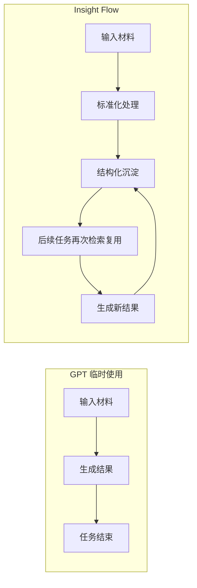
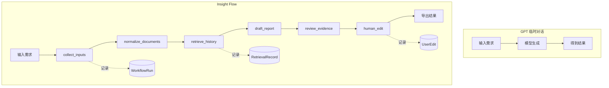
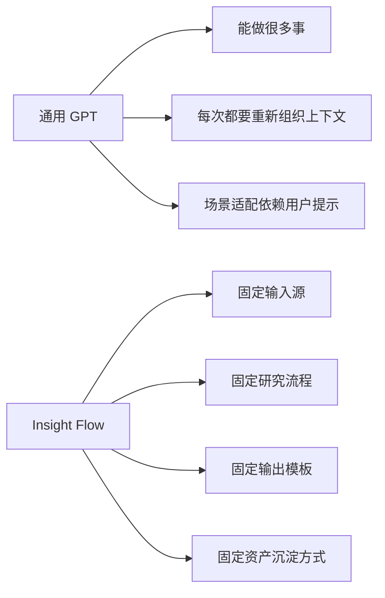
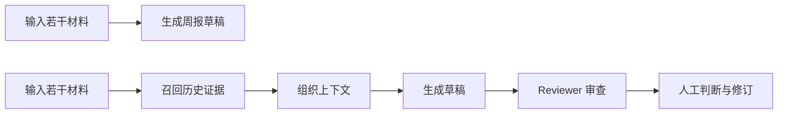

# Insight Flow 与 GPT 临时使用方式对比分析

## 1. 文档目的

本文档用于回答一个更尖锐也更关键的问题：

> 如果用户已经可以直接使用 GPT、Claude 或其他通用大模型完成摘要、周报和专题分析，为什么还需要 Insight Flow？

如果这个问题回答不清，Insight Flow 就更像一个“工程上完整的学习项目”，而不是一个具备清晰产品亮点和长期价值的系统。

因此，本分析不再泛泛讨论“AI 能做什么”，而是聚焦以下四点：

1. GPT 临时使用方式已经覆盖了什么
2. Insight Flow 必须比 GPT 多解决什么
3. 哪些能力可能成为真正亮点
4. 哪些能力其实不应再被当作核心卖点

---

## 2. 先承认：GPT 已经能做很多事

如果只看单次任务，通用大模型已经可以完成大量工作：

- 总结单篇文章
- 比较几篇文章
- 根据用户提供的链接生成日报或周报草稿
- 回答某个时间窗口内的趋势问题
- 输出结构化 Markdown
- 在联网或长上下文条件下，完成一定程度的归纳和检索增强

这意味着以下表述已经不足以构成强卖点：

- 自动摘要
- 自动周报
- 自动专题分析
- 自动整理信息

因为这些能力本质上更接近模型能力的直接延伸，而不是系统能力。

---

## 3. 真正的问题：Insight Flow 凭什么比“临时问 GPT”更值得长期使用

项目的价值必须从“单次生成能力”转移到“长期系统能力”。

换句话说，真正需要回答的问题不是：

> 这个项目能不能做 GPT 能做的事情？

而是：

> 这个项目能不能把 GPT 单次对话不擅长、用户长期又反复遇到的问题系统化解决？

这才是 Insight Flow 是否成立的关键。

---

## 4. GPT 临时使用方式 vs Insight Flow

## 4.1 核心对比表

| 维度 | GPT / Claude 临时使用 | Insight Flow 应追求的能力 |
| --- | --- | --- |
| 单篇摘要 | 很强，几乎开箱即用 | 不应作为卖点 |
| 多文档归纳 | 已经可用 | 不应作为核心卖点 |
| 周报草稿生成 | 可以完成 | 只能作为基础能力 |
| 一次性专题分析 | 可以完成 | 只能作为基础能力 |
| 长周期历史沉淀 | 弱，天然不连续 | 应成为核心能力 |
| 历史材料复用 | 弱，依赖手工回贴上下文 | 应成为核心能力 |
| 结构化资产库 | 不天然具备 | 应成为核心能力 |
| 流程可追踪 | 弱，通常只保留对话 | 应成为核心能力 |
| 结果可复盘 | 弱，过程不可审计 | 应成为核心能力 |
| 人工修改回流 | 弱，没有稳定闭环 | 应成为核心能力 |
| 垂直任务适配 | 通用但不深 | 可以成为增强能力 |
| 证据组织与审查 | 有一定能力但不稳定 | 可以成为高阶亮点 |

这个表说明了一件事：

> Insight Flow 不应该和 GPT 在“谁更会写摘要、谁更会写周报”上竞争，而应该在“谁更能支持长期研究工作”上建立差异。

---

## 5. 价值分层：哪些是基础能力，哪些才是项目亮点

为了避免项目价值继续失焦，需要把能力分层。

## 5.1 第一层：基础能力

这些能力必须有，但不应被当作项目的真正亮点：

- 摘要
- 标签生成
- 分类
- 周报起草
- 专题草稿生成
- Markdown 导出

这些能力的意义在于“构成闭环”，而不是“构成差异化”。

## 5.2 第二层：系统能力

这些能力才是项目应该重点强调的部分：

- 持续沉淀历史内容
- 将历史内容转化为可检索资产
- 保持任务流程状态化和可追踪
- 记录人工修订并参与后续任务
- 让一次性分析变成持续积累的研究系统

这一层是 GPT 临时使用方式天然不强的部分。

## 5.3 第三层：高阶能力

这些能力可以成为项目高级亮点，但前提是做得足够扎实：

- 证据覆盖检查
- 重复来源识别
- 结论强度控制
- 补充检索决策
- 帮助用户形成更可靠的阶段性判断

这一层价值很高，但不能在没有真实实现前过度承诺。

---

## 6. 真正值得强调的四个差异点

## 6.1 差异点一：长期研究资产沉淀

GPT 临时使用方式更像一次性工作台。

用户每次都可以把材料贴进去，让模型生成结果，但这些结果往往不会自然演进成一个持续增长、结构稳定、可反复利用的研究资产库。

Insight Flow 如果要成立，必须解决这件事：

- 内容被标准化存储
- 摘要、标签、分类被持久化
- 周报和专题稿被保留
- 人工编辑结果可追踪
- 历史资产能参与未来任务

这个能力的本质是：

> 让过去处理过的信息不会消失，而会成为未来研究任务的基础设施。

这可以被视为项目最重要的差异化之一。

### 图示：一次性使用 vs 持续资产沉淀

## 6.2 差异点二：流程可追踪、可复盘、可调优

GPT 可以给结果，但通常不天然提供一条稳定、可回溯的处理链路。

对于长期研究任务来说，仅有结果不够，用户还会关心：

- 这份周报使用了哪些原始材料
- 哪一步进行了历史检索
- Reviewer 为什么要求补证据
- 哪些内容被人工删改过
- 为什么这次结果和上次不同

Insight Flow 可以把这些信息显式化：

- 任务有状态
- 节点有输入输出
- 检索有召回记录
- 报告有版本
- 编辑有痕迹

这个能力的重要性在于：

> 它让系统不仅能“生成结果”，还能“解释结果是怎么来的”。

这在学习项目、简历项目和真实工具场景里都非常重要。

### 图示：黑盒式对话 vs 可追踪 workflow

## 6.3 差异点三：垂直场景的深度适配

GPT 是通用工具，强项是广谱适用。

Insight Flow 如果想进一步体现产品价值，就不能只停留在“通用研究工具”。

更合理的方向是：

> 围绕一个高频、固定、真实的研究任务做深度适配。

例如：

- 持续跟踪 AI / AI Coding 动态
- 聚焦中英文科技来源
- 适配周报、观察稿、专题分析稿这些固定输出形态
- 沉淀适合该场景的标签、分类、报告结构和检索逻辑

这样一来，Insight Flow 的价值就不只是“也能做总结”，而是：

> 对某一类长期重复出现的研究任务，比每次重新提示 GPT 更省心、更稳定、更顺手。

### 图示：通用工具 vs 垂直适配系统

## 6.4 差异点四：证据组织与审查支持

单次生成的难点通常不在“写一篇草稿”，而在：

- 材料是否足够
- 来源是否重复
- 结论是否过强
- 是否遗漏了重要背景

GPT 可以在一次对话里尝试做这些判断，但缺少稳定流程和上下文资产时，质量往往不稳定。

Insight Flow 如果在这一层做深，就会从“信息整理器”变成“研究支持系统”。

不过这一点要谨慎表述。

更稳妥的说法不是：

> 系统替用户做判断。

而是：

> 系统帮助用户把形成判断之前的证据组织和审查流程做得更扎实。

### 图示：从生成内容到组织证据

---

## 7. 哪些点不应该再被当作核心卖点

为了让项目价值表达更锋利，有些点应该从“卖点”降级为“基础能力”。

以下内容不建议再作为主卖点：

- 自动摘要
- 自动标签
- 自动分类
- 自动生成周报
- 自动生成专题稿
- 能接入 RAG
- 能接入 Agent

原因很简单：

- 前四项是当前大模型的常规能力
- 后两项只是技术手段，不是用户价值

也就是说：

> “用了 RAG / LangGraph / Agent”本身不是卖点，只有当它们解决了 GPT 临时使用方式难以解决的问题时，才构成项目亮点。

---

## 8. 项目的更强价值表述

基于上面的分析，Insight Flow 更有说服力的价值表达不应再是：

> 一个可以帮你自动整理信息、生成周报的 AI 工具。

更强的版本应该是：

> 一个面向长期研究任务的 AI 工作系统，重点不在单次生成，而在持续沉淀研究资产、提供可复盘的处理流程，并帮助用户在固定垂直场景中更稳定地组织证据和产出结果。

这个表述有三个明显优势：

- 它绕开了和 GPT 在“谁更会生成”上的直接竞争
- 它强调系统能力，而不是临时模型能力
- 它给 RAG、LangGraph、Agent 留下了合理位置

---

## 9. 最终判断：Insight Flow 是否有机会形成真正亮点

答案是：有，但前提很明确。

Insight Flow 的亮点不能建立在：

- “我也能摘要”
- “我也能写周报”
- “我也用了 RAG 和 Agent”

它只能建立在下面这些更硬的能力上：

1. 历史研究资产真的能长期沉淀并复用
2. workflow 真的可追踪、可复盘、可调优
3. 项目真的服务于一个高频、固定、可持续的垂直研究场景
4. 证据组织和审查机制真的能提升输出质量

如果这四点至少做实两点，这个项目就不再只是“GPT 的上层脚本”，而会更接近一个真正成立的 AI 研究工作系统。

---

## 10. 结论

Insight Flow 现在最需要避免的，是把“模型能力”误当成“项目价值”。

真正值得强调的不是：

- 系统能不能生成摘要
- 系统能不能写周报
- 系统有没有接 RAG、LangGraph、Agent

而是：

- 系统能不能让研究任务从一次性对话变成持续积累
- 系统能不能让结果从黑盒生成变成可追踪流程
- 系统能不能在固定场景中比通用 GPT 更顺手
- 系统能不能帮助用户更扎实地组织证据

因此，Insight Flow 的真正方向不应是“比 GPT 更会写”，而应是：

> 比 GPT 更适合承载长期、可复用、可追踪的研究工作。

只有在这个方向上站住，项目的产品说服力、简历说服力和工程说服力才会同时成立。
